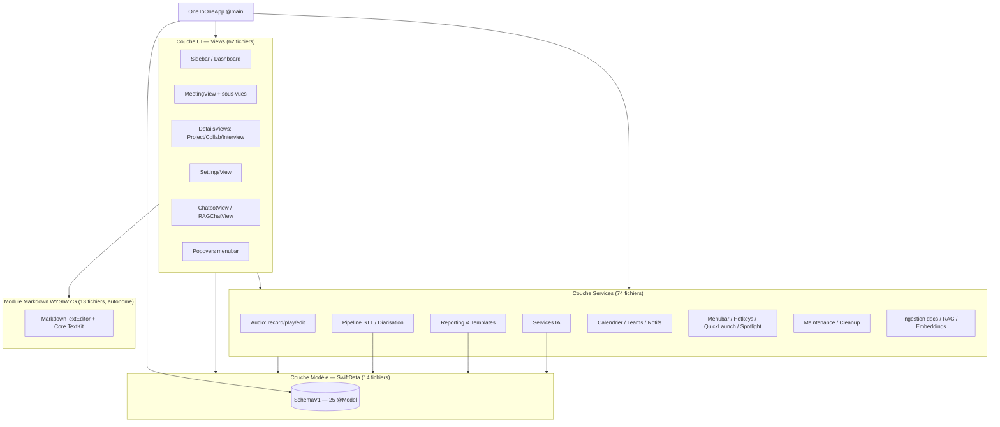
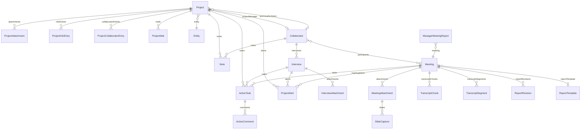
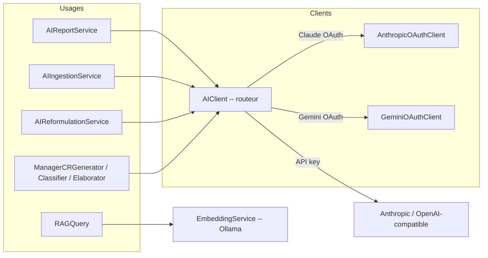
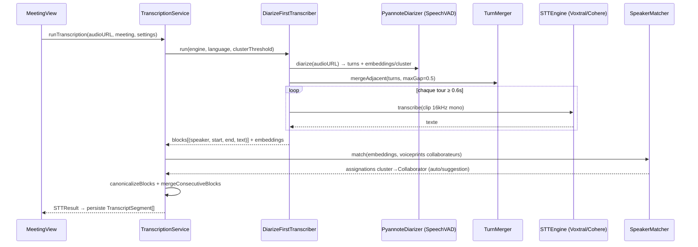
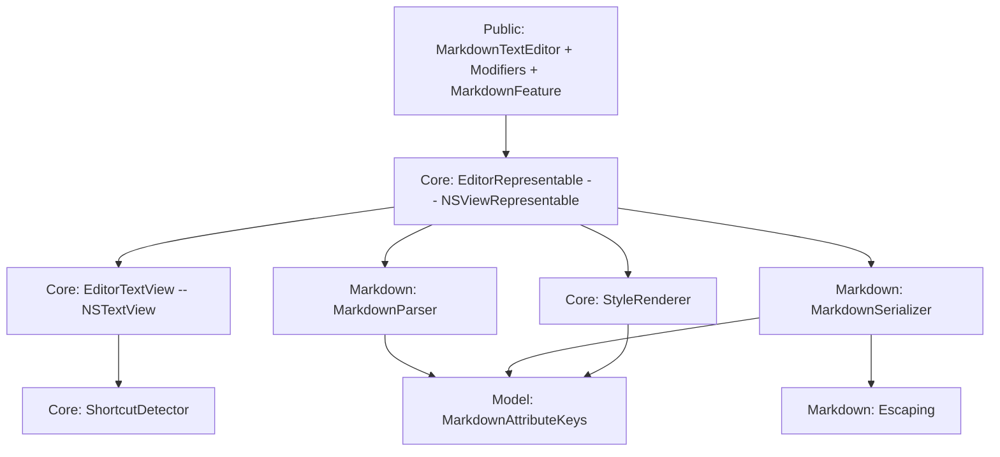

# Architecture — OneToOne (macOS)

> Document de référence de l'architecture du code. Décrit les sous-systèmes,
> le modèle de données, les flux principaux et les intégrations système.
> Public visé : tout développeur reprenant le projet.
>
> Généré à partir d'une cartographie exhaustive des 170 fichiers Swift de la
> cible `OneToOne` (~40 000 lignes). Tenir à jour lors des évolutions structurelles.

---

## 1. Présentation

**OneToOne** est une application macOS native (SwiftUI + SwiftData) destinée à un
**manager d'architectes**. Elle centralise :

- le **suivi de projets** (portfolio : code, phase, statut, budgets, risques, DAT/DIT) ;
- les **entretiens individuels (1:1)** et réunions (projet, manager, équipe, global) ;
- la **capture audio**, la **transcription locale** (STT sur appareil via MLX) avec
  **diarisation** (qui parle quand) et **identification du locuteur** (empreinte vocale) ;
- la **génération de comptes-rendus** par IA (templates de rapport, boucle écrivain/critique) ;
- l'**ingestion documentaire** (PDF/PPTX/XLSX) et le **RAG** (questions/réponses sur le contenu) ;
- de nombreuses **intégrations système** : Calendrier, Teams, Contacts, Rappels, Spotlight,
  Mail, capture d'écran, notifications, raccourcis globaux.

L'application est **100 % locale et orientée confidentialité** : la transcription et la
diarisation tournent sur l'appareil (MLX/Metal), les jetons API sont stockés dans le
**Keychain** (protégé Touch ID), et les fichiers importés sont copiés dans
`Application Support`.

---

## 2. Stack technique

| Domaine | Technologie |
|---|---|
| Langage / UI | Swift 6, SwiftUI, AppKit (ponts `NSViewRepresentable`) |
| Persistance | SwiftData (`@Model`, schéma versionné, migration lightweight) |
| Build | Swift Package Manager (exécutable, **pas de projet Xcode**) |
| STT local | `mlx-audio-swift` (`MLXAudioSTT`), `mlx-swift` (`MLX`) — Cohere / Voxtral |
| Diarisation | `speech-swift` (`SpeechVAD`, pipeline Pyannote + WeSpeaker ResNet34) |
| Markdown | `swift-markdown` (CommonMark + GFM) + moteur WYSIWYG maison |
| IA distante | Claude (OAuth + API), Gemini (OAuth), OpenAI-compatible, Ollama (embeddings) |
| Système | EventKit, Contacts, ScreenCaptureKit, Vision (OCR), CoreSpotlight, Carbon (hotkeys), UserNotifications, Keychain, App Groups |

**Dépendances SwiftPM** (`Package.swift`) :

- `mlx-audio-swift` — modèles STT MLX (Cohere Transcribe, Voxtral).
- `mlx-swift` — runtime MLX (tenseurs, inférence Metal).
- `speech-swift` — VAD + diarisation Pyannote + embeddings locuteur.
- `swift-markdown` — parsing AST CommonMark/GFM (utilisé côté rendu HTML rapport).

> ⚠️ **Metal / MLX** : SwiftPM ne compile pas les shaders Metal. Le script
> `Scripts/bump-and-build.sh` récupère `default.metallib` depuis une app voisine
> (Mickey.app) et l'embarque dans le bundle. Sans ce fichier, MLX crashe à la
> première opération GPU (donc la STT Cohere). Voir `Scripts/prepare-mlx-metallib.sh`.

---

## 3. Vue d'ensemble en couches

L'architecture suit un découpage **Vues → Services → Modèles** classique, avec deux
couches de services spécialisées (STT/diarisation et Reporting) et un module Markdown
réutilisable indépendant.

**Arêtes de dépendance dominantes** (mesurées sur la carte des symboles) :
`Views → Models` (153), `Services → Models` (124), `Views → Services` (94),
`Report → Models` (19), `App → Services` (13). Aucune dépendance circulaire de couche :
les modèles ne connaissent ni les vues ni les services.

**Conventions transverses :**

- Beaucoup de services sont des **`enum` sans cas** servant de *namespace* de fonctions
  statiques pures (ex. `TurnMerger`, `CollaboratorMatcher`, `ReportTemplating`,
  `ProjectMatchService`). Les services à état (audio, capture, notifications, queue) sont
  des **`class` singletons `@MainActor`** exposés via `.shared`.
- Les **commentaires et libellés UI sont en français** ; le code et les noms de symboles
  sont en anglais.
- Les **énumérations persistées** sont stockées en `…Raw: String` avec un wrapper calculé
  (contournement d'un bug SwiftData sur les enums).

---

## 4. Point d'entrée & cycle de vie

### `OneToOneApp` (`OneToOneApp.swift`)

Point d'entrée `@main`. Responsabilités :

1. **Initialise le `ModelContainer` SwiftData** dans `init()` sur un store dédié
   `Application Support/OneToOne/OneToOne.store` (évite la collision avec `default.store`).
   Si la migration échoue, le store cassé est **sauvegardé** (`.broken-<ts>`) puis recréé —
   opération destructive de dernier recours.
2. Expose un **conteneur statique partagé** `OneToOneApp.sharedContainer` pour les
   déclencheurs hors hiérarchie SwiftUI (callback AppIntent, hotkey Carbon).
3. Déclare **trois `WindowGroup`** : fenêtre principale (`ContentView`), fenêtre de réunion
   1:1 (`1to1-meeting`, paramétrée par `OneToOneLaunchToken`), fenêtre de préparation
   autonome (`prep-standalone`, paramétrée par `PrepWindowToken`).

### `ContentView`

Coquille `NavigationSplitView` (sidebar + détail). À l'apparition :

- force `NSApp.setActivationPolicy(.regular)` (nécessaire au lancement via `swift run`) ;
- **`repairStoreIfNeeded()`** — réparation idempotente des données : déduplication des codes
  projet, *backfill* des `stableID` optionnels (Project/Collaborator/Meeting/…), seeding des
  templates intégrés ;
- réindexation Spotlight, enregistrement des hotkeys, auto-cleanup audio conditionnel ;
- s'abonne aux `Notification.Name` inter-composants (`openPrepWindow`,
  `collaboratorHotkeysChanged`, `openCalendarMeetingPicker`) et aux activités Spotlight.

### `AppDelegate` (`AppDelegate.swift`)

`NSApplicationDelegate` branché via `@NSApplicationDelegateAdaptor`. Gère : permissions de
notification, routage des actions de notification de réunion (join Teams / snooze / ouvrir),
bootstrap de l'agenda calendrier, synchro des photos de contacts, génération de l'icône Dock.

---

## 5. Modèle de données (SwiftData)

Le schéma versionné `SchemaV1` (`SchemaVersions.swift`) déclare **25 types `@Model`**.
La stratégie de migration repose sur la **lightweight migration** automatique de SwiftData
(ajout de champs optionnels / avec valeur par défaut) ; un changement cassant nécessitera un
`SchemaV2` *nested* + `MigrationStage` (documenté dans le fichier).

### Entités principales et relations

### Inventaire des modèles

| Domaine | Modèles |
|---|---|
| Projets | `Project`, `ProjectInfoEntry`, `ProjectCollaboratorEntry`, `ProjectAttachment`, `Entity` |
| Personnes | `Collaborator` (empreinte vocale `voicePrint`), `Interview` (entretien job/1:1), `InterviewAttachment` |
| Réunions | `Meeting`, `MeetingAttachment`, `SlideCapture`, `TranscriptChunk` (RAG), `TranscriptSegment` (diarisation) |
| Actions | `ActionTask`, `ActionComment`, `ProjectAlert` |
| Manager | `ManagerReportItem`, `ManagerMeetingReport` |
| Rapports | `ReportTemplate`, `ReportRevision` (boucle écrivain/critique) |
| Mail / RAG | `ProjectMail`, `ProjectMailAttachment` |
| Divers | `Note`, `NoteAttachment`, `SavedPrompt`, `AppSettings` |

### Conventions de modélisation

- **`stableID: UUID?`** — identifiant stable exposable (noms de fichiers, tokens
  inter-fenêtres) car `persistentModelID` ne l'est pas. Optionnel pour survivre à la
  migration ; *backfillé* au lancement et via `ensuredStableID`.
- **Champs JSON** — les tableaux et dictionnaires (`keyPoints`, `participantStatuses`,
  `speakerAssignments`, `adhocAttendees`…) sont stockés en `String` JSON avec accesseurs
  calculés.
- **`AppSettings`** est un **singleton** (récupéré via l'extension
  `Collection<AppSettings>.canonicalSettings`) stockant toutes les préférences (IA, STT,
  calendrier, notifications, manager, cleanup).
- **`Meeting`** est l'entité la plus riche (50+ propriétés) : transcription brute/fusionnée,
  segments diarisés, rapport généré, métadonnées calendrier, mapping locuteur→collaborateur,
  flux de préparation. → cf. § 13 (dette technique : objet « dieu »).

---

## 6. Couche Services

74 fichiers, organisés par domaine fonctionnel.

### 6.1 Services IA

- **`AIClient`** — routeur central (`enum`) sélectionnant le fournisseur via `AppSettings`
  (Claude OAuth, Gemini OAuth, Anthropic API, OpenAI-compatible). Supporte le **streaming**
  (callback `onProgress`) et normalise les erreurs par fournisseur. `AIClientProtocol`
  permet l'injection de mocks pour les tests.
- **`AnthropicOAuthClient` / `GeminiOAuthClient`** — gestion des jetons OAuth (stockage
  Keychain + Touch ID, refresh, migration legacy).
- **`AIReportService`** — pipeline post-réunion : fusion transcript, génération structurée
  (résumé / points clés / décisions / actions / alertes), **boucle critique-révision**
  (`ReportRevision`), génération de préparation contextuelle.
- **`AIIngestionService`** — extraction texte (PDF/PPTX/XLSX/TXT) + parsing IA en
  `Project`/`Collaborator`/entretiens structurés, avec fallback parsers texte.
- **`ManagerCRGenerator` / `ManagerCategoryClassifier` / `ManagerSnippetElaborator`** —
  flux de CR manager (résumé d'items cochés, classification de catégorie, élaboration de
  snippets, extraction d'actions → `ActionTask`).
- **RAG** : `EmbeddingService` (Ollama `nomic-embed-text`, similarité cosinus),
  `RAGService` (`TextChunker` / `RAGIndexer` / `RAGQuery`) — indexe les `TranscriptChunk`
  et répond avec citations.

### 6.2 Pipeline STT / Diarisation (« diarize-first »)

Cœur technique de l'application — transcription locale avec attribution des locuteurs.
Deux modes pilotés par `AppSettings.transcriptionMode` :

- **`transcriptionOnly`** — transcription par chunks, segments anonymes.
- **`diarizeFirst`** — diarisation d'abord, puis STT par tour de parole.

**Composants :**

- **`STTEngine`** (protocole `@MainActor`) — moteur STT enfichable. `STTModelResolver`
  localise le dossier modèle (cache HuggingFace → dossier managé → chemin manuel).
- **`VoxtralEngine` / `CohereEngine`** — implémentations MLX (chargement paresseux,
  wrappers `@unchecked Sendable` `Box` pour franchir l'isolation de concurrence MLX).
- **`PyannoteDiarizer`** — wrappe `SpeechVAD` (pipeline Pyannote) ; renvoie les tours
  (`DiarTurn`) + un embedding moyen par cluster ; gère l'annulation via `CancellationFlag`.
- **`TurnMerger`** — helpers **purs** (sans dépendance audio) : `mergeAdjacent` (fusionne
  les tours consécutifs d'un même locuteur séparés de ≤ `maxGap`), `mergeConsecutiveBlocks`.
- **`DiarizeFirstTranscriber`** — orchestrateur du mode diarize-first.
- **`TranscriptionService`** — service de plus haut niveau : gère les deux modes, le
  chargement de modèle, le découpage, la récupération d'erreur, la canonicalisation
  (`canonicalizeBlocks`, `collapseRepetitions`) et la persistance des `TranscriptSegment`.
- **`SpeakerMatcher`** — appariement par similarité cosinus des embeddings de cluster contre
  les `voicePrint` des `Collaborator` (256-dim, WeSpeaker ResNet34). Décision auto/suggestion
  par seuils de confiance ; mise à jour **EMA** de l'empreinte sur labellisation manuelle.
- **`DiarizationService`** — VAD énergétique heuristique (V1, antérieur à Pyannote ;
  fallback / legacy).

`TranscriptSegment` encode trois états de locuteur : `0` = non assigné, `≥1` = cluster
diarisé, `speaker != nil` = résolu vers un `Collaborator`.

### 6.3 Reporting & templates

- **`ReportTemplate`** (modèle) + **`BuiltInTemplates`** — 10 templates intégrés en dur
  (1:1, manager, copil, codir, atelier, restitution…), *seedés* idempotemment en base et
  préservant les éditions utilisateur.
- **`ReportTemplating`** — résolution des variables `{{…}}` (`TemplateVariableResolver`) +
  construction de contexte (`HistoryContextBuilder`, `ProjectsContextBuilder`).
  Variables alimentées par `TranscriptTextBuilder` / `TranscriptHighlightsBuilder`.
- **Rendu HTML** (`Services/Report/`) : `MarkdownToHTMLRenderer` (CommonMark+GFM + directives
  custom `:::vigilance` / `:::reserve` via `swift-markdown`), `ReportHTMLBuilder` (document
  complet pour WKWebView / PDF / email, inlining CSS spécial Outlook), `ReportThemeCSS`
  (palette navy/cream).
- **`ExportService`** — export Markdown / PDF / email (Apple Mail, Outlook, `.eml`) / Apple
  Notes, pour réunions et entretiens.

### 6.4 Audio

- **`AudioRecorderService`** (singleton `@MainActor`) — capture **16 kHz / 16-bit / mono WAV**
  (format attendu par la STT MLX), VU-mètre, pause/reprise, concaténation WAV.
- **`AudioPlayerService`** — lecture WAV avec état observable (position, durée, metering).
- **`AudioFileEditor`** — édition WAV sans état (trim / split / cut) atomique via fichiers
  temporaires, hors *main* (`Task.detached`).
- **`AudioWaveform`** — extraction de pics décimés pour la visualisation.
- **Maintenance audio** : `AudioCompressionService` (WAV → AAC-LC M4A 32 kbps),
  `WavRetentionService` (planifie compression/suppression selon rétention configurée).

### 6.5 Calendrier, Teams, notifications

- **`CalendarAgendaService`** (singleton observable) — agenda du jour / à venir via EventKit,
  rafraîchi périodiquement.
- **`CalendarMeetingImportService`** — import d'événements Calendar en `Meeting` avec
  matching collaborateurs/projet et suggestion de *kind* (via `ProjectMatchService`).
- **`ProjectMatchService`** — suggestion de classification (manager/1:1/projet/global) par
  recouvrement de tokens + Jaro-Winkler.
- **`TeamsURLExtractor` / `TeamsLauncher`** — extraction d'URL Teams (EKEvent) + lancement
  app native (`msteams://`) avec fallback navigateur.
- **`MeetingNotificationService`** (singleton, `UNUserNotificationCenterDelegate`) — rappels
  pré-réunion, notifications de début/fin, routage des actions (join / snooze / ouvrir).

### 6.6 Lancement rapide, menubar, raccourcis, intégrations

- **`QuickLaunchRouter`** (singleton) — orchestre les lancements 1:1 rapides depuis Spotlight,
  AppIntents, hotkeys, menus contextuels ; publie des tokens vers les `WindowGroup`.
- **`QuickLaunchURLHandler`** — décode les `NSUserActivity` Spotlight → `startOneToOne`.
- **AppIntents** (`StartOneToOneIntent`, `CollaboratorEntity`, `OneToOneLaunchToken`,
  `OneToOneShortcuts`) — exposition à Shortcuts.app / Spotlight.
- **`GlobalHotkeyService`** + **`HotkeySpec`** — raccourcis clavier globaux (Carbon
  EventManager) ; spec sérialisable type `⌃⌥⌘A`.
- **`MenuBarController`** + **`MenuBarStats`** — UI barre de menus (prochaine réunion,
  actions urgentes, popovers de recherche/note/action rapides).
- **`OneToOneQuickPickerWindow`** — `NSPanel` flottant de recherche/lancement 1:1 (hotkey).
- **`SpotlightIndexService`** — indexation CoreSpotlight (Projects, Collaborators, entries).
- **`ContactPhotoService`** — synchro photos depuis Contacts (par email/nom).
- **`MickeyIntegration` / `ExternalServices` (`MickeyService`, `RemindersService`)** —
  intégration inter-app Mickey (URL scheme + App Group) et Rappels (EventKit).
- **`ScreenCaptureService`** (+ `OCRService` Vision, `PerceptualHasher`) — capture de slides
  (ScreenCaptureKit), détection auto par hash perceptuel, OCR, indexation.

### 6.7 Maintenance & infrastructure

- **`JobQueue`** (singleton) — file de jobs asynchrones (transcription, rapport, diarisation,
  édition audio, maintenance) avec contrôle de concurrence par *kind*, progression,
  annulation, rétention des jobs terminaux. Visualisée par `JobQueueSidebar`.
- **`BackupService`** — sérialisation/désérialisation JSON de tout l'état (DTOs) pour
  sauvegarde/restauration, avec gestion des pièces jointes.
- **`Services/Maintenance/`** : `StorageStatsService` (stats stockage en cache TTL),
  `BatchJobsService` (réunions sans rapport/transcript/diarisation), `OrphanCleanupService`
  (records/fichiers orphelins), `DatabaseVacuumService` (`PRAGMA optimize` + `VACUUM` SQLite).
- **`AttachmentImporter`** — copie des fichiers importés dans `Application Support`
  (resolution sécurisée par bookmarks).
- **`ProjectBacklogImportService`** — import backlog `.xlsx` en déléguant à un script Python
  (`Scripts/import_projects_xlsx.py`, openpyxl).

---

## 7. Module Markdown WYSIWYG (`OneToOne/Markdown/`)

Sous-système **autonome et réutilisable** (13 fichiers, style « bibliothèque »), découplé du
reste de l'app. Éditeur WYSIWYG markdown bâti sur TextKit.

- **Public** : `MarkdownTextEditor` (vue SwiftUI sans barre d'outils) + API fluide
  (`.markdownFeatures(_:)`, `.markdownPlaceholder(_:)`, `.markdownDebounce(_:)`,
  `.markdownReadOnly(_:)`) ; `MarkdownFeature` (flags granulaires d'édition).
- **Core** : `EditorRepresentable` (pont AppKit, debounce des écritures SwiftData),
  `EditorTextView` (`NSTextView` + toggle des cases à cocher), `ShortcutDetector`
  (raccourcis frappés → attributs), `StyleRenderer` (rendu visuel des attributs `md*`).
- **Markdown** : `MarkdownParser` (CommonMark+GFM → `NSAttributedString`),
  `MarkdownSerializer` (aller-retour inverse), `Escaping`.
- **Model** : `MarkdownAttributeKeys` (clés `NSAttributedString.Key` custom, `BlockType`,
  `ListInfo`).

> À ne pas confondre avec les rendus markdown **secondaires** : `Views/MarkdownText.swift`
> (rendu lecture seule léger) et `Services/Report/MarkdownToHTMLRenderer.swift` (rendu HTML
> riche des rapports via `swift-markdown`). `EditableTextField.swift` fournit un éditeur
> AppKit alternatif (collage d'images, barre d'outils).

---

## 8. Couche Views

62 fichiers. Organisation :

- **Navigation racine** : `Sidebar.swift` (`MainSidebarView`, `DashboardView`, Gantt,
  cartes de stats), `MeetingsListView`, `ProjectListView`, `AllCollaboratorsView`,
  `AllNotesView`, `ActionsListView`.
- **Détails entités** : `DetailsViews.swift` (`ProjectDetailView`, `CollaboratorDetailView`,
  `InterviewView`).
- **Réunion** (`Views/Meeting/`) : `MeetingView` (vue maîtresse), en-tête éditorial, barre
  de chrome supérieure, barre contextuelle d'enregistrement, blocs de détails, onglets,
  prévisualisation rapport (WKWebView), thème, avatars, et **sidebar droite configurable**
  (`Sidebar/` : panels Actions/Projects/Capture réordonnables et persistés).
- **Préparation** : `MeetingPrepTab`, `MeetingPrepContextPanel`, `PrepWindow`.
- **Manager** : `ManagerTrackingView`, `ManagerAgendaSidebar`, `ManagerClassificationSheet`,
  `ManagerActionReviewSheet`, `ManagerCategoriesEditor`.
- **Audio** : `AudioEditorSheet`, `AudioWaveformEditor`.
- **IA / RAG** : `ChatbotView`, `ChatbotTemplateGallery`, `RAGChatView`.
- **Calendrier / Mail** : `CalendarEventImportSheet`, `CalendarMeetingPicker`,
  `MailBrowserView`, `AgendaInspectorPanel`, `WeekStripView`.
- **Capture écran** : `ScreenCaptureConfigView`, `RectSelectorOverlay`.
- **Réglages** (`SettingsView` + `Views/Settings/`) : maintenance, éditeur/liste de templates,
  section hotkeys.
- **Menubar** (`Views/Menubar/`) : popovers recherche / note / action / urgent.
- **Partagé** (`Views/Shared/`, `Views/Layouts/`) : `AddCollaboratorSheet`, `OwnerPickerMenu`,
  `ProjectStatusPalette`, `FlowLayout`, `ColorHex`, `MeetingHeatmapView`.

---

## 9. Flux clés (bout en bout)

**A. Réunion → rapport**
1. Création/ouverture d'un `Meeting` (manuel, import calendrier, hotkey 1:1, AppIntent).
2. Enregistrement audio (`AudioRecorderService` → WAV 16 kHz) ou import d'un fichier existant.
3. Transcription (`TranscriptionService`) : mode `diarizeFirst` → `PyannoteDiarizer` +
   `TurnMerger` + `STTEngine`, puis `SpeakerMatcher` attribue les locuteurs ; persistance en
   `TranscriptSegment`.
4. Génération du rapport (`AIReportService` + `ReportTemplate` + `ReportTemplating`) ; boucle
   critique-révision (`ReportRevision`) ; extraction d'actions/alertes → `ActionTask` /
   `ProjectAlert`.
5. Rendu HTML (`ReportHTMLBuilder`) et export (`ExportService`).

**B. Préparation de réunion** — drain des `standingPrepNotes` (pool collab/projet) vers
`Meeting.prepNotes` à l'ouverture ; *carryover* des items non cochés vers le pool en fin de
réunion (`PrepCarryoverService`, flags d'idempotence).

**C. CR manager 1:1** — sélection d'items à aborder (`ManagerReportItem`), classification IA
(`ManagerCategoryClassifier`), génération du CR (`ManagerCRGenerator`) → `ManagerMeetingReport`
+ `ActionTask` extraites (revue via `ManagerActionReviewSheet`).

**D. RAG / Chatbot** — indexation des transcripts/mails en `TranscriptChunk` (embeddings
Ollama) ; `RAGChatView` interroge `RAGQuery` (top-K + similarité) et répond avec citations.

**E. Lancement rapide 1:1** — hotkey global / Spotlight / AppIntent → `QuickLaunchRouter`
publie un `OneToOneLaunchToken` → ouverture de la fenêtre `1to1-meeting` avec auto-record.

---

## 10. Intégrations système & permissions

| Intégration | Framework | Usage |
|---|---|---|
| Calendrier | EventKit | Agenda, import de réunions, extraction Teams |
| Rappels | EventKit | `RemindersService` (actions → rappels) |
| Contacts | Contacts | Synchro photos collaborateurs |
| Notifications | UserNotifications | Rappels de réunion, actions |
| Capture d'écran | ScreenCaptureKit | Capture de slides |
| OCR | Vision | Texte des slides |
| Recherche | CoreSpotlight | Indexation projets/collaborateurs |
| Raccourcis globaux | Carbon | Hotkeys hors focus |
| Secrets | Keychain (+ Touch ID) | Jetons OAuth (Anthropic, Gemini) |
| Inter-app | App Groups + URL schemes | Mickey (enregistrement), Teams |
| STT/Diarisation | MLX (Metal) + SpeechVAD | Inférence locale sur appareil |

---

## 11. Build, packaging & exécution

- **Build dev** : `swift build` (Debug) — `run.sh` lance `swift run -c release OneToOne`.
- **Packaging** : `Scripts/bump-and-build.sh [dev|prod]` — bumpe `CFBundleVersion` (= nombre
  de commits), build SwiftPM, **empaquette le binaire dans un bundle `.app`** (le projet n'a
  pas de cible app Xcode), embarque le bundle de ressources SwiftPM, **récupère et embarque
  le `default.metallib` MLX** (sinon crash GPU), signe ad-hoc, installe dans
  `~/Applications` (dev) ou `/Applications` (prod), relance LaunchServices.
- **Info.plist** est injecté au link via `-sectcreate __TEXT __info_plist` (voir
  `Package.swift`).
- **Ressources** : `OneToOne/Resources/` (icône, `sample_projects.json`).

---

## 12. Tests

42 fichiers de tests (`Tests/`, cible `OneToOneTests`, ~3 850 lignes). Couverture orientée
**logique pure et services** (les vues SwiftUI ne sont pas testées) :

- **STT / diarisation** : `TurnMergerTests`, `CanonicalizeClustersTests`,
  `SpeakerMatcherTests`, `CollaboratorVoicePrintTests`, `TranscriptEditServiceTests`,
  `TranscriptHighlightsBuilderTests`.
- **Reporting / templates** : `TemplateVariableResolverTests`, `HistoryContextBuilderTests`,
  `ProjectsContextBuilderTests`, `ReportHTMLBuilderTests`, `ReportTemplateModelTests`,
  `BuiltInTemplatesTests`, `MarkdownToHTMLRendererTests`.
- **Markdown** : `MarkdownParserTests`, `MarkdownSerializerTests`, `MarkdownRoundTripTests`.
- **Manager** : `ManagerCRGeneratorTests`, `ManagerCategoryClassifierTests`,
  `ManagerReportServiceTests`, `AppSettingsManagerCategoriesTests`.
- **Calendrier / matching** : `CalendarImportEventTests`, `ProjectMatchServiceTests`,
  `CollaboratorMatcherTests`.
- **Audio / maintenance** : `AudioFileEditorTests`, `AudioCompressionServiceTests`,
  `AudioWaveformTests`, `WavRetentionServiceTests`, `OrphanCleanupServiceTests`,
  `BatchJobsServiceTests`, `MeetingEffectiveDurationTests`.
- **Quick launch / système** : `QuickLaunchRouterTests`, `QuickLaunchURLHandlerTests`,
  `HotkeySpecTests`, `MenuBarStatsTests`, `TeamsLauncherTests`, `TeamsURLExtractorTests`,
  `SpotlightCollaboratorIndexTests`, `PanelLayoutEntryTests`, `PrepCarryoverServiceTests`,
  `PrepCheckboxCompatTests`, `SentenceContextExtractorTests`, `SwiftDataTests`.

Lancer : `swift test`.

---

## 13. Observations architecturales & dette technique

Points relevés lors de la cartographie (candidats à un refactoring ultérieur, **non
bloquants**) :

- **Objets « dieu »** :
  - `Meeting` (50+ propriétés couvrant transcription, rapport, calendrier, diarisation, prep).
  - `Project` (40+ propriétés ; doublon `chefDeProjet: String` vs `projectManager: Collaborator?`).
  - Vues monolithiques : `MeetingView` (~2300 l.), `DetailsViews` (~2670 l.),
    `Sidebar` (~1890 l., regroupe sidebar + dashboard + helpers), `SettingsView` (~1200 l.).
    → candidats à un découpage par responsabilité.
- **Duplication** : palette de couleurs navy/cream dupliquée entre `ReportThemeCSS` et
  `ReportHTMLBuilder.inlineForOutlook` ; plusieurs `DateFormatter` recréés à chaque accès au
  lieu d'être mis en cache statiquement ; extension `Array`/subscript « safe » répétée dans
  plusieurs services (candidate à une utilitaire partagée) ; fonctions `riskColor`/`alertColor`
  dupliquées.
- **i18n** : libellés UI et prompts codés en dur en français (pas de `Localizable.strings`).
- **Robustesse** : plusieurs `try?`/early-return silencieux (ex. `OrphanCleanupService`,
  popovers menubar) masquent les échecs ; logging incohérent (`print` vs `os.Logger`).
- **Dépendances externes fragiles** : recherche d'images DuckDuckGo (parsing HTML),
  chemins Python/Gemini CLI codés en dur.

> Ces observations servent de feuille de route ; le détail du code mort retiré et des
> simplifications appliquées/différées est consigné dans [`cleanup-report.md`](./cleanup-report.md).

---

*Dernière mise à jour : 2026-06-02.*
