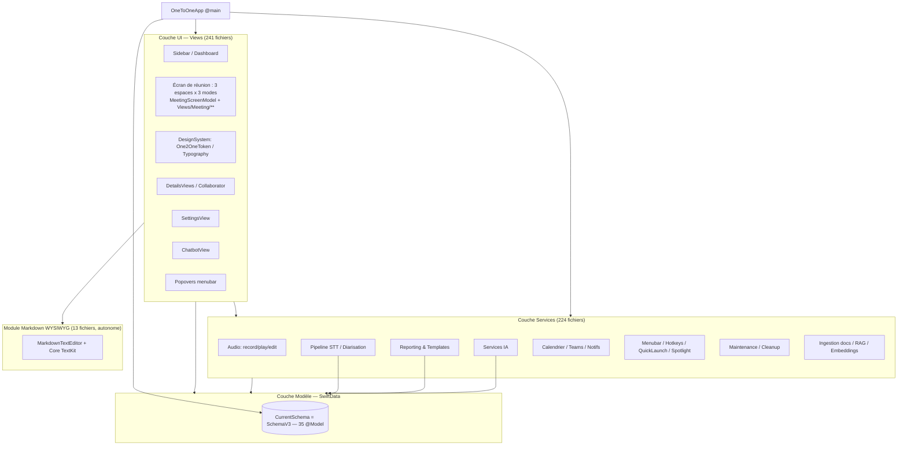
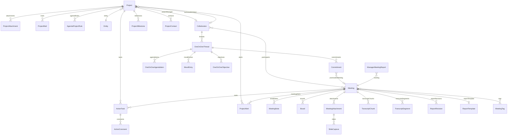
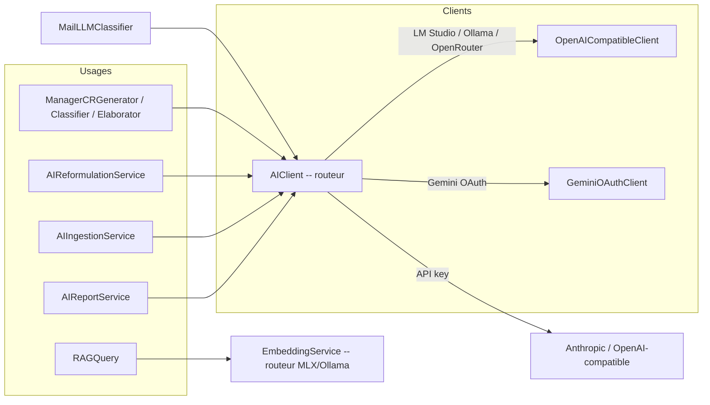
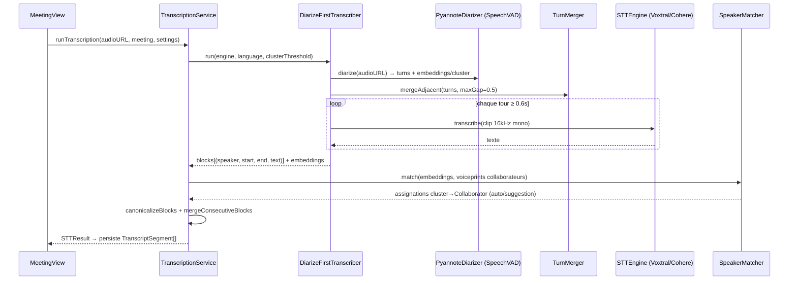
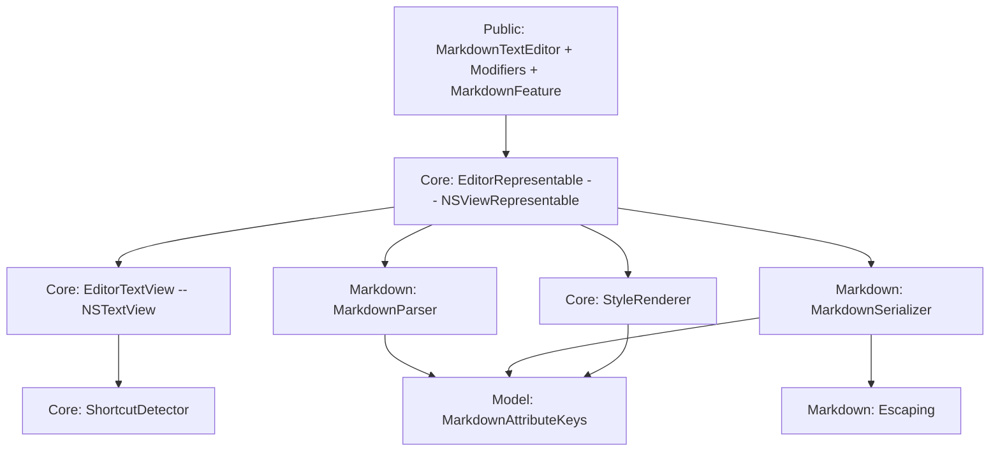

# Architecture — OneToOne (macOS)

> Document de référence de l'architecture du code. Décrit les sous-systèmes,
> le modèle de données, les flux principaux et les intégrations système.
> Public visé : tout développeur reprenant le projet.
>
> Généré à partir d'une cartographie exhaustive des 170 fichiers Swift de la
> cible `OneToOne` (~40 000 lignes). Tenir à jour lors des évolutions structurelles.

---

## 1. Présentation

**OneToOne** est une application macOS native (SwiftUI + SwiftData) destinée à un
**manager d'architectes**. Elle centralise :

- le **suivi de projets** (portfolio : code, phase, statut, budgets, risques, DAT/DIT) ;
- les **entretiens individuels (1:1)** et réunions (projet, manager, équipe, global) ;
- la **capture audio**, la **transcription locale** (STT sur appareil via MLX) avec
  **diarisation** (qui parle quand) et **identification du locuteur** (empreinte vocale) ;
- la **génération de comptes-rendus** par IA (templates de rapport, boucle écrivain/critique) ;
- l'**ingestion documentaire** (PDF/PPTX/XLSX) et le **RAG** (questions/réponses sur le contenu) ;
- de nombreuses **intégrations système** : Calendrier, Teams, Contacts, Rappels, Spotlight,
  Mail, capture d'écran, notifications, raccourcis globaux.

La transcription, la diarisation et les embeddings par défaut tournent sur l'appareil
(MLX/Metal). La génération utilise l'endpoint choisi : LM Studio, Ollama ou OpenRouter
distant, avec maintien des anciens fournisseurs. Les clés API sont migrées dans le
Trousseau à la première utilisation ; les nouveaux exports omettent les secrets.
Les fichiers importés sont copiés dans `Application Support`.

---

## 2. Stack technique

| Domaine | Technologie |
|---|---|
| Langage / UI | Swift 6, SwiftUI, AppKit (ponts `NSViewRepresentable`) |
| Persistance | SwiftData (`@Model`, schéma versionné, migration lightweight) |
| Build | Swift Package Manager (exécutable, **pas de projet Xcode**) |
| STT local | `mlx-audio-swift` (`MLXAudioSTT`), `mlx-swift` (`MLX`) — Cohere / Voxtral |
| Diarisation | `speech-swift` (`SpeechVAD`, pipeline Pyannote + WeSpeaker ResNet34) |
| Markdown | `swift-markdown` (CommonMark + GFM) + moteur WYSIWYG maison |
| Génération IA | LM Studio / Ollama / OpenRouter (HTTP compatible OpenAI), anciens fournisseurs cloud conservés |
| Embeddings locaux | `mlx-swift-lm` (`MLXEmbedders`) — `intfloat/multilingual-e5-base` in-process, défaut |
| Système | EventKit, Contacts, ScreenCaptureKit, Vision (OCR), CoreSpotlight, Carbon (hotkeys), UserNotifications, Keychain, App Groups |

**Dépendances SwiftPM** (`Package.swift`) :

- `mlx-audio-swift` — modèles STT MLX (Cohere Transcribe, Voxtral).
- `mlx-swift` — runtime MLX (tenseurs, inférence Metal).
- `speech-swift` — VAD + diarisation Pyannote + embeddings locuteur.
- `swift-markdown` — parsing AST CommonMark/GFM (utilisé côté rendu HTML rapport).

> ⚠️ **Metal / MLX** : SwiftPM ne compile pas les shaders Metal. Le script
> `Scripts/bump-and-build.sh` récupère `default.metallib` depuis une app voisine
> (Mickey.app) et l'embarque dans le bundle. Sans ce fichier, MLX crashe à la
> première opération GPU (donc la STT Cohere). Voir `Scripts/prepare-mlx-metallib.sh`.

---

## 3. Vue d'ensemble en couches

L'architecture suit un découpage **Vues → Services → Modèles** classique, avec deux
couches de services spécialisées (STT/diarisation et Reporting) et un module Markdown
réutilisable indépendant.

```mermaid
graph TD
    subgraph UI["Couche UI — Views (241 fichiers)"]
        SIDEBAR[Sidebar / Dashboard]
        MEETING["Écran de réunion : 3 espaces x 3 modes<br/>MeetingScreenModel + Views/Meeting/**"]
        TOKENS[DesignSystem: One2OneToken / Typography]
        DETAILS[DetailsViews / Collaborator]
        SETTINGS[SettingsView]
        CHATBOT[ChatbotView]
        MENUBAR_UI[Popovers menubar]
    end

    subgraph SVC["Couche Services (224 fichiers)"]
        AI[Services IA]
        STT[Pipeline STT / Diarisation]
        REPORT[Reporting & Templates]
        AUDIO[Audio: record/play/edit]
        CAL[Calendrier / Teams / Notifs]
        SYS[Menubar / Hotkeys / QuickLaunch / Spotlight]
        MAINT[Maintenance / Cleanup]
        IMPORT[Ingestion docs / RAG / Embeddings]
    end

    subgraph MODEL["Couche Modèle — SwiftData"]
        SCHEMA[("CurrentSchema = SchemaV3 — 35 @Model")]
    end

    subgraph MD["Module Markdown WYSIWYG (13 fichiers, autonome)"]
        EDITOR[MarkdownTextEditor + Core TextKit]
    end

    UI --> SVC
    UI --> MODEL
    SVC --> MODEL
    UI --> MD
    STT --> MODEL
    REPORT --> MODEL
    AI --> MODEL

    APP[OneToOneApp @main] --> UI
    APP --> SVC
    APP --> SCHEMA
```

**Arêtes de dépendance dominantes** (mesurées sur la carte des symboles) :
`Views → Models` (153), `Services → Models` (124), `Views → Services` (94),
`Report → Models` (19), `App → Services` (13). Aucune dépendance circulaire de couche :
les modèles ne connaissent ni les vues ni les services.

**Conventions transverses :**

- Beaucoup de services sont des **`enum` sans cas** servant de *namespace* de fonctions
  statiques pures (ex. `TurnMerger`, `CollaboratorMatcher`, `TemplateVariableResolver`,
  `ProjectMatchService`). Les services à état (audio, capture, notifications, queue) sont
  des **`class` singletons `@MainActor`** exposés via `.shared`.
- Les **commentaires et libellés UI sont en français** ; le code et les noms de symboles
  sont en anglais.
- Les **énumérations persistées** sont stockées en `…Raw: String` avec un wrapper calculé
  (contournement d'un bug SwiftData sur les enums).

---

## 4. Point d'entrée & cycle de vie

### `OneToOneApp` (`OneToOneApp.swift`)

Point d'entrée `@main`. Responsabilités :

1. **Initialise le `ModelContainer` SwiftData** dans `init()` sur un store dédié
   `Application Support/OneToOne/OneToOne.store` (évite la collision avec `default.store`).
   Si la migration échoue, le store cassé est **sauvegardé** (`.broken-<ts>`) puis recréé —
   opération destructive de dernier recours.
2. Expose un **conteneur statique partagé** `OneToOneApp.sharedContainer` pour les
   déclencheurs hors hiérarchie SwiftUI (callback AppIntent, hotkey Carbon).
3. Déclare **trois `WindowGroup`** : fenêtre principale (`ContentView`), fenêtre de réunion
   1:1 (`1to1-meeting`, paramétrée par `OneToOneLaunchToken`), fenêtre de préparation
   autonome (`prep-standalone`, paramétrée par `PrepWindowToken`).

### `ContentView`

Coquille `NavigationSplitView` (sidebar + détail). À l'apparition :

- force `NSApp.setActivationPolicy(.regular)` (nécessaire au lancement via `swift run`) ;
- **`repairStoreIfNeeded()`** — réparation idempotente des données : déduplication des codes
  projet, *backfill* des `stableID` optionnels (Project/Collaborator/Meeting/…), seeding des
  templates intégrés ;
- réindexation Spotlight, enregistrement des hotkeys, auto-cleanup audio conditionnel ;
- s'abonne aux `Notification.Name` inter-composants (`openPrepWindow`,
  `collaboratorHotkeysChanged`, `openCalendarMeetingPicker`) et aux activités Spotlight.

### `AppDelegate` (`AppDelegate.swift`)

`NSApplicationDelegate` branché via `@NSApplicationDelegateAdaptor`. Gère : permissions de
notification, routage des actions de notification de réunion (join Teams / snooze / ouvrir),
bootstrap de l'agenda calendrier, synchro des photos de contacts, génération de l'icône Dock.

---

## 5. Modèle de données (SwiftData)

Le schéma courant est **`SchemaV3`** (`typealias CurrentSchema = SchemaV3`,
`Models/SchemaVersions.swift`), qui déclare **35 types `@Model`**. Trois versions se
succèdent, toutes par **lightweight migration** automatique de SwiftData (ajout de champs
optionnels ou à valeur par défaut ; aucun champ supprimé, renommé ni rendu obligatoire), donc
sans `MigrationStage` custom — `OneToOneMigrationPlan` les enchaîne :

| Version | Date | Apport |
|---|---|---|
| `SchemaV1` | — | le socle historique |
| `SchemaV2` | 2026-09-06 | `ChatSession`, `ChatMessageEntity` (persistance de l'historique du chatbot) |
| `SchemaV3` | 2026-09-07 | les neuf tables du modèle cible de la refonte (lot 0B) : `MeetingNote`, `Board`, `ProjectMilestone`, `ProjectContact`, `OneOnOneThread`, `Commitment`, `OneOnOneAgendaItem`, `MoodEntry`, `OneOnOneObjective` — plus des colonnes à valeur par défaut sur `ActionTask`, `MeetingAttachment`, `SlideCapture`, `Project` et `Meeting` |

Vérifié par `Tests/SchemaV3MigrationTests.swift`. Le modèle « Interview » a été **supprimé** au
2026-08-11 (ADR `2026-08-11-suppression-du-modele-interview.md`) : les entretiens sont des
`Meeting` d'un `kind` donné.

### Entités principales et relations

```mermaid
erDiagram
    Project ||--o{ ActionTask : tasks
    Project ||--o{ ProjectAlert : alerts
    Project ||--o{ ProjectAttachment : attachments
    Project ||--o{ ProjectMail : mails
    Project ||--o{ AgendaProjectRule : agendaRules
    Project }o--|| Entity : entity
    Project }o--o| Collaborator : projectManager
    Project }o--o| Collaborator : technicalArchitect

    Project ||--o{ ProjectMilestone : milestones
    Project ||--o{ ProjectContact : contacts

    Collaborator }o--o{ Meeting : participants
    Collaborator ||--o{ OneOnOneThread : threads

    OneOnOneThread ||--o{ Commitment : commitments
    OneOnOneThread ||--o{ OneOnOneAgendaItem : agendaItems
    OneOnOneThread ||--o{ MoodEntry : moodEntries
    OneOnOneThread ||--o{ OneOnOneObjective : objectives
    Commitment }o--o| Meeting : promisedInMeeting

    Meeting ||--o{ MeetingNote : timedNotes
    Meeting ||--o{ Board : boards
    Meeting ||--o{ ActionTask : tasks
    Meeting ||--o{ MeetingAttachment : attachments
    Meeting ||--o{ ProjectAlert : meetingAlerts
    Meeting ||--o{ TranscriptChunk : transcriptChunks
    Meeting ||--o{ TranscriptSegment : transcriptSegments
    Meeting ||--o{ ReportRevision : reportRevisions
    Meeting }o--o| ReportTemplate : reportTemplate
    Meeting }o--o{ MeetingTag : tags

    ActionTask ||--o{ ActionComment : comments
    MeetingAttachment ||--o{ SlideCapture : slides
    ManagerMeetingReport }o--|| Meeting : meeting
```

### Inventaire des modèles

| Domaine | Modèles |
|---|---|
| Projets | `Project`, `ProjectAttachment`, `Entity`, `AgendaProjectRule` (règle titre agenda → projet) |
| Personnes | `Collaborator` (empreinte vocale `voicePrint`) |
| Réunions | `Meeting`, `MeetingTag` (thème libre, many-to-many), `MeetingAttachment`, `SlideCapture`, `TranscriptChunk` (RAG), `TranscriptSegment` (diarisation) |
| Réunion, modèle cible (lot 0B) | `MeetingNote` — une ligne de note **adressable** : `t` sur l'axe temps, `kind`, `visibility` (trois niveaux, spec §3.2), `sourceRef` en trois colonnes plates (décision D1). `Board` — une planche d'atelier ; scène et vignette sur disque sous `recordings/<uuid>/boards/`, jamais en base (D6) |
| Fiche projet (lot 9) | `ProjectMilestone`, `ProjectContact` |
| 1:1 (lot 10, décision D3) | `OneOnOneThread` — un fil par collaborateur et par rôle, créé paresseusement au premier 1:1, `myRole` déduit du type (D4) ; `Commitment` (engagement réciproque), `OneOnOneAgendaItem` (ordre du jour, demandes), `MoodEntry`, `OneOnOneObjective` |
| Chatbot | `ChatSession`, `ChatMessageEntity` |
| Actions | `ActionTask`, `ActionComment`, `ProjectAlert` |
| Manager | `ManagerReportItem`, `ManagerMeetingReport` |
| Rapports | `ReportTemplate`, `ReportRevision` (boucle écrivain/critique) |
| Mail / RAG | `ProjectMail`, `ProjectMailAttachment`, `MailIndexSuggestion` (suggestion en attente de validation), `MailScanRecord` (trace de dédup du scan) |
| Divers | `SavedPrompt`, `AppSettings` |

### Conventions de modélisation

- **`stableID: UUID?`** — identifiant stable exposable (noms de fichiers, tokens
  inter-fenêtres) car `persistentModelID` ne l'est pas. Optionnel pour survivre à la
  migration ; *backfillé* au lancement et via `ensuredStableID`.
- **Champs JSON** — les tableaux et dictionnaires (`keyPoints`, `participantStatuses`,
  `speakerAssignments`, `adhocAttendees`…) sont stockés en `String` JSON avec accesseurs
  calculés.
- **`AppSettings`** est un **singleton** (récupéré via l'extension
  `Collection<AppSettings>.canonicalSettings`) stockant toutes les préférences (IA, STT,
  calendrier, notifications, manager, cleanup).
- **`Meeting`** est l'entité la plus riche (50+ propriétés) : transcription brute/fusionnée,
  segments diarisés, rapport généré, métadonnées calendrier, mapping locuteur→collaborateur,
  flux de préparation. → cf. § 13 (dette technique : objet « dieu »).

---

## 6. Couche Services

74 fichiers, organisés par domaine fonctionnel.

### 6.1 Services IA

```mermaid
graph LR
    subgraph Clients
        AIClient[AIClient -- routeur]
        ENDPOINT[OpenAICompatibleClient]
        GEM[GeminiOAuthClient]
    end
    subgraph Usages
        REPORTSVC[AIReportService]
        INGEST[AIIngestionService]
        REFORM[AIReformulationService]
        MGR[ManagerCRGenerator / Classifier / Elaborator]
        RAGQ[RAGQuery]
    end
    REPORTSVC --> AIClient
    INGEST --> AIClient
    REFORM --> AIClient
    MGR --> AIClient
    AIClient -->|LM Studio / Ollama / OpenRouter| ENDPOINT
    MAIL[MailLLMClassifier] --> AIClient
    AIClient -->|Gemini OAuth| GEM
    AIClient -->|API key| HTTP[Anthropic / OpenAI-compatible]
    RAGQ --> EMB[EmbeddingService -- routeur MLX/Ollama]
```

- **`AIClient`** — routeur central sélectionnant le profil via `AppSettings`. Les nouveaux
  endpoints LM Studio, Ollama et OpenRouter passent par `OpenAICompatibleClient` ; les
  anciens adaptateurs cloud restent accessibles. Le moteur Direct et Gemma4Swift sont
  retirés ; les profils Direct migrent vers LM Studio sans conversion automatique du
  nom de modèle. `AIClientProtocol` permet l'injection de mocks.
- **`Services/AI/`** — profils JSON sans secrets, instantané de requête, Trousseau et
  transport HTTP/SSE injectable. Une réponse tronquée, refusée ou interrompue échoue
  explicitement. Le catalogue et le test des réglages ne changent pas le profil actif.
- **`AnthropicOAuthClient` / `GeminiOAuthClient`** — gestion des jetons OAuth (stockage
  Keychain + Touch ID, refresh, migration legacy).
- **`AIReportService`** — pipeline post-réunion : fusion transcript, génération structurée
  (résumé / points clés / décisions / actions / alertes), **boucle critique-révision**
  (`ReportRevision`), génération de préparation contextuelle.
- **`AIIngestionService`** — extraction texte (PDF/PPTX/XLSX/TXT) + parsing IA en
  `Project`/`Collaborator`/entretiens structurés, avec fallback parsers texte.
- **`ManagerCRGenerator` / `ManagerCategoryClassifier` / `ManagerSnippetElaborator`** —
  flux de CR manager (résumé d'items cochés, classification de catégorie, élaboration de
  snippets, extraction d'actions → `ActionTask`).
- **RAG** : `EmbeddingService` — routeur à deux backends piloté par la clé UserDefaults
  `onetoone_embedding_backend` : **`.mlx`** (défaut) délègue à `MLXEmbeddingEngine`
  (`MLXEmbedders`, `mlx-swift-lm`, modèle `intfloat/multilingual-e5-base` in-process, préfixes
  `query:`/`passage:` selon le rôle — requête vs indexation ; nomic v1.5 inchargeable,
  bug upstream NomicBert rotary) ; **`.ollama`**
  (legacy) appelle `nomic-embed-text` via l'API HTTP Ollama. Similarité cosinus commune aux
  deux backends. Un changement de backend/modèle rend les chunks existants obsolètes :
  `BatchJobsService.staleChunks` les détecte et la section « EMBEDDINGS / RAG » de
  `MaintenanceView` propose de « Ré-embedder l'index ». `RAGService`
  (`TextChunker` / `RAGIndexer` / `RAGQuery`) indexe les `TranscriptChunk` et répond avec
  citations.

### 6.2 Pipeline STT / Diarisation (« diarize-first »)

Cœur technique de l'application — transcription locale avec attribution des locuteurs.
Deux modes pilotés par `AppSettings.transcriptionMode` :

- **`transcriptionOnly`** — transcription par chunks, segments anonymes.
- **`diarizeFirst`** — diarisation d'abord, puis STT par tour de parole.

```mermaid
sequenceDiagram
    participant UI as MeetingView
    participant TS as TranscriptionService
    participant DFT as DiarizeFirstTranscriber
    participant PD as PyannoteDiarizer (SpeechVAD)
    participant TM as TurnMerger
    participant ENG as STTEngine (Voxtral/Cohere)
    participant SM as SpeakerMatcher

    UI->>TS: runTranscription(audioURL, meeting, settings)
    TS->>DFT: run(engine, language, clusterThreshold)
    DFT->>PD: diarize(audioURL) → turns + embeddings/cluster
    DFT->>TM: mergeAdjacent(turns, maxGap=0.5)
    loop chaque tour ≥ 0.6s
        DFT->>ENG: transcribe(clip 16kHz mono)
        ENG-->>DFT: texte
    end
    DFT-->>TS: blocks[(speaker, start, end, text)] + embeddings
    TS->>SM: match(embeddings, voiceprints collaborateurs)
    SM-->>TS: assignations cluster→Collaborator (auto/suggestion)
    TS->>TS: canonicalizeBlocks + mergeConsecutiveBlocks
    TS-->>UI: STTResult → persiste TranscriptSegment[]
```

**Composants :**

- **`STTEngine`** (protocole `@MainActor`) — moteur STT enfichable. `STTModelResolver`
  localise le dossier modèle (cache HuggingFace → dossier managé → chemin manuel).
- **`VoxtralEngine` / `CohereEngine`** — implémentations MLX (chargement paresseux,
  wrappers `@unchecked Sendable` `Box` pour franchir l'isolation de concurrence MLX).
- **`PyannoteDiarizer`** — wrappe `SpeechVAD` (pipeline Pyannote) ; renvoie les tours
  (`DiarTurn`) + un embedding moyen par cluster ; gère l'annulation via `CancellationFlag`.
- **`TurnMerger`** — helpers **purs** (sans dépendance audio) : `mergeAdjacent` (fusionne
  les tours consécutifs d'un même locuteur séparés de ≤ `maxGap`), `mergeConsecutiveBlocks`.
- **`DiarizeFirstTranscriber`** — orchestrateur du mode diarize-first.
- **`TranscriptionService`** — service de plus haut niveau : gère les deux modes, le
  chargement de modèle, le découpage, la récupération d'erreur, la canonicalisation
  (`canonicalizeBlocks`, `collapseRepetitions`) et la persistance des `TranscriptSegment`.
- **`SpeakerMatcher`** — appariement par similarité cosinus des embeddings de cluster contre
  les `voicePrint` des `Collaborator` (256-dim, WeSpeaker ResNet34). Décision auto/suggestion
  par seuils de confiance ; mise à jour **EMA** de l'empreinte sur labellisation manuelle.
- **`DiarizationService`** — VAD énergétique heuristique (V1, antérieur à Pyannote ;
  fallback / legacy).

`TranscriptSegment` encode trois états de locuteur : `0` = non assigné, `≥1` = cluster
diarisé, `speaker != nil` = résolu vers un `Collaborator`.

### 6.3 Reporting & templates

- **`ReportTemplate`** (modèle) + **`BuiltInTemplates`** — 10 templates intégrés en dur
  (1:1, manager, copil, codir, atelier, restitution…), *seedés* idempotemment en base et
  préservant les éditions utilisateur.
- **`ReportTemplating.swift`** — résolution des variables `{{…}}` (`TemplateVariableResolver`) +
  construction de contexte (`HistoryContextBuilder`, `ProjectsContextBuilder`).
  Variables alimentées par `TranscriptTextBuilder` / `TranscriptHighlightsBuilder`.
- **Rendu HTML** (`Services/Report/`) : `MarkdownToHTMLRenderer` (CommonMark+GFM + directives
  custom `:::vigilance` / `:::reserve` via `swift-markdown`), `ReportHTMLBuilder` (document
  complet pour WKWebView / PDF / email, inlining CSS spécial Outlook), `ReportThemeCSS`
  (palette navy/cream).
- **`ExportService`** — export Markdown / PDF / email (Apple Mail, Outlook, `.eml`) / Apple
  Notes, pour réunions et entretiens.

### 6.4 Audio

- **`AudioRecorderService`** (singleton `@MainActor`) — capture **16 kHz / 16-bit / mono WAV**
  (format attendu par la STT MLX), VU-mètre, pause/reprise, concaténation WAV.
- **`AudioPlayerService`** — lecture WAV avec état observable (position, durée, metering).
- **`AudioFileEditor`** — édition WAV sans état (trim / split / cut) atomique via fichiers
  temporaires, hors *main* (`Task.detached`).
- **`AudioWaveform`** — extraction de pics décimés pour la visualisation.
- **Maintenance audio** : `AudioCompressionService` (WAV → AAC-LC M4A 32 kbps),
  `WavRetentionService` (planifie compression/suppression selon rétention configurée).

### 6.5 Calendrier, Teams, notifications

- **`CalendarAgendaService`** (singleton observable) — agenda du jour / à venir via EventKit,
  rafraîchi périodiquement.
- **`CalendarMeetingImportService`** — import d'événements Calendar en `Meeting` avec
  matching collaborateurs/projet et suggestion de *kind* (via `ProjectMatchService`).
- **`ProjectMatchService`** — suggestion de classification (manager/1:1/projet/global) par
  recouvrement de tokens + Jaro-Winkler.
- **`TeamsURLExtractor` / `TeamsLauncher`** — extraction d'URL Teams (EKEvent) + lancement
  app native (`msteams://`) avec fallback navigateur.
- **`MeetingNotificationService`** (singleton, `UNUserNotificationCenterDelegate`) — rappels
  pré-réunion, notifications de début/fin, routage des actions (join / snooze / ouvrir).

### 6.6 Lancement rapide, menubar, raccourcis, intégrations

- **`QuickLaunchRouter`** (singleton) — orchestre les lancements 1:1 rapides depuis Spotlight,
  AppIntents, hotkeys, menus contextuels ; publie des tokens vers les `WindowGroup`.
- **`QuickLaunchURLHandler`** — décode les `NSUserActivity` Spotlight → `startOneToOne`.
- **AppIntents** (`StartOneToOneIntent`, `CollaboratorEntity`, `OneToOneLaunchToken`,
  `OneToOneShortcuts`) — exposition à Shortcuts.app / Spotlight.
- **`GlobalHotkeyService`** + **`HotkeySpec`** — raccourcis clavier globaux (Carbon
  EventManager) ; spec sérialisable type `⌃⌥⌘A`.
- **`MenuBarController`** + **`MenuBarStats.swift`** (`TodayStatsCalculator`, `MenubarBadgeText`)
  — UI barre de menus (prochaine réunion,
  actions urgentes, popovers de recherche/note/action rapides).
- **`OneToOneQuickPickerWindow`** — `NSPanel` flottant de recherche/lancement 1:1 (hotkey).
- **`SpotlightIndexService`** — indexation CoreSpotlight (Projects, Collaborators, entries).
- **`ContactPhotoService`** — synchro photos depuis Contacts (par email/nom).
- **`MickeyIntegration` / `ExternalServices.swift` (`MickeyService`, `RemindersService`)** —
  intégration inter-app Mickey (URL scheme + App Group) et Rappels (EventKit).
- **`ScreenCaptureService`** (+ `OCRService` Vision, `SlideDetector`) — capture de slides
  (ScreenCaptureKit), détection auto par hash perceptuel, OCR, indexation.

**Scan automatique des mails** — `MailAutoIndexService` (singleton `@MainActor`, boucle
périodique selon le même pattern que `ContactPhotoService`) scanne périodiquement les boîtes
Mail.app sélectionnées (réglages « Mails ») dans un job `JobQueue.JobKind.mailScan` :

1. **Lecture** — `MailService.listRecentRead` liste les mails lus des boîtes choisies sur une
   fenêtre glissante (`mailAutoIndexLookbackDays`), déduplication via `MailScanStore`
   (`MailScanRecord`, purgé au-delà fenêtre + 30 j).
2. **Matching étage 1 (heuristiques)** — `MailProjectMatcher.match` note chaque projet actif
   sur trois signaux (le meilleur gagne) : continuité de fil déjà rattaché (confiance 0.95),
   recouvrement de tokens + Jaro-Winkler sujet↔nom de projet ou code projet cité tel quel
   (0.9), appartenance de l'expéditeur à l'équipe projet (bonus +0.2, ou 0.4 seul).
3. **Matching étage 2 (LLM)** — sous le seuil auto, `MailLLMClassifier.classify` interroge
   le modèle configuré via `AIClient` avec les projets candidats ; un endpoint distant
   exige `allowRemoteMailClassification`, sinon repli heuristique. Le verdict LLM **remplace**
   l'heuristique (`.verdict`), une réponse inexploitable force l'ignorance (`.unparseable`), une
   erreur LLM retombe sur l'heuristique (`.unavailable`).
4. **Décision par seuils** (`AppSettings.mailAutoIndexAutoThreshold` / `…SuggestThreshold`) :
   au-dessus du seuil auto → rattachement direct (`ProjectMailStore.save`, corps + pièces
   jointes récupérés, embeddings générés) ; entre les deux seuils → file de validation
   (`MailIndexSuggestion`, revue via `MailSuggestionReviewSheet` + `MailSuggestionService`) ;
   sous le seuil bas → ignoré. Un mail en erreur (embedding indisponible, AppleScript en échec)
   reste sans `MailScanRecord` et est re-tenté à la passe suivante ; un `ProjectMail`
   partiellement sauvé sans chunks est annulé plutôt que laissé orphelin.

### 6.7 Maintenance & infrastructure

- **`JobQueue`** (singleton) — file de jobs asynchrones (transcription, rapport, diarisation,
  édition audio, maintenance) avec contrôle de concurrence par *kind*, progression,
  annulation, rétention des jobs terminaux. Visualisée par `JobQueueSidebar`.
- **`BackupService`** — sérialisation/désérialisation JSON de tout l'état (DTOs) pour
  sauvegarde/restauration, avec gestion des pièces jointes.
- **`Services/Maintenance/`** : `StorageStatsService` (stats stockage en cache TTL),
  `BatchJobsService` (réunions sans rapport/transcript/diarisation), `OrphanCleanupService`
  (records/fichiers orphelins), `DatabaseVacuumService` (`PRAGMA optimize` + `VACUUM` SQLite).
- **`AttachmentImporter`** — copie des fichiers importés dans `Application Support`
  (resolution sécurisée par bookmarks).
- **`ProjectBacklogImportService`** — import backlog `.xlsx` en déléguant à un script Python
  (`Scripts/import_projects_xlsx.py`, openpyxl).

---

## 7. Module Markdown WYSIWYG (`OneToOne/Markdown/`)

Sous-système **autonome et réutilisable** (13 fichiers, style « bibliothèque »), découplé du
reste de l'app. Éditeur WYSIWYG markdown bâti sur TextKit.

```mermaid
graph TD
    PUB[Public: MarkdownTextEditor + Modifiers + MarkdownFeature]
    REP[Core: EditorRepresentable -- NSViewRepresentable]
    TV[Core: EditorTextView -- NSTextView]
    SD[Core: ShortcutDetector]
    SR[Core: StyleRenderer]
    PARSE[Markdown: MarkdownParser]
    SER[Markdown: MarkdownSerializer]
    ESC[Markdown: Escaping]
    KEYS[Model: MarkdownAttributeKeys]

    PUB --> REP --> TV
    REP --> PARSE
    REP --> SER
    REP --> SR
    TV --> SD
    PARSE --> KEYS
    SER --> KEYS
    SR --> KEYS
    SER --> ESC
```

- **Public** : `MarkdownTextEditor` (vue SwiftUI sans barre d'outils) + API fluide
  (`.markdownFeatures(_:)`, `.markdownPlaceholder(_:)`, `.markdownDebounce(_:)`,
  `.markdownReadOnly(_:)`) ; `MarkdownFeature` (flags granulaires d'édition).
- **Core** : `EditorRepresentable` (pont AppKit, debounce des écritures SwiftData),
  `EditorTextView` (`NSTextView` + toggle des cases à cocher), `ShortcutDetector`
  (raccourcis frappés → attributs), `StyleRenderer` (rendu visuel des attributs `md*`).
- **Markdown** : `MarkdownParser` (CommonMark+GFM → `NSAttributedString`),
  `MarkdownSerializer` (aller-retour inverse), `MarkdownEscaping`.
- **Model** : `MarkdownAttributeKeys.swift` (clés `NSAttributedString.Key` custom, `BlockType`,
  `ListInfo`).

> À ne pas confondre avec les rendus markdown **secondaires** : `Views/MarkdownText.swift`
> (rendu lecture seule léger) et `Services/Report/MarkdownToHTMLRenderer.swift` (rendu HTML
> riche des rapports via `swift-markdown`). `EditableTextField.swift` fournit un éditeur
> AppKit alternatif (collage d'images, barre d'outils).

---

## 8. Couche Views

273 fichiers. Organisation :

- **Navigation racine** (`Views/Navigation/`) : `MainRoute`, `MainRouter`, `MainDetailView` et
  `SidebarSelectionGuard` — voir « Navigation de la fenêtre principale » ci-dessous. La barre
  latérale est `Sidebar.swift` (`MainSidebarView`, `DashboardView`, `EntityDetailView`, Gantt,
  cartes de stats) ; les écrans de liste qu'elle atteint sont `MeetingsListView`,
  `AllCollaboratorsView`, `AllNotesView`, `ActionsListView`.
- **Barre latérale, section « Projets »** (`Views/Sidebar/`) : `ProjectsSidebarSection`
  (les quatre destinations — Portfolio, À risque, Mes réunions projets, Actions projets — et
  leurs compteurs), `PinnedProjectsList` et `RecentProjectsList`. C'est la variante **2a** du
  handoff (`2a-sidebar-section-projets.png`) : la barre latérale est un **point d'accès**, plus
  un catalogue. L'arbre des projets par entité, sa clé `sidebar.projectsExpanded`, ses boutons
  « Ajouter un projet » et le glisser-déposer d'un projet vers une entité ont été retirés au
  lot 6 ; changer l'entité d'une sélection passe par le menu « Entité » de `ProjectBatchBar`
  (décision **D15**) et la fiche d'une entité s'ouvre depuis l'en-tête de groupe du Portfolio.
  La section garde sa propre clé de dépliage, `sidebar.projectsSectionExpanded` (décision
  **D5**). Les compteurs viennent de `SidebarProjectCounts` et la recherche de `ProjectSearch`
  (`Services/Project/`). **Retiré au lot 2** (décision **D16**) : ProjectListView, le catalogue
  de projets qui doublait l'arbre ; sa pastille de statut est devenue `StatusIcon`, dans
  `Views/DesignSystem/`.
- **Portfolio** (`Views/Portfolio/`) : l'écran 1a du handoff — tableau triable, facettes et
  vues enregistrées. `PortfolioView` assemble cinq bandes et ne calcule rien (décision
  **D11**) : `PortfolioHeader` (titre, sous-titre, segmenté « Tableau / Groupé par entité »,
  « ＋ Nouveau projet »), `PortfolioFilterBar` (champ de 230 px, chips de facettes,
  `SavedViewMenu` et `SavedViewNameSheet`), `ProjectBatchBar` (la barre en lot, partagée avec
  la barre latérale — décision **D15**), `PortfolioTable` (huit colonnes, en-tête de 30 px,
  lignes de 44 px alternées, tri au clic, ⇧-clic pour la sélection multiple) ou
  `PortfolioGroupedView` (dont l'en-tête de groupe ouvre la fiche de l'entité — le seul
  appelant de `MainRoute.entity` depuis le retrait de l'arbre), et le pied. `PhaseBadge` et
  `RiskBadge` portent les couples de
  teintes ; l'état d'écran est dans `PortfolioModel` (`@Observable`) et les vues enregistrées
  passent par `PortfolioSavedViewStore`.
- **Palette `⌘K`** (`Views/Palette/`) : l'écran 1c du handoff — une carte de 560 pt posée en
  superposition de la fenêtre principale, ouverte par `⌘K` depuis n'importe quel écran
  (décision **D1**, ADR `docs/adr/2026-09-09-palette-commande-k.md`). `CommandPalette` monte le
  champ de 44 pt à pastille `esc`, les groupes `PROJETS` et `ACTIONS` et le pied ;
  `PaletteRow.swift` porte les deux formes de ligne (projet et action) et `HighlightedText` le
  surlignage `highlight` des occurrences du terme. L'état est dans `PaletteModel`
  (`Services/Project/`), l'ouverture dans `MainRouter` — un item de menu natif n'a accès à
  aucune hiérarchie de vues.
- **Recherche dans les CR** (`Views/Search/`) : `ReportSearchView`, l'écran de résultats de
  « Chercher « x » dans les CR » (décision **D8**). Il monte la route
  `MainRoute.searchReports(_:)`, groupe par projet, surligne l'extrait et ouvre la réunion par
  `QuickLaunchRouter.pendingToken`. Les règles sont dans `ReportSearch`.
- **Écran projet** (`Views/Project/`) : l'écran 1d du handoff — l'écran **par défaut** d'un
  projet depuis le lot 4, à la place de `ProjectDetailView`. `ProjectScreen` est un routeur :
  il monte `ProjectHeader` (fil d'Ariane `Portfolio / <entité> / <code>`, nom en 21 pt, pilules
  de statut, phase, type, entité et alerte de deadline, boutons « Épingler » / « Démarrer une
  réunion » et menu `···`), `ProjectTabs` (les six `ProjectTab`, badges des actions ouvertes et
  des mails, soulignement de 2 px) et le contenu de l'onglet actif. Il porte aussi le brouillon
  et la bannière d'annulation de l'édition in-place (décision **D9**). `Pilotage/` tient les
  cartes : `KPITiles` (actions ouvertes, dernière réunion, **rythme** — huit barres sur douze
  semaines, qui remplacent la heatmap de 52 semaines —, charge), `OpenActionsCard`,
  `RecentMeetingsCard`, `ScopeCard`, `SideColumn` (interlocuteurs, risque, mails liés,
  identité, 330 pt), plus `MeetingTypeBadgeView` et le châssis commun `PilotageCard`. `Tabs/`
  tient les quatre onglets secondaires : `ProjectMeetingsTab`, `ProjectActionsTab`,
  `ProjectMailsTab` et `ProjectDocumentsTab` (les pièces jointes, sorties de
  `ProjectDetailView`). `ProjectCardPanel` — la fiche de 430 px de la refonte réunion — reste
  dans le même dossier ; sa réunion est devenue optionnelle.
- **Vue « À risque »** (`Views/AtRisk/`) : l'écran 1f du handoff — les projets groupés par
  **motif** et non par entité. `AtRiskView` monte l'en-tête (« À risque » + « n projets
  demandent une décision · mis à jour <relatif> ») et trois `AtRiskGroup` (jalon dépassé en
  `report`, sans réunion depuis 30 j en `warn`, fiche incomplète en `inkMuted`) : un titre
  `.sectionLabel(teinte)`, une carte à bord gauche de 3 pt, une `AtRiskRow` par projet. Les
  trois groupes viennent d'`AtRiskBuilder` (décision **D11**) ; la vue n'exécute que les
  gestes — « Replanifier » (onglet Fiche complète, `MainRouter.pendingFocusField`),
  « Planifier » (une réunion de projet à J+7, puis l'onglet Réunions) et « Compléter »
  (onglet Pilotage, champ visé : sélecteur de chef **prérempli** par
  `ProjectPeople.suggestedManager`, champ sponsor en édition in-place, menu de statut).
- **Détails entités** : `DetailsViews.swift` (`ProjectDetailView`, l'onglet « Fiche complète »
  de l'écran projet — sans sa heatmap ni sa barre d'outils depuis le lot 4),
  `Views/Collaborator/` (`CollaboratorFicheView`, `CollaboratorEditSheet`).
- **Réunion** (`Views/Meeting/`) : voir la section dédiée ci-dessous — c'est le chantier de
  la refonte 2026-09, et de loin le plus gros sous-arbre de `Views/`.
- **Préparation** : `MeetingPrepTab`, `MeetingPrepContextPanel`, `PrepWindow.swift`
  (`PrepWindowView`, `PrepWindowToken`).
- **Manager** : `ManagerTrackingView`, `ManagerClassificationSheet`,
  `ManagerActionReviewSheet`, `ManagerCategoriesEditor`.
- **Audio** : `AudioEditorSheet`, `AudioWaveformEditor`.
- **IA / RAG** : `ChatbotView`, `ChatbotTemplateGallery`, `RAGChatView`.
- **Calendrier / Mail** : `CalendarEventImportSheet`, `CalendarMeetingPicker`,
  `MailBrowserView`, `AgendaInspectorPanel`, `WeekStripView`.
- **Capture écran** : `CaptureSourcePopover`, `RegionSelectorWindow`.
- **Réglages** (`SettingsView` + `Views/Settings/`) : maintenance, éditeur/liste de templates,
  section hotkeys.
- **Menubar** (`Views/Menubar/`) : popovers recherche / note / action / urgent.
- **Partagé** (`Views/Shared/`, `Views/Layouts/`) : `AddCollaboratorSheet`, `OwnerPickerMenu`,
  `ProjectStatusPalette`, `FlowLayout`, `ColorHex.swift`, `MeetingHeatmapView`.
- **Jetons de conception** (`Views/DesignSystem/`) : `One2OneToken` (la **seule** source de
  couleurs, de rayons et de largeurs), `One2OneTypography.swift` (`Font.plexSans` / `plexMono` et
  leurs pendants `NSFont`, IBM Plex embarquée avec repli système — décision D2),
  `RiskLevelTint.swift` (teinte d'un niveau de risque, table unique — `MeetingKPI.Level.teinte`),
  `StatusIcon` (pastille de statut d'un projet, taille en paramètre — décision D16),
  `EditableInPlace` (lecture d'abord, champ actif au clic, `⏎`/`⌘⏎` valide, `esc` annule le
  champ — décision D9), `AvatarStack` (diamètre en paramètre : 19 pt partout, 26 sur l'écran
  projet), `One2OneTheme`.

### Navigation de la fenêtre principale

La fenêtre principale est routée par une **valeur**, pas par des destinations inline
(ADR `docs/adr/2026-09-09-routeur-de-navigation.md`, décision D0 de la refonte de la gestion
des projets).

- `MainRoute` nomme un écran : les huit historiques (`dashboard`, `assistant`, `actions`,
  `meetings`, `notes`, `manager`, `collaborators`, `settings`), les cinq de la refonte des
  projets (`portfolio`, `atRisk`, `projectMeetings`, `projectActions`, `searchReports`) et les
  trois fiches — un projet et un collaborateur par leur `stableID`, une entité par son
  `PersistentIdentifier` (`Entity` n'a pas de `stableID`). `ProjectTab` porte les six onglets
  de l'écran projet.
- `MainRouter` (`@Observable`, singleton `.shared`) porte la route, une histoire bornée à vingt
  écrans, les projets récents (`RecentProjects`), le terme en attente de la palette et son
  **ouverture** (`paletteTerme`, `ouvrirPalette`, `fermerPalette`).
  Singleton parce que `MenuBarController` est un `NSObject` : il ne lit aucun environnement, et
  c'est lui qui ouvre un projet depuis la recherche du menu système.
- `MainSidebarView` est une liste à sélection sur `MainRoute` ; `MainDetailView` monte l'écran
  par un `switch` total. C'est un routeur, comme `MeetingView` : il ne calcule rien.
- **La liste ne sélectionne pas la route directement.** Elle sélectionne un état local, et
  `SidebarSelectionGuard` décide si ce changement mérite d'être porté au routeur : `NSTableView`
  conserve un **index** de ligne, et quand la composition des lignes change (semis, épinglage,
  recherche, groupe déplié) SwiftUI le retraduit en tag d'une **autre** ligne, qu'il écrit dans
  le binding — l'application ouvrait alors une fiche que personne n'avait demandée (relevé deux
  fois à la recette du 2026-09-09). L'écriture n'est acceptée que si `SidebarRowsFingerprint`
  n'a pas bougé dans les 300 ms ; sinon la sélection est restaurée depuis la route. Pas de
  condition de focus : la première version en exigeait une, et elle refusait les sélections
  faites par l'accessibilité (`AXSelected`, VoiceOver) comme le premier clic depuis un état non
  focalisé.
- `ContentView` injecte le routeur par `.environment(_:)`, borne la colonne latérale à
  170 / 250 / 320 px et pose la palette en superposition — **avant** l'injection, sinon la
  superposition ne verrait pas le routeur de la fenêtre.

Le vocabulaire de valeurs d'un projet vit dans `Services/Project/` : `ProjectPhase`,
`ProjectStatus`, `ProjectType` et `RiskLevel` interprètent les colonnes — restées des chaînes
libres — et rendent `nil` pour une valeur hors table ; `PortfolioSavedView`, `PortfolioFilters`
et `PortfolioSort` sont les vues enregistrées du Portfolio, encodées en JSON dans
`AppSettings.portfolioSavedViewsJSON`. `ProjectSearch` est la **seule** recherche de projets
(nom, code, domaine, sponsor, entité, chef de projet, architecte, notes ; correspondance,
classement, surlignage — décision **D7**) : la barre latérale, le Portfolio, la palette, le
popover de la barre de menus et le sélecteur de projet de la liste des réunions l'appellent
tous. `SidebarProjectCounts` porte les trois compteurs de la barre latérale ; son badge
« à risque » **appelle** `AtRiskBuilder.count` depuis le lot 5, au lieu de répéter les trois
motifs comme il le faisait depuis le lot 1.

`AtRiskBuilder` est la règle **unique** des trois motifs de la vue « À risque » (décision
**D11**) : jalon dépassé (`dueAt` passé et `state != .done`, ou `state == .late`), aucune
réunion **tenue** depuis trente jours (`MeetingStatsScope.lastHeldByProject`), fiche incomplète
(sponsor vide, `projectManager` non lié — décision **D3** —, statut inconnu). `build` rend un
`AtRiskReport` : trois listes d'`AtRiskItem` (titre, détail, `AtRiskAction`), le nombre de
projets **distincts** et le sous-titre accordé. Les archivés sont exclus ; un projet peut
figurer dans plusieurs groupes mais n'est compté qu'une fois. `SidebarProjectCounts` et
`AtRiskView` l'appellent tous les deux.

`PaletteModel` tient l'état de la palette `⌘K` : les six projets que `ProjectSearch.rank`
remonte (archivés compris), les deux actions, les bornes de `↑`/`↓`, l'effet de `⌘↩` sur
`Project.pinned` et la sous-ligne `code · entité · phase · chef de projet`. `ReportSearch`
cherche un terme dans `Meeting.textualContent` des réunions hors notes, groupe les résultats
par projet et découpe l'extrait de ±60 caractères (décision **D8** : les comptes rendus
seulement, pas les mails).

Le tableau du Portfolio est construit par `PortfolioBuilder` : `rows` transforme les projets
actifs en `PortfolioRow` (une valeur par ligne, sa cellule `MilestoneCell` et son libellé
relatif de dernière réunion), `apply` cumule les facettes de `PortfolioFacet` en ET, `sort`
ordonne les sept colonnes, `values` alimente les menus, `summary`, `footer` et `groups`
écrivent les textes et le groupement. `ProjectPeople` lit les rôles — la **relation** fait foi
(décision **D3**), d'où « Non affecté », et `suggestedManager` préremplit le sélecteur de
l'action « Compléter » de la vue « À risque ». `ProjectBatchActions` et `ProjectCreation` portent les opérations en
lot et la création d'un projet, jusqu'ici méthodes privées de `Sidebar.swift`.
`MeetingStatsScope.lastHeldByProject` est la source unique de « dernière réunion tenue »,
partagée par le tableau et les compteurs.

L'onglet « Pilotage » de l'écran projet suit le même partage : `ProjectPilotageBuilder.build`
rend un `ProjectPilotageState` — les quatre tuiles, les quatre actions (les retards d'abord),
les trois réunions, les trois mails, les interlocuteurs, le risque et les cinq lignes
d'identité — et aucune vue ne recompte. `MeetingTypeBadge` porte la règle **D10** : un COPIL se
reconnaît à un thème ou à un titre, un atelier et un 1:1 à leur `kind`, et toute autre réunion
n'a pas de badge. `ProjectCardDraft` transporte les champs éditables de la fiche, statut
persisté compris, et son `apply` reste le seul point d'écriture ; `MainRouter.switchTab(_:)`
change d'onglet sans empiler l'histoire. `ProjectRelationWriter` porte la seule écriture de
relation du domaine qui demande un contournement : réaffecter `Project.entity` puis
enregistrer perd la valeur environ une fois sur trois — `Entity.projects` est le seul inverse
déclaré du modèle — et le service relit puis répare. `ProjectCardDraft.apply` et
`ProjectBatchActions.setEntity` y passent tous les deux.

### L'écran de réunion (refonte 2026-09)

`MeetingView.swift` (~2 050 l.) est un **routeur** : il monte la barre du haut, la barre
d'espaces et le contenu de l'espace actif, et fabrique `MeetingMenuActions`. Il ne porte plus
l'état d'écran — c'est `Views/Meeting/MeetingScreenModel.swift` (`@Observable`) qui porte
l'espace, le mode, la tête de lecture, le tiroir de ressources, la fiche projet, le brouillon
d'action et les filtres de notes. La règle du programme de refonte (§7) tient : **rien ne
s'ajoute dans `MeetingView.swift`, on en retire**.

- **Trois espaces** (spec §1.1), `MeetingScreenModel.Space` : Réunion, Rapport,
  Ressources — ils ont remplacé sept onglets. Barre :
  `Spaces/MeetingSpacesBar.swift`, masquée dans l'espace Réunion en mode Relire, où la nav
  latérale de 190 px la remplace (décision D0).
- **Trois modes** temporels (spec §2.2), `MeetingScreenModel.Mode` : Préparer,
  En séance, Relire. Le routage espace × mode × type est une fonction pure :
  `Services/Meeting/MeetingSpaceRouting.swift`.
- `Spaces/**` — bandeau de quatre indicateurs (`MeetingKPIBand`, alimenté par
  `MeetingKPIBuilder`), colonne notes ↔ transcription (`Notes/`, `Transcript/`), rail
  d'actions de 330 px (`Rail/`), poste de pilotage du mode Relire (`Review/`), barre
  d'assistant (`MeetingAssistantDock`), frise audio.
- `Session/**` — mode séance plein écran (spec §2.6, `⌃⌘F`) : présentateur, substitution du
  contenu de fenêtre, colonne d'axe temps, panneau d'assistant, file d'affectation.
- `Resources/**` — tiroir de 396 px, zone « À l'écran », épinglage, annotations, aperçu de
  document (spec §4.1–4.2).
- `Capture/**` — sélecteur de source, état visible, bande de captures (spec §5.1–5.3) ; la
  pastille flottante du mode séance vit dans `Views/Capture/Pill/**`.
- `OneOnOne/**` — les deux rôles du 1:1 (D4) : `Manager/` et `ManagerPrep/` (écrans 2a et
  2b), `Collaborator/` et `CollaboratorPrep/` (5a et 5b), `Shared/` pour ce que les deux
  côtés partagent (cartes de personne, composeur, échelle d'humeur, ancienneté).
- `Workshop/**` — planches d'atelier dans un `WKWebView` (Excalidraw embarqué, décision D6,
  derrière le drapeau `workshopEnabled`) : palettes, dock, inspecteur, planche de séance.
- `Views/Project/ProjectCardPanel.swift` — la fiche projet en panneau de 430 px (spec §4.3),
  qui se superpose à n'importe quel espace.
- `Views/Menus/` — `AppShortcut` (la table des raccourcis clavier de l'**application**, seule à
  épeler une combinaison ; elle s'appelait « raccourcis de réunion » avant que `⌘K` n'aille à la
  palette — décision **D1**), `MeetingCommands` (menus natifs, dont l'item « Palette… »),
  `MeetingMenuActions` (source unique des actions secondaires, partagée avec le menu `⋯`),
  `MeetingShortcutsSheet` (l'aide, qui rend la table).

**Retirés au lot 19a** (décision D8) : OverviewDashboard, PanelLayoutEntry,
DashboardGridLayout, MeetingTabsUnderline, CollaboratorDetailView — le dashboard
personnalisable et la barre latérale droite configurable que la refonte a remplacés.

---

## 9. Flux clés (bout en bout)

**A. Réunion → rapport**
1. Création/ouverture d'un `Meeting` (manuel, import calendrier, hotkey 1:1, AppIntent).
2. Enregistrement audio (`AudioRecorderService` → WAV 16 kHz) ou import d'un fichier existant.
3. Transcription (`TranscriptionService`) : mode `diarizeFirst` → `PyannoteDiarizer` +
   `TurnMerger` + `STTEngine`, puis `SpeakerMatcher` attribue les locuteurs ; persistance en
   `TranscriptSegment`.
4. Génération du rapport (`AIReportService` + `ReportTemplate` + `ReportTemplating.swift`) ; boucle
   critique-révision (`ReportRevision`) ; extraction d'actions/alertes → `ActionTask` /
   `ProjectAlert`.
5. Rendu HTML (`ReportHTMLBuilder`) et export (`ExportService`).

**A′. Réunion → rapport, avec chaîne de citation** (refonte, lots 0B, 2, 6, 15). Depuis le
modèle cible, ce qui entre dans le rapport n'est plus un bloc de markdown mais des **lignes
adressables** :
1. En séance, chaque ligne saisie devient un `MeetingNote` : `t` sur l'axe temps
   (`Meeting.recordingStartedAt`), un `kind` (`note`, `decision`, `risk`, `action`,
   `commitment`, `feedback`…), un `visibility` (privé / partagé / escaladé, spec §3.2) et,
   quand elle vient d'ailleurs, un `sourceRef` : trois colonnes plates
   (`sourceKindRaw`, `sourceStableID`, `sourceT`) qui pointent la phrase de transcription, la
   capture ou la pièce d'origine.
2. Une action créée depuis une phrase (`⌘⇧A`) ou une pièce citée depuis le tiroir porte le
   même `sourceRef` : la chaîne remonte de la ligne du rapport jusqu'à la seconde d'audio.
3. `ReportOptionalBlocks` compose les blocs que le template demande ; `ConfidentialityFilter`
   — **la** règle de sortie, écrite une fois — écarte ce qui ne doit pas sortir ; les lignes
   `escalated` n'entrent que dans un export « Escalade » explicite (décision D9).
4. Le rendu et l'export sont inchangés (`ReportHTMLBuilder`, `ExportService`).

**A″. 1:1, deux rôles** (lots 10 à 14, décisions D3 et D4). `OneOnOneThreadStore` crée le fil
d'un collaborateur **paresseusement**, au premier 1:1 ; `myRole` est déduit du type de réunion
(`1:1` = je mène, `1:1 Manager` = je suis mené), jamais saisi. Le fil porte les engagements
réciproques (`Commitment`, chacun rattaché à la réunion où il a été pris), l'ordre du jour et
les demandes (`OneOnOneAgendaItem`, avec report d'une séance à l'autre), l'humeur (`MoodEntry`)
et les objectifs. `ReminderRules` en déduit ce qu'il faut rappeler à la préparation suivante ;
`DeliveredItemsBuilder` alimente « Ce que j'ai livré » du côté collaborateur. Les engagements
dérivés de l'ancien `EngagementLedger` restent lus en « Historique » et ne sont pas convertis :
ils compteraient deux fois.

**A‴. Captures et pastille** (lots 7 et 8, décision D7). `CaptureSessionCoordinator` observe la source
choisie (`CaptureSourcePopover`) : `detectsAutomatically` déclenche sur différence d'image
(`SlideDetector`), `periodicCapture` arme l'écriture au prochain tick stable. Chaque
`SlideCapture` porte le `t` de l'**axe audio**, pas celui de la session, pour rester alignée
sur la transcription. En mode séance, la pastille flottante (`Views/Capture/Pill/**`) offre les
mêmes gestes hors de la fenêtre, par raccourcis système (`CaptureHotkey` : `⌘⇧S`, `⌘⇧N`).

**A⁗. Atelier** (lots 16 à 18, décision D6). Un `Board` par planche ; sa scène JSON et sa
vignette PNG vivent sur disque sous `recordings/<uuid>/boards/`, jamais en base — seul le
chemin est persisté. Le moteur est Excalidraw embarqué dans un `WKWebView` (script inliné,
aucun CDN, comme `MermaidResourceLocator`), avec un seul `WKWebView` vivant par réunion et
trois modes de palette (Croquis, Schéma, Manuscrit). La planche de séance (6b) et les légendes
de planche dans le rapport ferment la boucle.

**B. Préparation de réunion** — drain des `standingPrepNotes` (pool collab/projet) vers
`Meeting.prepNotes` à l'ouverture ; *carryover* des items non cochés vers le pool en fin de
réunion (`PrepCarryoverService`, flags d'idempotence).

**C. CR manager 1:1** — sélection d'items à aborder (`ManagerReportItem`), classification IA
(`ManagerCategoryClassifier`), génération du CR (`ManagerCRGenerator`) → `ManagerMeetingReport`
+ `ActionTask` extraites (revue via `ManagerActionReviewSheet`).

**D. RAG / Chatbot** — indexation des transcripts/mails en `TranscriptChunk` (embeddings via
`EmbeddingService`, MLX in-process par défaut) ; `RAGChatView` interroge `RAGQuery` (top-K +
similarité) et répond avec citations.

**E. Lancement rapide 1:1** — hotkey global / Spotlight / AppIntent → `QuickLaunchRouter`
publie un `OneToOneLaunchToken` → ouverture de la fenêtre `1to1-meeting` avec auto-record.

---

## 10. Intégrations système & permissions

| Intégration | Framework | Usage |
|---|---|---|
| Calendrier | EventKit | Agenda, import de réunions, extraction Teams |
| Rappels | EventKit | `RemindersService` (actions → rappels) |
| Contacts | Contacts | Synchro photos collaborateurs |
| Notifications | UserNotifications | Rappels de réunion, actions |
| Capture d'écran | ScreenCaptureKit | Capture de slides |
| OCR | Vision | Texte des slides |
| Recherche | CoreSpotlight | Indexation projets/collaborateurs |
| Raccourcis globaux | Carbon | Hotkeys hors focus |
| Secrets | Keychain (+ Touch ID) | Jetons OAuth (Anthropic, Gemini) |
| Inter-app | App Groups + URL schemes | Mickey (enregistrement), Teams |
| STT/Diarisation | MLX (Metal) + SpeechVAD | Inférence locale sur appareil |

---

## 11. Build, packaging & exécution

- **Build dev** : `swift build` (Debug) — `run.sh` lance `swift run -c release OneToOne`.
- **Packaging** : `Scripts/bump-and-build.sh` (`dev` ou `prod`) — bumpe `CFBundleVersion` (= nombre
  de commits), build SwiftPM, **empaquette le binaire dans un bundle `.app`** (le projet n'a
  pas de cible app Xcode), embarque le bundle de ressources SwiftPM, **récupère et embarque
  le `default.metallib` MLX** (sinon crash GPU), signe ad-hoc, installe dans
  `~/Applications` (dev) ou `/Applications` (prod), relance LaunchServices.
- **Info.plist** est injecté au link via `-sectcreate __TEXT __info_plist` (voir
  `Package.swift`).
- **Ressources** : `OneToOne/Resources/` (icône, `sample_projects.json`).
- **Registre des décisions** : `Scripts/generer-decisions.py` régénère `docs/decisions.md`
  depuis les en-têtes de `docs/adr/*.md` (date, titre, statut) ; le skill
  `documenter-application` le relance à chaque ADR ajouté.

---

## 12. Tests

**308 fichiers de tests** (`Tests/`, cible `OneToOneTests`, ~52 450 lignes), mêlant Swift
Testing et XCTest. Couverture orientée **logique pure et services** — les vues SwiftUI ne sont
pas montées, mais quelques suites **relisent les sources** (`#filePath`) pour vérifier ce qui
ne se teste pas autrement : un modifieur de mise en page, l'absence d'une condition, l'unicité
d'une déclaration de raccourci (`AppShortcutsTests`, `Tests/RefonteFinitionsTests.swift`,
`ReviewStateTests`) :

- **STT / diarisation** : `TurnMergerTests`, `CanonicalizeClustersTests`,
  `SpeakerMatcherTests`, `CollaboratorVoicePrintTests`, `TranscriptEditServiceTests`,
  `TranscriptHighlightsBuilderTests`.
- **Reporting / templates** : `TemplateVariableResolverTests`, `HistoryContextBuilderTests`,
  `ProjectsContextBuilderTests`, `ReportHTMLBuilderTests`, `ReportTemplateModelTests`,
  `BuiltInTemplatesTests`, `MarkdownToHTMLRendererTests`.
- **Markdown** : `MarkdownParserTests`, `MarkdownSerializerTests`, `MarkdownRoundTripTests`.
- **Manager** : `ManagerCRGeneratorTests`, `ManagerCategoryClassifierTests`,
  `ManagerReportServiceTests`, `AppSettingsManagerCategoriesTests`.
- **Calendrier / matching** : `CalendarImportEventTests`, `ProjectMatchServiceTests`,
  `CollaboratorMatcherTests`.
- **Audio / maintenance** : `AudioFileEditorTests`, `AudioCompressionServiceTests`,
  `AudioWaveformTests`, `WavRetentionServiceTests`, `OrphanCleanupServiceTests`,
  `BatchJobsServiceTests`, `MeetingEffectiveDurationTests`.
- **Quick launch / système** : `QuickLaunchRouterTests`, `QuickLaunchURLHandlerTests`,
  `HotkeySpecTests`, `MenuBarStatsTests`, `TeamsLauncherTests`, `TeamsURLExtractorTests`,
  `SpotlightCollaboratorIndexTests`, `PrepCarryoverServiceTests`,
  `PrepCheckboxCompatTests`, `SentenceContextExtractorTests`, `SwiftDataTests`.
- **Écran de réunion (refonte)** : `MeetingScreenModelTests` (état d'écran),
  `ReviewStateTests`, `AppShortcutsTests` (la table des raccourcis),
  `Tests/RefonteFinitionsTests.swift`, `MeetingMenuActionsTests`, `SessionNoChromeTests`,
  `ActionsRailGroupingTests`, `CaptureStripModelTests`, `BoardStoreTests`,
  `ManagerPrepRoutingTests` (routage espace × mode × type, `MeetingSpaceRouting`),
  `OneOnOneBackupTests`, `SchemaV3MigrationTests`, `RefonteVague5IntegrationTests`.
- **Documentation** : `Tests/DocumentationTests.swift` — vérifie contre `docs/documentation.yml`
  que tout chemin, symbole ou ADR cité dans un document tenu existe dans les sources.

Lancer : `swift test`. Un seul échec connu, **horaire** : `MenuBarStatsTests` entre 0 h et
2 h du matin, l'heure de référence n'étant pas injectée.

---

## 13. Observations architecturales & dette technique

Points relevés lors de la cartographie (candidats à un refactoring ultérieur, **non
bloquants**) :

- **Objets « dieu »** :
  - `Meeting` (50+ propriétés couvrant transcription, rapport, calendrier, diarisation, prep).
  - `Project` (40+ propriétés ; doublon `chefDeProjet: String` vs `projectManager: Collaborator?`).
  - Vues monolithiques (tailles relevées le 2026-09-09, `wc -l`) : `MeetingView` (2 068 l. — un
    **routeur** depuis la refonte, mais encore le plus gros fichier de `Views/` : il porte le
    routage d'espace, la fabrique de `MeetingMenuActions` et six présentations),
    `Sidebar.swift` (1 995 l. — regroupe la barre latérale, `DashboardView`,
    `EntityDetailView`, les vues Gantt et leurs cartes de stats ; 141 l. de moins depuis le
    retrait de l'arbre par entité au lot 6), `SettingsView` (908 l.),
    `DetailsViews.swift` (617 l. — `ProjectDetailView`, devenue l'onglet « Fiche complète » de
    l'écran projet, sans sa heatmap ni sa barre d'outils depuis le lot 4).
    → candidats à un découpage par responsabilité.
- **Duplication** : palette de couleurs navy/cream dupliquée entre `ReportThemeCSS` et
  `ReportHTMLBuilder.inlineForOutlook` ; plusieurs `DateFormatter` recréés à chaque accès au
  lieu d'être mis en cache statiquement ; extension `Array`/subscript « safe » répétée dans
  plusieurs services (candidate à une utilitaire partagée) ; fonctions `riskColor`/`alertColor`
  dupliquées.
- **i18n** : libellés UI et prompts codés en dur en français (pas de `Localizable.strings`).
- **Robustesse** : plusieurs `try?`/early-return silencieux (ex. `OrphanCleanupService`,
  popovers menubar) masquent les échecs ; logging incohérent (`print` vs `os.Logger`).
- **Dépendances externes fragiles** : recherche d'images DuckDuckGo (parsing HTML),
  chemins Python/Gemini CLI codés en dur.

### Dette laissée par la refonte de l'écran de réunion (2026-09)

- **Code mort hors périmètre de la refonte** — le lot 19a a inventorié ~3 000 lignes que sa
  seule intention ne pouvait pas retirer : `Services/Agent/`, `AnthropicOAuthClient`,
  `RAGChatView`, `ManagerCRGenerator`, `MickeyIntegration`, `ReportThemeCSS`,
  `ManagerActionReviewSheet`, `CollaboratorEntity`/`StartOneToOneIntent`,
  `ExternalServices.swift`, `SessionPillHostModifier`, `CollaboratorTopBarModel`. Un lot dédié,
  à arbitrer. **Deux entrées en sont sorties** : `MailBrowserView` et `MailSuggestionService`
  ont de nouveau une porte d'entrée depuis l'onglet « Mails » de l'écran projet
  (`ProjectMailsTab`, lot 4).
- **`AppSettings.rightSidebarLayoutJSON`** — colonne sans lecteur depuis le lot 19a ; elle
  partira avec la prochaine version de schéma, pas avant (une suppression de colonne casse la
  lightweight migration).
- **Doubles vérités résiduelles** — `EngagementLedger` (dérivé de `DecisionEntry` et
  `ActionTask`) coexiste avec `Commitment` (table) : les nouveaux fils n'écrivent que la
  table, l'ancien mécanisme reste **lu** en Historique. `ReportOptionalBlocks.escape`
  duplique `ReportHTMLBuilder.escape`.
- **Atteignable mais orphelin** — `ActionsViewMode.kanban` / `.sticky` (encore servis par
  `ActionsListView`, hors écran de réunion), `CaptureSource.region` (présent dans le modèle,
  jamais écrit).
- **`Commitment.linkedAction` n'est pas sauvegardée** — `ActionTask` n'expose pas d'identité
  stable et relier par titre créerait de faux liens entre deux actions homonymes.
- **Recette visuelle** — les douze écrans restent à recapturer avec le binaire de la pile
  complète (lot 19b) ; les décisions produit en attente sont recensées par
  [`docs/adr/2026-09-08-refonte-ecran-reunion-bilan.md`](./adr/2026-09-08-refonte-ecran-reunion-bilan.md).

### Dette laissée par la refonte de la gestion des projets (2026-09-09)

Sept lots (0 à 6), décisions D0 à D18 ; le bilan décision par décision est dans
[`adr/2026-09-09-gestion-projets-bilan.md`](./adr/2026-09-09-gestion-projets-bilan.md).

- **Le coût des écrans sur le store réel n'est pas mesuré.** `PortfolioView` porte quatre
  `@Query` globales (projets, réunions, entités, réglages) et reconstruit tout son tableau à
  chaque changement ; `ProjectScreen` en ajoute trois ; `PortfolioBuilder.rows`,
  `ProjectPilotageBuilder.build` et `AtRiskBuilder.build` traversent **toutes** les réunions du
  store à chaque rechargement. Sur le semis de recette (76 projets, 82 réunions) c'est
  instantané ; sur un portefeuille réel de plusieurs centaines de réunions avec transcriptions,
  à mesurer une bonne fois pour les trois constructeurs.
- **`ReportSearch` n'a pas d'index.** Il balaye `Meeting.textualContent` de toutes les réunions
  hors notes, transcriptions comprises, à chaque ouverture de l'écran (décision **D8**). Le
  remède suivant serait un `#Predicate` sur le titre et le résumé avant le balayage complet.
- **`ProjectCardDraft.apply` requête toute la table à chaque édition** : `Entity`, puis
  `Collaborator`, puis `Collaborator` encore, même quand aucune relation n'a changé.
  `ModelContext.model(for:)` ne peut pas remplacer ces `fetch` — il rend un objet faulté quand
  l'identité vient d'un autre conteneur.
- **Les écritures de projet avalent leurs erreurs** : `try? context.save()` dans
  `ProjectCardDraft.apply`, `ProjectRelationWriter` et `ProjectBatchActions` (qui porte aussi
  `ProjectCreation`). Un enregistrement qui échoue est silencieux, et la bannière d'annulation
  propose d'annuler ce qui n'a pas eu lieu. C'est le style de tout le dossier ; un chantier
  « les écritures projet disent quand elles échouent » les prendrait ensemble.
- **`ProjectRelationWriter` répare sans expliquer.** Réaffecter `Project.entity` puis
  enregistrer perd la valeur environ une fois sur trois sur un conteneur **en mémoire** ; la
  sonde sur un store fichier n'a pas abouti. Il se peut que le contournement ne serve qu'aux
  tests.
- **`MilestoneCell.none` est un piège de nom** : derrière un optionnel, `== .none` se résout en
  `Optional.none` et compare toujours faux. `.aucun` serait plus sûr — un renommage mécanique.
- **Deux clés de préférences à surveiller.** `sidebar.projectsExpanded` n'a plus de lecteur
  depuis le lot 6 : la valeur reste dans les préférences des utilisateurs existants, sans
  effet. `sidebar.projectsSectionExpanded` (défaut `true`) s'applique aussi aux utilisateurs
  qui n'ont jamais rien exprimé — l'absence de clé est indistinguable d'un choix.
- **`MainRoute.entity` porte un `PersistentIdentifier`** et non un identifiant stable :
  `Entity` n'a pas de `stableID`. La route ne survit donc pas à un relancement de
  l'application, contrairement à `project` et `collaborator`.
- **Les préférences du bundle de recette ne sont pas isolées** par `CFFIXED_USER_HOME` :
  `cfprefsd` sert `com.onetoone.app.recette` depuis les préférences réelles. Un cadre de
  fenêtre hors écran hérité d'une session précédente a coûté une demi-journée d'observations
  fausses ; `Scripts/recette-run.sh` lance désormais avec `-ApplePersistenceIgnoreState YES` et
  purge ce domaine sous `--reset`.

> Ces observations servent de feuille de route ; le détail du code mort retiré et des
> simplifications appliquées/différées est consigné dans [`cleanup-report.md`](./cleanup-report.md).
> Le bilan de la refonte, décision par décision, est dans
> [`adr/2026-09-08-refonte-ecran-reunion-bilan.md`](./adr/2026-09-08-refonte-ecran-reunion-bilan.md).

