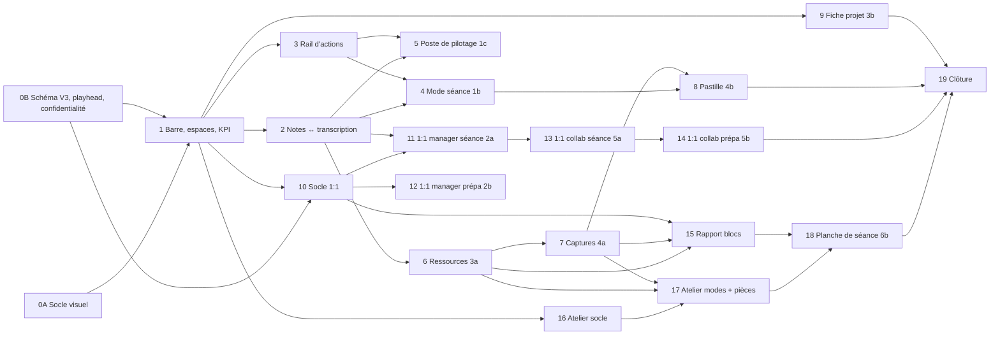

# Refonte de l'écran de réunion — plan directeur par lots

> **Pour les sessions d'exécution (Opus) :** ce document est le **programme**. Chaque lot ci-dessous
> devient, à son tour, une session `superpowers:brainstorming` (courte, les décisions sont déjà prises
> ici) → `superpowers:writing-plans` → `superpowers:subagent-driven-development`, sur sa propre
> branche, avec sa propre PR. Ne jamais attaquer deux lots dans une même PR.

**Date :** 2026-09-07 · **Statut :** **validé** le 2026-09-07 (décisions D0–D11 acceptées par Laurent ; D7 précisée par la référence Teams-Capture, §2.5)
**Spécification source :** `docs/superpowers/specs/refonte-2026-09/specs-one2one.md` (version 1, 6 sept. 2026)
**Écrans de référence (13 captures, à reproduire strictement) :** `docs/superpowers/specs/refonte-2026-09/ecrans/`

| Fichier | Écran | Chantier |
| --- | --- | --- |
| `1a-cockpit.png` | Cockpit — espace Réunion, mode En séance | 1 |
| `1b-mode-seance.png` | Mode séance plein écran, palette sombre | 1 |
| `1c-poste-de-pilotage.png` | Poste de pilotage — nav latérale, tableau d'actions | 1 |
| `2a-1to1-manager-seance.png` | 1:1 côté manager — le fil (séance) | 2 |
| `2b-1to1-manager-preparation.png` | 1:1 côté manager — le suivi (préparation) | 2 |
| `3a-tiroir-ressources.png` | Tiroir Ressources + zone « À l'écran » | 3 |
| `3b-fiche-projet.png` | Fiche projet en panneau latéral | 3 |
| `4a-capture-selecteur.png` | Sélecteur de source de capture + bande de captures | 4 |
| `4b-pastille-flottante.png` | Pastille flottante au-dessus de Teams | 4 |
| `5a-1to1-collaborateur-seance.png` | 1:1 côté collaborateur — mon 1:1 | 5 |
| `5b-1to1-collaborateur-preparation.png` | 1:1 côté collaborateur — préparation en 2 minutes | 5 |
| `6a-atelier-planche.png` | Atelier — planche plein cadre | 6 |
| `6b-atelier-planche-de-seance.png` | Atelier — planche de séance (sortie chronologique) | 6 |

---

## 1. Lecture des écrans : comment les 13 captures s'articulent dans l'application

La spécification décrit trois « restructurations » pour le chantier 1 (1a, 1b, 1c) et deux écrans par
type pour les autres chantiers. La consigne est de **reproduire strictement chaque écran**. Voici
l'articulation retenue (à confirmer, cf. D0) :

| Écran | Où il vit dans l'app | Déclencheur |
| --- | --- | --- |
| **1a Cockpit** | Espace `Réunion`, mode **En séance**, fenêtre normale. C'est l'écran par défaut de tout type multi-participants (Globale, Projet, Architecture). | Ouverture d'une réunion, ou clic `En séance`. |
| **1b Mode séance** | Même espace `Réunion`, **plein écran** (bouton dans la pilule audio ou `⌃⌘F`), palette `dark/*`. | Depuis 1a en mode En séance. `Esc` ramène à 1a. |
| **1c Poste de pilotage** | Espace `Réunion`, mode **Relire** (résumé + décisions + tableau d'actions, transcription repliée, cf. spec §2.2). La nav latérale 190 px remplace la barre d'espaces dans ce mode. | Clic `Relire`, ou automatiquement après génération du rapport. |
| **2a / 2b** | Type `1:1` (côté manager) : 2b s'ouvre en mode **Préparer**, 2a en mode **En séance** (spec §3). | Sélecteur de mode. |
| **3a** | Tiroir **par-dessus** 1a (espace `Ressources`, bouton `Capture`, dépôt, `⌘⇧V`). | Cf. spec §4.1. |
| **3b** | Panneau **par-dessus** 1a/1c (segment projet du fil d'Ariane). | Cf. spec §4.3. |
| **4a** | Popover sur 1a + bande de captures en pied de colonne principale. | Bouton `Capture`, `⌘⇧S`. |
| **4b** | Fenêtre flottante indépendante, active en mode 1b (et en 1a si l'enregistrement tourne). | Automatique en mode séance. |
| **5a / 5b** | Type `1:1 Manager` (côté collaborateur, `myRole = collaborator`) : 5b en **Préparer**, 5a en **En séance**. | Sélecteur de mode. |
| **6a / 6b** | Type `Atelier` : 6a en **En séance**, 6b en **Relire**. | Sélecteur de mode. |

Le **mode Préparer** des types multi-participants (spec §2.2 : actions reportées + derniers points +
alertes, rail réduit) n'a pas de capture dédiée : il se construit avec les composants de 1a et 1c,
sans invention visuelle.

---

## 2. Écart entre la spécification et le code existant

Inventaire réalisé le 2026-09-07 sur `master` (commit `a3c44f2`). Détail dans les fichiers cités.

### 2.1 Structure de l'écran

| Spécification | Existant | Écart |
| --- | --- | --- |
| 3 espaces + 3 modes temporels | 7 onglets `MeetingView.MeetingSection` (`MeetingView.swift:175`), `visibleSections(for:)` ne distingue que `.note` | Réécriture de la navigation. `MeetingView` fait 2 948 lignes, ~55 `@State`, aucun view-model. |
| Barre du haut une ligne, 38 px | `MeetingTopChromeBar` (602 l.) sur deux lignes (fil d'Ariane + `MeetingTagEditor`) | Fusion, suppression de la ligne 2. |
| Bandeau 4 KPI | Cartes de dashboard (`OverviewDashboard`, grille personnalisable persistée dans `AppSettings.rightSidebarLayoutJSON`) | Le dashboard personnalisable disparaît de l'espace Réunion (cf. D8). |
| Rail d'actions 330 px permanent, 3 vues | `ActionsPanel` (666 l.) carte de dashboard, 5 vues (`ActionsViewMode` déclaré dans `ActionsPanel.swift:5`) | Kanban et Post-it retirés du contexte réunion ; enum à déplacer. |
| Assistant = surface + `⌘K` | Onglet `Chat` (`MeetingChatView`, éphémère) ; **aucun `⌘K` dans l'app** | Barre d'invocation + palette. |
| Pas d'onglet vide | `ContentUnavailableView` sur Documents | Invites actives partout. |

### 2.2 Données

| Spécification | Existant | Écart |
| --- | --- | --- |
| `Note {t, kind, visibility, authorId, links}` | `Meeting.liveNotes: String` (markdown libre) ; **aucun timecode, aucun kind, aucune visibilité** | Nouveau modèle `MeetingNote` (D1). |
| `Action.sourceRef {kind,id,t}`, `priority`, `status`, `effortMin`, `deferralCount`, `carriedFromMeetingId` | `ActionTask` : `isUrgent/isImportant`, `isCompleted`, `pomodoros`, `engagementSettledAt` ; pas de source, pas de statut `dropped` | Colonnes à ajouter, statut calculé à conserver en cohérence avec `isCompleted`. |
| `TranscriptSegment {t, tEnd, speakerId, confidence}` | `TranscriptSegment` (`startSeconds`, `endSeconds`, `speakerID`, `speaker`) | Quasi conforme. |
| Axe temps commun (`t` depuis le début d'enregistrement) | `AudioPlayerService` instancié **deux fois** (`MeetingView:83`, `AudioWaveformEditor:23`), aucune tête de lecture partagée ; `SlideCapture.capturedAt: Date` sans lien audio ; pas de `recordingStartedAt` sur `Meeting` | Service `MeetingPlayhead` + horloge d'enregistrement. |
| `Attachment {scope, kind file/link/capture, mime, bytes, addedBy, pinnedAtT, extractedText, citations}` | `MeetingAttachment` (`fileName, filePath, bookmarkData, kind: String, extractedText`) — **référencé, pas copié** ; `ProjectAttachment` séparé, copié, non indexé RAG | Extension + politique unique « copie, jamais référence » (spec §8, D5). |
| `Capture {source, trigger, t, ocrText, thumbUrl}` | `SlideCapture` (`imagePath, ocrText, capturedAt`), module `Services/SlideCapture/` (empreinte 32×32, polling 500 ms, `WindowCatalog`, OCR Vision) | Ajout `t`, `source`, `trigger` ; réutilisation intégrale du moteur. |
| `Board` | Rien. Aucun canvas interactif dans le code. Seul précédent de dessin : `Vendor/BeautifulMermaidSwift` (CoreGraphics + elk) et `MermaidRenderer` (WKWebView hors écran, `mermaid.min.js` embarqué 3,5 Mo) | Nouveau sous-système (D6). |
| `ProjectCard {status, budget, scopeText, tags, milestones, risks, contacts}` | `Project` : `status` Green/Yellow/Red, `budgetCons/budgetInit/budgetRev`, `riskLevel/riskDescription/keyPoints`, `ProjectAlert` ; **pas de jalons, pas d'interlocuteurs, pas de tags projet** | `ProjectMilestone`, `ProjectContact`, `scopeText`, `tags`. |
| `OneOnOneThread`, `Commitment`, `AgendaItem`, `moodHistory`, `objectives`, `recurringTopics` | `EngagementLedger` (dérivation sur `DecisionEntry.settledAt` + `ActionTask.engagementSettledAt`), `ManagerReportItem` (agenda côté manager uniquement, avec provenance UTF-16), cases à cocher markdown dans `prepNotes` (`PrepChecklist`, `PrepCarryoverService`), `OneToOneCadence/OneToOneRhythm` ; **ni humeur, ni objectifs, ni visibilité** | Nouveau domaine 1:1 (D3). |
| `MeetingType` avec `workshop` | `MeetingKind` : `global, project, oneToOne, work("Architecture"), manager, note` — valeurs brutes persistées | Ajout `workshop` ; conserver les raws. |
| `isExportable(item, audience)` unique | **Aucun filtre** ; `ExportService.MarkdownOptions.shareable` inutilisé. Cinq lecteurs indépendants du texte : rapport (`AIReportService`), HTML (`ReportHTMLBuilder`), export, RAG (`RAGIndexer`), contexte chatbot (`ChatbotView.buildDatabaseContext`) | Service `ConfidentialityFilter` + câblage des 5 lecteurs. |

### 2.3 Rendu

| Spécification | Existant | Écart |
| --- | --- | --- |
| IBM Plex Sans / Plex Mono, tailles 9,5–14 px | **Aucune fonte embarquée**, tout en `Font.system` | Embarquer Plex (D2). |
| Jetons `#f7f4ee`, `#2563d9`, `#b8544c`… | `AppTheme` (`verbe #0A6CFF`, `urgenceForte #D9483F`), `MeetingTheme` (`accentOrange`), `FicheTokens` — trois palettes | Nouveau jeu de jetons `One2OneTokens`, les autres restent pour les écrans non refondus. |
| Palette sombre `dark/*` pour 1b | `.preferredColorScheme(.light)` épinglé sur les 3 `WindowGroup` (`OneToOneApp.swift:72/80/88`) | Thème local par environnement, pas via le mode sombre système. |

### 2.4 Points durs identifiés dans le code (à traiter, pas à contourner)

1. `MeetingView.swift` (2 948 l.) porte orchestration rapport, transcription, participants, locuteurs et navigation. Le lot 0A en extrait l'état d'écran ; les lots suivants n'ajoutent **rien** dans ce fichier.
2. `adoptPendingLiveNotes()` / `discardEmptyNoteIfNeeded()` (`MeetingView:384–515`) dépendent de l'ordre de démontage SwiftUI. Toute nouvelle colonne de notes doit rester hors de ce chemin (le markdown des types `Note` le conserve).
3. `Meeting.textualContent` (`OtherModels.swift:417`) est la liste unique lue par `/cherche` et `NoteFactory.isDiscardableEmptyNote` : chaque nouveau champ texte s'y déclare.
4. `OverviewDashboard.cardScrollMaxHeight = 380` protège d'un `_NSDetectedLayoutRecursion` : les nouvelles dispositions n'imbriquent pas de `ScrollView` non borné.
5. `CurrentSchema = SchemaV2`, `stages: []` : aucune vraie `MigrationStage` n'a encore été écrite. Les lots n'ajoutent que des tables et des colonnes avec valeur par défaut (migration légère).
6. `StorageStatsService`, `OrphanCleanupService`, `BackupService` ne connaissent que les emplacements existants : chaque nouveau dossier de fichiers s'y enregistre.
7. Signature ad hoc (`Scripts/bump-and-build.sh:141`) : l'autorisation Enregistrement d'écran peut sauter à chaque build ; la pastille et le sélecteur doivent survivre à un refus sans dialogue bloquant (spec §5.2).
8. Code mort à retirer en fin de programme : `CollaboratorDetailView` (`DetailsViews.swift:628–1242`), `docs/architecture.md` §5/§8 périmés.

### 2.5 Référence fonctionnelle : le dépôt Teams-Capture

`/Users/laurent.deberti/Documents/dev/perso/Teams-Capture` (Swift 6, macOS 14, `swift test` vert) est
l'implémentation **fonctionnelle et validée à l'usage** de la capture, de la pastille et des jetons.
Le module `Services/SlideCapture/` de OneToOne en est un portage **antérieur** (plan du 2026-09-02) ;
Teams-Capture a évolué depuis (spec `docs/superpowers/specs/2026-09-06-fenetres-capture-par-type-design.md`
de ce dépôt). Règle inchangée : **copier, jamais lier** (pas de dépendance SwiftPM, cf. ADR
`2026-09-02-capture-slides-polling-empreinte.md`), en portant les tests avec le code.

| Élément de Teams-Capture | Fichiers | Repris dans | Ce qu'il apporte |
| --- | --- | --- | --- |
| Jetons §1.2 exacts | `Sources/CaptureDesign/Tokens.swift` | Lot 0A | Table complète, règle « seul ce fichier nomme une couleur », `captureMarker #3d5180`, rayons, largeurs. |
| Typographie Plex | `Sources/CaptureDesign/Typography.swift` + `Tests/CaptureDesignTests` | Lot 0A | `Font.plexSans/plexMono`, `sectionLabel()`, repli système, **piège des noms PostScript abrégés** (`IBMPlexSans-Medm`, `-SmBld`, jamais `-Medium`/`-SemiBold`), test qui vérifie que les 5 noms résolvent, interdiction de `.weight()` par-dessus. |
| Profils de capture par type | `Sources/CaptureCore/MeetingType.swift`, `CaptureSettings.swift` | Lot 7 | `CaptureProfile {sensitivity, detectsAutomatically, periodicCapture}` : Globale/Projet normal auto ; 1:1 et Note faible sans auto ; Architecture élevée ; Atelier élevée + 2 min. Champs non écrasés si réglés à la main (`TunedField`). |
| Coordinateur | `Sources/CaptureCore/CaptureCoordinator.swift` + `Tests/CaptureCoreTests/CaptureCoordinatorTests.swift` (785 l.) | Lot 7 | `detectsAutomatically`, `periodicCapture` (l'échéance **arme**, l'écriture attend un tick stable), `captureNow()` + `SlideDetector.acknowledge` (évite le doublon après capture manuelle), `CapturedSlide {id, t, trigger automatic/manual/periodic, url, thumbnail 264 px}`, horloge injectée `now`, `startedAt` conservé à travers stop/start, revérification de session après chaque `await`. |
| Contrôleur de session | `Sources/CaptureCore/SessionController.swift` + tests (380 l.) | Lot 7 | Gardes de démarrage, sélection `nil` = no-op, `primaryAction` unique pour toutes les surfaces, `SystemEffects` injectable. |
| Sélecteur de source, barre du haut, rail, bandeau | `Sources/TeamsCapture/Cockpit/{SourcePopover,TopBar,CaptureRail,IndicatorStrip,SlideAreaCard}.swift` | Lot 7 | Vues déjà aux jetons de la spec : à réécrire sur les modèles OneToOne mais à copier pour la mise en page, `PrimaryButtonStyle`, libellés. |
| Pastille flottante | `Sources/TeamsCapture/Pill/{PillPanelController,FloatingPill}.swift`, `ScreenCorner` | Lot 8 | `NSPanel` `.borderless + .nonactivatingPanel`, `.floating`, `collectionBehavior [.canJoinAllSpaces, .fullScreenAuxiliary]`, magnétisation aux coins par débounce 250 ms sur `didMoveNotification`, coin persisté (pas la position), **un seul panneau agrandi** pour la confirmation 4 s (`pillExpandedHeight`), état porté par `@Observable` + `withObservationTracking` réarmé (fonctionne fenêtre principale fermée), point pulsant réarmé sur chaque transition, `TimelineView` pour le chrono. |
| Raccourci global | `Sources/TeamsCapture/GlobalHotKey.swift` | Lot 8 | Même approche Carbon que `GlobalHotkeyService` de OneToOne ; à **réutiliser** le service OneToOne, en reprenant deux leçons : retour `nil` si la combinaison est détenue par une autre app (à afficher dans les réglages), registre des closures sans retenir l'instance. |
| Pièges documentés | `One2One-specs.md` (22 défauts corrigés, §3–§11), `docs/verification-ecran.md` | Lots 7, 8 | Dérive lente, tick en vol après clôture, message d'erreur jamais effacé, contrôle sans effet, menu de barre figé ; checklist de recette à l'écran. |

Ce qui reste propre à OneToOne et n'existe pas dans Teams-Capture : le lien `t` ↔ audio (`MeetingPlayhead`),
la persistance `SlideCapture` en base, l'OCR, l'insertion dans les notes, `✎ Note` et
`＋ Action depuis la capture` sur la pastille (volontairement absents de Teams-Capture), Zoom.

---

## 3. Modèle cible : correspondance spec → Swift

Conventions du dépôt conservées : énums persistées en `…Raw: String` + wrapper calculé, `stableID: UUID?` + `ensuredStableID`, relations `.cascade` depuis `Meeting`.

| Entité spec | Type Swift | Décision |
| --- | --- | --- |
| `Meeting.mode` | **Non persisté** : `MeetingScreenModel.mode` (`prepare/live/review`), mémorisé par réunion dans `UserDefaults` | Le mode est un état d'écran, pas une donnée. |
| `Meeting.ref` | Déjà dans le titre `[P25_110]` ; pas de colonne | Conforme à la spec §2.1. |
| `MeetingType.workshop` | `MeetingKind.workshop = "workshop"`, label « Atelier » | Lot 16. |
| `Participant` | `Collaborator` + `Meeting.participantStatuses` + `AvatarPalette` ; `isSpeaker` = cluster résolu dans `speakerAssignmentsJSON` | Pas de nouveau modèle. |
| `Note` | `@Model MeetingNote { stableID, t: Double, text, kindRaw, visibilityRaw, authorSideRaw, sourceKindRaw?, sourceStableID?, sourceT?, orderIndex, createdAt, meeting }` | D1. |
| `Action` | `ActionTask` + `priorityRaw` (`normal/urgent`, alimenté depuis `isUrgent`), `statusRaw` (`open/done/dropped`, synchronisé avec `isCompleted`), `effortMinutes: Int?`, `sourceKindRaw?/sourceStableID?/sourceT?`, `deferralCount: Int = 0`, `carriedFromMeeting: Meeting?` | Lot 0B. |
| `Ref` | `struct SourceRef: Codable { kind: transcript/note/capture/board, stableID, t }` + trois colonnes plates sur les porteurs | Requêtable, pas de JSON. |
| `Attachment` | `MeetingAttachment` + `scopeRaw` (`meeting/project`), `kind` étendu (`link`, `capture`), `mimeType`, `byteCount`, `addedByName`, `pinnedAtT: Double?`, `citationCount` ; `presentState` = état runtime | Lot 6. |
| `Capture` | `SlideCapture` + `t: Double?`, `sourceRaw` (`teams/zoom/screen/region`), `triggerRaw` (`manual/share_change/interval`) | Lot 7. |
| `Board` | `@Model Board { stableID, index, title, modeRaw, t, authorNames, scenePath, thumbPath, updatedAt, meeting }` — scène JSON et vignette **sur disque** dans `recordings/<uuid>/boards/` | D5, lot 16. |
| `ProjectCard` | `Project` + `scopeText`, `tagsJSON` ; `@Model ProjectMilestone { label, dueAt?, stateRaw, order, project }`, `@Model ProjectContact { name, role, order, project }` ; risques = `ProjectAlert` existants | Lot 9. |
| `OneOnOneThread` | `@Model OneOnOneThread { stableID, collaborator, myRoleRaw, cadenceDays (miroir de `Collaborator.oneToOneCadence`), createdAt }` ; `meetings` = requête sur `Meeting.participants` + kind | Lot 10. |
| `Commitment` | `@Model Commitment { stableID, thread, text, ownerSideRaw, dueAt?, stateRaw, promisedAt, promisedInMeeting?, deferralCount, visibilityRaw, linkedAction?, linkedDecisionIndex? }` | Remplace la dérivation `EngagementLedger` pour les nouveaux fils ; l'ancien reste lu pour l'historique. |
| `AgendaItem` | `@Model OneOnOneAgendaItem { stableID, thread, text, addedBySideRaw, order, stateRaw, visibilityRaw, meeting?, deferredToMeeting? }` | `ManagerReportItem` n'est **pas** fusionné (provenance UTF-16 et flux CR manager conservés). |
| `moodHistory` | `@Model MoodEntry { thread, meeting, value: Int (1…5), recordedAt }` | Saisie humaine uniquement, jamais par le LLM. |
| `objectives` | `@Model OneOnOneObjective { thread, label, progress: Int, reviewAt?, order }` | Lot 10. |
| `recurringTopics` | **Calculé** depuis `MeetingTag` des réunions du fil + mots-clés des `OneOnOneAgendaItem` (`RecurringTopicsBuilder`, pur) | Pas de table. |

Une seule montée de schéma : **`SchemaV3`** déclarée au lot 0B avec toutes les tables ci-dessus (tables vides = coût nul). Les lots suivants ajoutent au besoin des colonnes à valeur par défaut, sans nouvelle version.

---

## 4. Décisions structurantes à valider avant le lot 0

Chaque décision a une recommandation. Une décision non tranchée bloque le lot indiqué.

| # | Question | Options | Recommandation | Bloque |
| --- | --- | --- | --- | --- |
| **D0** | Articulation 1a/1b/1c | (a) 1c = disposition du mode Relire ; (b) 1c = quatrième mode « Pilotage » ; (c) 1c = préférence utilisateur remplaçant 1a | **(a)** : le contenu de 1c (EN UNE PHRASE, DÉCISIONS PRISES, tableau d'actions, transcription absente) est exactement la définition du mode Relire dans la spec §2.2. | Lot 1 |
| **D1** | Stockage des notes horodatées | (a) `MeetingNote` en base, une ligne par note ; (b) markdown `liveNotes` enrichi de marqueurs `[04:12]` parsés | **(a)** : la confidentialité par ligne, les kinds, `sourceRef` et `isExportable` exigent des lignes adressables. Le module `Markdown/` reste intact pour le type `Note` et pour le rapport. `liveNotes` existant est importé en une note `t=0, kind=note` à la première ouverture d'une réunion migrée. | Lot 0B |
| **D2** | Fontes IBM Plex | (a) embarquer Plex Sans 400/500/600 + Plex Mono 500/600 (OFL, ~1 Mo, `Resources/Fonts`, `ATSApplicationFontsPath`) ; (b) rester en `Font.system` | **(a)** : la consigne est la reproduction stricte ; repli système si le chargement échoue. Teams-Capture s'appuie sur Plex **installé sur le poste** (vérifié le 6 sept.) ; OneToOne embarque en plus les fichiers pour le bundle `.app`, avec les **mêmes noms PostScript** et la même résolution (`Typography.swift`). | Lot 0A |
| **D3** | Domaine 1:1 | (a) nouvelles entités `OneOnOneThread/Commitment/AgendaItem/MoodEntry/Objective` ; (b) tout mettre en colonnes JSON sur `Collaborator` | **(a)** : `Meeting` et `Collaborator` sont déjà des objets « dieu » (architecture.md §13). Le fil est créé paresseusement au premier 1:1 d'un collaborateur. | Lot 10 |
| **D4** | Rôle collaborateur | (a) `myRole` déduit du type (`1:1` = manager, `1:1 Manager` = collaborateur) ; (b) champ libre sur le fil | **(a)** avec badge obligatoire « Je suis le collaborateur » ; le manager reste résolu par `AppSettings.managerEmail`. | Lot 10 |
| **D5** | Fichiers déposés | (a) copie dans `recordings/<uuid>/documents/` (politique unique « copie, jamais référence », spec §8) ; (b) garder le bookmark actuel | **(a)** ; les `MeetingAttachment` existants sont copiés paresseusement à la première ouverture si la source existe encore, sinon marqués `orphelin`. ADR à écrire. | Lot 6 |
| **D6** | Moteur de planches | (a) Excalidraw embarqué dans un `WKWebView` (MIT, bundle local ~4 Mo, modes Croquis/Schéma/Manuscrit = trois palettes du même moteur, export `.excalidraw`/PNG/SVG natifs) ; (b) moteur natif CoreGraphics/SwiftUI Canvas écrit de zéro ; (c) natif pour Manuscrit + Excalidraw pour Croquis/Schéma | **(a)** : seul choix qui tient les cibles (2 000 objets à 60 fps, undo 100, bibliothèque de formes, connecteurs) dans un délai raisonnable, et il réutilise le précédent `MermaidResourceLocator` (script inliné, aucun CDN). Export `.drawio` reporté hors v1. Derrière un drapeau `workshopEnabled`. | Lot 16 |
| **D7** | Détection « changement de partage » Teams/Zoom | (a) différence d'image via `SlideDetector` (portable, validé 9 h 30 en production) ; (b) API de fenêtre | **(a), confirmé par Laurent** : reprendre le `CaptureCoordinator` de Teams-Capture (§2.5), où « à chaque changement de partage » = `detectsAutomatically` et « toutes les 2 minutes » = `periodicCapture` armant l'écriture au prochain tick stable. Le titre de fenêtre (`TeamsCallObservation`) sert seulement à détecter la réunion active. | Lot 7 |
| **D8** | Dashboard personnalisable actuel (`OverviewDashboard`, `PanelLayoutEntry`) | (a) retiré de l'espace Réunion, code supprimé au lot 19 ; (b) conservé comme quatrième espace | **(a)** : la spec impose « trois espaces, pas sept onglets » ; les KPI reprennent l'information des cartes Présence/Actions/Résumé. | Lot 1 |
| **D9** | Niveau `escalated` | (a) exclu du récap collaborateur, inclus dans un export « Escalade » explicite, sans trace d'accès (app mono-utilisateur) ; (b) hors v1 | **(a)**, confirmation à la première utilisation par réunion comme spécifié. | Lot 10 |
| **D10** | Vues Calendrier/Eisenhower dans le rail 330 px | (a) conservées dans le rail (comme sur `1a-cockpit.png`) en rendu compact ; (b) déportées | **(a)** : la capture fait foi. | Lot 3 |
| **D11** | Édition simultanée des planches | (a) mono-utilisateur, pilule de présence masquée ; (b) transport local | **(a)** ; la spec le prévoit (« sinon masquée »). | Lot 16 |

---

## 5. Découpage en lots

Légende taille : **S** ≤ 4 tâches · **M** 5–8 · **L** 9–14 · **XL** > 14 tâches de plan. Chaque lot livre : code + tests + `STATUS.md` + capture d'écran comparée à la référence.

### Lot 0A — Socle visuel et état d'écran

- **Écrans :** aucun (invisible), mais préalable de tous.
- **Objectif :** rendre reproductibles les jetons, la typographie, la géométrie de la spec §1.2, et sortir l'état d'écran de `MeetingView`.
- **Périmètre :**
  1. `Views/DesignSystem/One2OneTokens.swift` : **copie** de `Teams-Capture/Sources/CaptureDesign/Tokens.swift` (table §1.2 complète, règle « seul ce fichier nomme une couleur ») complétée des jetons manquants (`dark/*` du mode séance au complet, `dark/accent report #e8b0aa`) et des largeurs fixes (330/320/356/190/52/78/430/396/400).
  2. Typographie : **copie** de `Typography.swift` (`Font.plexSans/plexMono`, `sectionLabel()`, noms PostScript abrégés `IBMPlexSans-Medm`/`-SmBld`) et de son test des 5 noms ; fontes IBM Plex embarquées en plus (`Resources/Fonts/*.ttf`, enregistrement `CTFontManagerRegisterFontsForURL` au lancement ou `ATSApplicationFontsPath`), repli système conservé. Test : les 5 noms résolvent dans le bundle même sans Plex installé.
  3. Primitives : `SectionLabel` (mono 9,5 px, `letter-spacing .07em`), `Pill`, `InvitePill` (`＋ assigner`), `Chip`, `Card`, `TimecodeLabel` (`mm:ss` largeur fixe), `AvatarStack` (19 px, −6 px, max 6 + `+n`), `MonoMeta`, `ProgressBar`, `SegmentedMode`. Un aperçu `#Preview` par primitive.
  4. `One2OneTheme` en `EnvironmentValue` (`.paper` / `.session`) pour la palette sombre de 1b sans toucher au `colorScheme` épinglé.
  5. `MeetingScreenModel` (`@Observable`, `@MainActor`) : `space` (`meeting/report/resources`), `mode` (`prepare/live/review`), brouillon d'action (`newTaskTitle`, `selectedCollaborator`, `dueDate`, `audience`, `urgent`, `important`, `pomodoros`), `showSpeakers`, `follow`. Persistance du dernier `space/mode` par réunion. Les vues existantes le reçoivent par environnement ; **aucun changement visuel** dans ce lot.
- **Fichiers touchés :** `MeetingView.swift` (retrait des `@State` déplacés), `MeetingTopChromeBar`, `OverviewDashboard`, `ActionsPanel` (bindings → modèle), `Info.plist`, `Package.swift` (ressources seulement).
- **Dépendances :** D2.
- **Critères :** build et 1 655 tests inchangés ; contraste ≥ 4,5:1 vérifié par test unitaire sur chaque paire texte/fond < 12 px ; capture avant/après identique.
- **Taille :** L.

### Lot 0B — Socle de données : schéma V3, axe temps, confidentialité

- **Écrans :** aucun.
- **Objectif :** créer une fois toutes les tables, la tête de lecture partagée et le filtre unique de confidentialité.
- **Périmètre :**
  1. `SchemaV3` (`Models/SchemaVersions.swift`) : `MeetingNote`, `Board`, `ProjectMilestone`, `ProjectContact`, `OneOnOneThread`, `Commitment`, `OneOnOneAgendaItem`, `MoodEntry`, `OneOnOneObjective` ; colonnes ajoutées à `ActionTask`, `MeetingAttachment`, `SlideCapture`, `Project`, `Meeting.recordingStartedAt: Date?`. `MigrationPlan` toujours léger. Tests : container V2 → V3 sur un store réel temporaire.
  2. `MeetingKind.workshop` (label « Atelier », symbole), `compatibleTemplates` → `.workshop`.
  3. `Services/Live/MeetingPlayhead.swift` : `@Observable` par réunion, `t`, `duration`, `isPlaying`, `follow`, `seek(to:)`, `marker(at:)`. En enregistrement, `t = now − recordingStartedAt` ; en relecture, source = `AudioPlayerService` unique par réunion (le second de `AudioWaveformEditor` devient un consommateur). Registre `MeetingPlayhead.for(meeting:)`.
  4. `Services/ConfidentialityFilter.swift` : `enum Audience { me, collaborator, manager, projectTeam, hr }`, `static func isExportable(_ item: Confidential, for: Audience) -> Bool`, protocole `Confidential { visibility }` adopté par `MeetingNote`, `Commitment`, `OneOnOneAgendaItem`. Câblage immédiat dans `AIReportService.buildPrompt`, `ReportHTMLBuilder`, `ExportService`, `RAGIndexer` (les notes privées ne sont pas chunkées), `ChatbotView.buildDatabaseContext`, `MeetingChatView`. Test obligatoire (spec chantier 2, critère 1) : une note privée n'apparaît dans aucun des cinq flux.
  5. `MeetingNoteStore` (`enum` de fonctions pures + `@MainActor` d'écriture) : import de `liveNotes` en une note `t=0` à la première ouverture (drapeau `Meeting.notesMigrated`), `textualContent` mis à jour, `NoteFactory.isDiscardableEmptyNote` ajusté.
  6. `SourceRef` (`Codable`) + accesseurs sur `ActionTask`/`MeetingNote`.
- **Dépendances :** D1, D3, D5 (noms de dossiers).
- **Critères :** migration V2→V3 sans perte sur une copie du store de production ; tests de confidentialité rouges avant, verts après.
- **Taille :** L.

### Lot 1 — Chantier 1 socle : barre du haut, trois espaces, modes, bandeau KPI

- **Écrans :** `1a-cockpit.png` (partie haute : barre, espaces, 4 cartes KPI).
- **Objectif :** remplacer les 7 onglets par les 3 espaces et le sélecteur de mode ; le reste de 1a arrive aux lots 2 et 3.
- **Périmètre :**
  1. `MeetingTopChromeBar` réécrit sur une ligne 38 px (spec §2.1) : fil d'Ariane (segment projet bordé `accent/action`, ouvre la fiche au lot 9), titre `flex:1` ellipsis éditable au double-clic, pilule audio `ink/1` (`▶ mm:ss / mm:ss` + marqueur `⌘M` + saisie directe de timecode), menu type (7 types, `+` intégré), menu template, bouton `Rapport ✓ (m:ss)` (`accent/report`), `⋯`. `MeetingTagEditor` passe dans `Détails`.
  2. `MeetingSpacesBar` 34 px : `Réunion · Rapport ✓ · Ressources n doc` (soulignement 2 px `accent/report`), sélecteur `Préparer / En séance / Relire`, date. Compteurs obligatoires.
  3. `MeetingKPIBand` : Présence (pile d'avatars, clic → `ManageParticipantsSheet`), Actions (non assignées en `accent/report`, barre `done`), Décisions (première décision, clic → filtre `kind:decision`), Risques (points par niveau, `ProjectAlert` de la réunion). Compteur 0 = invite textuelle.
  4. Routage des espaces : `Réunion` = nouvelle vue `MeetingSpaceView(mode:)` (contenu provisoire : notes markdown existantes + transcription existante côte à côte, remplacés au lot 2) ; `Rapport` = `reportView` actuel ; `Ressources` = `documentsView` actuel (remplacé au lot 6). Onglets `Vue d'ensemble`, `Préparation`, `Chat` supprimés de la navigation ; leur contenu : préparation → mode Préparer, chat → barre assistant.
  5. Barre d'invocation assistant persistante en pied (`✳ Demander à l'assistant…` + 2 suggestions + `⌘K`) : ouvre un panneau `MeetingAssistantPanel` réutilisant `MeetingChatView` (mode outillage/RAG inchangé). `⌘K` enregistré comme `keyboardShortcut` de scène.
  6. Mode Préparer (types multi-participants) : colonne principale = actions reportées (`carriedFromMeeting` + `PrepCarryoverService`), derniers points (3 dernières réunions du projet), alertes ; rail réduit ; focus composeur de sujet. Réutilise `MeetingPrepTab` pour le brouillon markdown.
  7. `MeetingMenuActions` / `MeetingCommands` : ajout `⌘K`, `⌘M`, conservation des raccourcis existants.
- **Fichiers :** `MeetingTopChromeBar.swift`, `MeetingTabsUnderline.swift` (supprimé), `MeetingView.swift` (routage seulement), nouveaux `Views/Meeting/Spaces/*`.
- **Dépendances :** 0A, 0B, D0, D8.
- **Critères :** spec chantier 1 n° 1 (aucune zone vide sans invite), n° 4 (changement de mode sans perte de saisie : test sur le brouillon d'action et le texte en cours), n° 5 (1 280 px : colonne fluide ≥ 520 px, test de layout par `ViewInspector`-like ou calcul pur des largeurs).
- **Taille :** XL (à couper en 1a « chrome » et 1b « espaces + KPI + assistant » si le plan dépasse 14 tâches).

### Lot 2 — Notes ↔ transcription, frise audio, création d'action depuis une phrase

- **Écrans :** `1a-cockpit.png` (carte centrale « Notes & transcription »).
- **Objectif :** la carte double colonne synchronisée sur l'audio (spec §2.4).
- **Périmètre :**
  1. `TimedNotesColumn` : liste de `MeetingNote` (`timecode | texte`), timecode cliquable → `playhead.seek`, barre gauche 2 px `accent/report` (décision) / `accent/warn` (risque), édition inline (`EditableTextField`), menu de ligne (kind, visibilité, supprimer).
  2. `NoteComposer` : champ au timecode courant, commandes `/action /décision /risque /citer` **toujours visibles** (pilules), `⌘⏎` valide, `⌘⇧N` focus. Parseur pur `NoteCommandParser` (testé) ; `/action` ouvre le composeur d'action du rail prérempli.
  3. `TranscriptColumn` : segments `timecode | Locuteur — texte` sur `surface/alt`, survol → fond `accent/action bg` + rangée `＋ Action · Décision · Citer dans la note` ; `⌘⇧A` sur segment survolé ou sélection ; bascule `Speakers`, bouton `Résumer` (→ `SummaryCard.generate` existant) ; défilement lié `Suivre` / `Reprendre le suivi`.
  4. `ActionFromPhrase` (pur, testé) : nettoyage de la phrase, verbe à l'infinitif si détecté (lexique FR simple), `sourceRef {transcript, id, t}`, responsable = locuteur si résolu.
  5. `AudioTimelineStrip` 22 px : onde (`AudioWaveform` existant), tête 2 px, marqueurs ronds (note) / losanges (décision) / carrés (capture, lot 7), clic et glisser.
  6. Transcription live (`LiveTranscriptionService`) affichée dans la même colonne pendant l'enregistrement.
- **Fichiers :** nouveaux `Views/Meeting/Spaces/Notes/*`, `Views/Meeting/Spaces/Transcript/*`, `Services/ActionFromPhrase.swift`, `Services/NoteCommandParser.swift` ; `MeetingView.transcriptView` retiré au profit de la colonne (les fonctions de diarisation/locuteurs déménagent dans `TranscriptSpeakerTools`).
- **Dépendances :** Lot 1.
- **Critères :** spec chantier 1 n° 2 (un clic, `sourceRef` conservé, `mm:ss ↗` replace à ± 1 s : test sur `MeetingPlayhead`).
- **Taille :** L.

### Lot 3 — Rail d'actions 330 px permanent

- **Écrans :** `1a-cockpit.png` (colonne droite).
- **Objectif :** spec §2.5.
- **Périmètre :**
  1. `ActionsRail` : onglets `Actions n / Risques n / Historique`, vues `Liste · Calendrier · Eisenhower` (rendus compacts de `CalendarBoard`/`EisenhowerBoard` existants) ; `ActionsViewMode` déplacé dans `Models/ActionsViewMode.swift`, cas `kanban`/`sticky` retirés du contexte réunion (conservés dans `ActionsListView`).
  2. Groupes `À ASSIGNER` (barre `accent/report`) → `MES ACTIONS` → `REPORTÉES DU <date>` (une ligne).
  3. `ActionCard` : titre 2 lignes, pilules `InvitePill` (`＋ assigner`, `＋ échéance`) → sélecteurs inline (`OwnerPickerMenu` réutilisé, `DatePicker` compact), `Tab` passe au champ suivant ; pilule `◫ mm:ss` si source capture.
  4. `OwnerSuggestion` (pur, testé) : locuteur source → dernier porteur de même préfixe → participant unique restant.
  5. Composeur en pied : champ + `Moi · Demain · ! · 30min`, `⌘⏎` crée sans perdre le focus ; animation d'insertion 150 ms en tête.
  6. Onglet Risques = `ProjectAlert` de la réunion + ajout ; Historique = actions closes/déplacées de la réunion.
- **Dépendances :** Lot 1 ; Lot 2 pour la création depuis phrase.
- **Critères :** spec chantier 1 n° 3 (assignation sans quitter le rail ni modale).
- **Taille :** M.

### Lot 4 — Mode séance plein écran (1b)

- **Écrans :** `1b-mode-seance.png`.
- **Objectif :** spec §2.6.
- **Périmètre :**
  1. `SessionFullscreenView` : thème `.session`, grille `78 | 1fr | 400`, barre d'état (point rouge, `En séance · réf`, temps, avatars, locuteur courant depuis la diarisation live, `Clore la séance`).
  2. `TimeRailColumn` : axe 3 px, portion écoulée `#e04b3f`, marqueurs rond/carré, position courante, libellés à 30 px ; bouton `Marquer ⌘M`.
  3. Colonne notes = `TimedNotesColumn` en thème sombre + composeur (`/action /décision /risque /citer`), mention `@Prénom`.
  4. Colonne droite : transcription live `Suivre`, panneau `ASSISTANT` (question, réponse, puces de sources horodatées cliquables), champ `Poser une question…`, bloc `CAPTURÉ CETTE SÉANCE` (actions / décision / risques).
  5. Bandeau `EN ATTENTE — n actions sans responsable` + `Assigner maintenant` → `AssignmentQueue` (responsable → échéance → suivante, 3 clics, clavier).
  6. Entrée : bouton plein écran de la pilule audio + `⌃⌘F` ; sortie `Esc` avec confirmation si enregistrement en cours.
- **Dépendances :** Lots 2, 3.
- **Critères :** aucun chrome hors barre d'état ; `Esc` confirmé ; test de la file d'assignation (pur).
- **Taille :** M.

### Lot 5 — Poste de pilotage = mode Relire (1c)

- **Écrans :** `1c-poste-de-pilotage.png`.
- **Objectif :** spec §2.7.
- **Périmètre :**
  1. `ReviewSidebarNav` 190 px : `Synthèse · Notes n · Transcription mm′ · Actions n · Rapport ✓ · Documents ＋ · Assistant` (entrée active = carte blanche ombre 1 px), bloc projet (3 dernières réunions cliquables), bloc `ALERTES · n`.
  2. En-tête : titre + `ref · type · date · durée · n participants`, boutons `Capture`, `Exporter ⌄` (menus d'export existants), `Rapport ✓`.
  3. Carte `EN UNE PHRASE` (`Meeting.shortSummary`, badge `généré`, tags `MeetingTag`), carte `DÉCISIONS PRISES · n` (timecode + texte + porteur).
  4. `ActionsTable` : colonnes `20 | 1fr | 108 | 92 | 62 | 76 | 30`, édition inline par cellule, `↑↓` navigue, `Espace` coche, `⌥↑↓` réordonne (`sortOrder`), source `mm:ss ↗` → playhead, pied composeur + `n autres · tout afficher`.
  5. Frise audio pleine largeur en pied d'écran avec étiquettes (`04:12`, `DÉCISION`, `15:20`) et `✂ Éditer` → `AudioEditorSheet` existant.
  6. Passage automatique en Relire après génération du rapport (remplace `activeSection = .report`) ; focus = champ d'assignation de la première action non assignée.
- **Dépendances :** Lots 2, 3.
- **Critères :** navigation clavier complète du tableau (test des commandes pures de réordonnancement).
- **Taille :** M.

### Lot 6 — Ressources en séance : tiroir, « À l'écran », épinglage

- **Écrans :** `3a-tiroir-ressources.png`.
- **Objectif :** spec §4.1–4.2.
- **Périmètre :**
  1. Politique de stockage (D5) : `AttachmentImporter.Bucket.meetingDocuments(uuid)` ; copie systématique ; `MeetingAttachment` étendu ; `StorageStatsService`, `OrphanCleanupService`, `BackupService` mis à jour ; ADR `docs/adr/<date>-pieces-copiees-jamais-referencees.md`.
  2. Kind `link` (URL collée, `⌘⇧V`, favicon/titre récupérés hors ligne = domaine seulement), `capture` (pont vers `SlideCapture`).
  3. `ResourcesDrawer` 396 px superposé (colonne principale interactive) : en-tête compteurs `n séance / n projet` + `＋ Importer`, filtres `Cette séance · Le projet · Captures · Liens`, vignettes (icône 34×40 typée, nom, `Ajouté par · hh:mm · poids`, `À l'écran/Présenter · Citer · Envoyer`), zone de dépôt permanente, pied `À L'ENVOI DU RAPPORT` (3 cases, 2 cochées par défaut).
  4. Ouverture : espace `Ressources`, bouton `Capture`, dépôt n'importe où (`onDrop` au niveau de `MeetingView`), `⌘⇧V`.
  5. `OnScreenCard` : document + page courante (aperçu Quick Look / `PDFKit` / image), `Annoter`, `Épingler à mm:ss`, `Arrêter le partage` ; légende **sous** l'aperçu ; pilule barre du haut `● Partage actif · n voient` (n = participants présents). Annotation = calque simple (rectangle, flèche, texte) enregistré comme `SlideCapture` dérivée.
  6. Épinglage : `pinnedAtT`, marqueur sur la frise, puce `◫ nom · p.n` insérée dans la note courante, bande `ÉPINGLÉ DANS LA SÉANCE`.
  7. `Citer` = insertion d'une puce dans la note ; `Envoyer` = partage macOS (`NSSharingServicePicker`).
  8. Espace `Ressources` sans tiroir = même contenu en pleine largeur (« jamais un écran vide »).
- **Dépendances :** Lots 1, 2.
- **Critères :** spec chantier 3 n° 1 (dépôt sans changement d'écran ni perte de focus : test sur `MeetingScreenModel`), n° 2, n° 3 (retrouvable par timecode, cité dans le rapport → lot 15 pour le bloc rapport).
- **Taille :** L.

### Lot 7 — Captures Teams / Zoom : sélecteur, état visible, bande

- **Écrans :** `4a-capture-selecteur.png`.
- **Objectif :** spec §5.1–5.3. **Référence : Teams-Capture (§2.5)** — porter les évolutions de `CaptureCore` dans `Services/SlideCapture/` **avec leurs tests**, puis réécrire les vues sur les modèles OneToOne.
- **Périmètre :**
  0. Portage des deltas `CaptureCore` → `Services/SlideCapture/` : `CaptureProfile` par `MeetingKind` (table de `MeetingType.swift`, `hint` affiché), `CaptureSettings.detectsAutomatically/periodicCapture`, `SlideDetector.acknowledge`, `captureNow()`, `CapturedSlide {t, trigger}` avec horloge injectée, `TunedField` ; tests `CaptureCoordinatorTests`/`SessionControllerTests`/`SlideDetectorTests` transposés (preuve par mutation sur la dérive lente et le tick en vol, comme dans `One2One-specs.md` §12).
  1. `CaptureSourceCatalog` : sources `Teams · Zoom · Écran entier · Zone à la souris` construites depuis `WindowCatalog` + `TeamsCallMonitor` (état « Réunion · partage de X en cours » = fenêtre Teams active + `SlideDetector` en mouvement) ; Zoom détecté par bundle `us.zoom.xos`.
  2. `CaptureSourcePopover` 346 px : reprise de `SourcePopover.swift` (liste vignette 44×30, libellé, sous-titre, point `accent/ok` ; bascules « à chaque changement de partage » = `detectsAutomatically`, défaut selon le profil du type, indisponible si source inactive avec explication ; « toutes les 2 minutes » = `periodicCapture` ; mention de confiance ; `Capturer maintenant`). Première fois via `⌘⇧S`, ensuite `⌘⇧S` capture directement.
  3. `ScreenCaptureService` : `trigger` (`manual/share_change/interval` ↔ `manual/automatic/periodic`), `source`, `t` depuis `MeetingPlayhead` (et non depuis `startedAt` de la session : l'axe de référence est l'audio) ; échec (fenêtre fermée, refus TCC) → état `sourceLost` sans dialogue ; message d'erreur remis à zéro sur tous les chemins de succès (piège 14).
  4. Barre du haut : pilule `● Capture · Teams n ⌄` (`accent/ok` bordé), `Source perdue` (`accent/warn`) avec lien de reconfiguration ; bouton neutre `Capture` sinon.
  5. Frise : marqueur carré 12 px `#3d5180`, dernier en `accent/action`, légende `■ = capture`.
  6. `CapturesStrip` en pied de colonne : reprise de `CaptureRail.swift` (vignettes 132×76 depuis `thumbnail` en mémoire, légende `mm:ss · auto|⌘⇧S|2 min` selon `trigger`, dernière tuile = capture manuelle, invites de rail vide par type), colonne d'état (texte extrait, timecode, `Joindre au rapport`).
  7. Carte de capture dans une note (56×36 + titre + 1re ligne OCR + `Agrandir`) ; action issue d'une capture = pilule `◫ mm:ss`. OCR indexé (`rebuildAttachmentText` existant) et cherchable.
- **Dépendances :** Lots 2, 6 ; D7.
- **Critères :** spec chantier 4 n° 1, 3, 4. Tests sans ScreenCaptureKit via `FrameSource`. Recette à l'écran selon `Teams-Capture/docs/verification-ecran.md`.
- **Taille :** L (le portage des tests compte).

### Lot 8 — Pastille flottante (4b)

- **Écrans :** `4b-pastille-flottante.png`.
- **Objectif :** spec §5.4. **Référence : Teams-Capture `Pill/` (§2.5)**, fonctionnelle par-dessus Teams en plein écran.
- **Périmètre :**
  1. `SessionPillPanelController` + `FloatingPill` : **copie** de `PillPanelController.swift` / `FloatingPill.swift` / `ScreenCorner` (panel `.borderless + .nonactivatingPanel`, `.floating`, `collectionBehavior [.canJoinAllSpaces, .fullScreenAuxiliary]`, `isMovableByWindowBackground`, magnétisation par débounce, coin persisté dans `AppSettings`, un seul panneau agrandi pour la confirmation, observation par `withObservationTracking` réarmé), adaptée à `MeetingPlayhead` et `ScreenCaptureService`.
  2. Contenu : point rouge pulsant (réarmé à chaque transition), temps mono via `TimelineView` (playhead), `◫ Capturer` (`accent/action`), `✎ Note`, compteur de captures.
  3. `ActiveMeetingRegistry` : notion de « réunion active » (celle qui enregistre, sinon la dernière ouverte en mode séance), exposée hors hiérarchie SwiftUI via `OneToOneApp.sharedContainer`.
  4. Raccourcis globaux `⌘⇧S` / `⌘⇧N` via `GlobalHotkeyService` (Carbon), actifs sans focus ; échec d'enregistrement (combinaison détenue par une autre app) remonté dans les réglages, jamais silencieux ; `⌘⇧N` ouvre un mini-champ de note dans la pastille au timecode courant.
  5. Mini-panneau de confirmation 186 px pendant 4 s (`CAPTURÉ · mm:ss`, vignette, 1re ligne OCR, `＋ Action depuis la capture`) ; la vignette « glisse » dans les notes (insertion `MeetingNote` avec `sourceRef capture`).
  6. Affichage automatique en mode 1b ; masquage à la clôture.
- **Dépendances :** Lots 4, 7.
- **Critères :** spec chantier 4 n° 2 (aucun retour dans l'app). Recette manuelle sur Teams en plein écran (documentée dans `STATUS.md`, checklist `verification-ecran.md`).
- **Taille :** S (le gros du code existe et fonctionne).

### Lot 9 — Fiche projet en panneau (3b)

- **Écrans :** `3b-fiche-projet.png`.
- **Objectif :** spec §4.3.
- **Périmètre :**
  1. Modèle : `ProjectMilestone`, `ProjectContact` (créés au lot 0B), `Project.scopeText`, `Project.tagsJSON` ; mapping du statut Green/Yellow/Red ↔ `ok/watch/risk` ; budget = `budgetCons / (budgetRev ?? budgetInit)`.
  2. `ProjectCardPanel` 430 px glissant depuis la droite (ombre `-8px 0 24px rgba(0,0,0,.07)`, colonne principale à 55 % d'opacité, `Esc` ferme) : en-tête (`FICHE PROJET`, nom, `ref · n réunions · dernière mise à jour <quand> par <qui>`, bascule `Édition`, `✕`), statut, budget (couleur par ratio), jalons (ligne d'ajout inline `Nouveau jalon… date · statut`), périmètre & contexte + tags `＋`, risques (`ProjectAlert`) + `＋ Ajouter un risque`, interlocuteurs + `＋ Ajouter`.
  3. Déclencheur : segment projet du fil d'Ariane (lot 1) ; aussi depuis 1c (bloc projet).
  4. `ProjectCardSuggestions` : l'assistant déduit des mises à jour (budget, statut de jalon) depuis notes + décisions de la séance via `AIClient` (JSON strict) ; encart `L'assistant propose n mises à jour`, `Revoir` → diff champ par champ, acceptation individuelle ; **jamais d'écriture automatique** (test : le modèle n'est pas modifié tant que l'utilisateur n'accepte pas).
  5. Enregistrement optimiste avec `Annuler` pendant 5 s (`UndoBanner`).
  6. Reprise en préparation : le mode Préparer de la prochaine réunion du projet affiche la fiche (jalons proches, risques).
- **Dépendances :** Lot 1.
- **Critères :** spec chantier 3 n° 4.
- **Taille :** M.

### Lot 10 — Socle 1:1 : fil, engagements, ordre du jour, humeur, confidentialité

- **Écrans :** aucun ; préalable des lots 11–14.
- **Objectif :** le domaine 1:1 partagé par les deux rôles (spec §3.1–3.2, §6.1, §1.3).
- **Périmètre :**
  1. `OneOnOneThreadStore` : création paresseuse du fil au premier `.oneToOne`/`.manager` d'un collaborateur ; `myRole` déduit du type (D4) ; `cadenceDays` miroir de `Collaborator.oneToOneCadence` ; liste des réunions du fil.
  2. `Commitment` : création depuis `/engagement` (manager) et `/promesse` (collaborateur → `ownerSide = manager`), depuis une action (`linkedAction`) ou une décision ; états `open/kept/missed` ; `deferralCount` ; `CommitmentLedger` (pur) : tenus depuis le dernier 1:1, en retard, taux `kept / (kept + missed)`. Migration douce : les engagements de `EngagementLedger.pending` restent affichés en lecture dans « Historique » ; pas de conversion automatique.
  3. `OneOnOneAgendaItem` : ordre, `addedBySide`, `state todo/done/deferred`, visibilité ; `AgendaCarryover` (pur, testé) : un item non traité migre vers le 1:1 suivant du même fil (`deferredToMeeting`), affiche `→ <date>`.
  4. `MoodEntry` : 5 crans, delta vs précédent, `MoodTrend` (pur) : « en baisse » si moyenne des 2 derniers < moyenne des 3 précédents − 0,5 ; phrase = sujet récurrent le plus cité.
  5. `OneOnOneObjective` : label, progression, date de revue, couleur par seuil (<30 warn, <70 violet, ≥70 ok).
  6. `RecurringTopicsBuilder` (pur) : familles charge/carrière/reconnaissance/formation par lexique FR, comptage sur le fil.
  7. `ReminderRules` (pur, testé) : « À ne pas oublier » dans l'ordre (1) engagement manager en retard, (2) sujet ≥ 3 fois sans décision, (3) réussite récente non reconnue (action close du collaborateur non citée dans un feedback).
  8. Confidentialité par ligne : `visibility` sur `MeetingNote`/`Commitment`/`AgendaItem`, défaut par rôle (manager `shared`, collaborateur `private`), `escalated` avec confirmation par réunion (D9) ; `/privé` ; compte des lignes exclues.
  9. Jetons `accent/oneonone`, fond de barre `#f4f1f6` pour les deux types 1:1 ; éléments retirés (présence, projets, Kanban/Post-it, capture reléguée dans `⋯`).
  10. Récap : `OneOnOneRecapBuilder` (markdown filtré par `ConfidentialityFilter`), `Envoyer le récap` (Mail via `ExportService`), `Planifier le prochain` (EventKit, date = dernier + cadence), `Verser dans mon dossier annuel` (fichier markdown daté dans `recordings/annual/<année>/`).
- **Dépendances :** Lot 0B, Lot 1 (barre), D3, D4, D9.
- **Critères :** spec chantier 2 n° 1 (test automatisé), n° 4 ; chantier 5 n° 4. Tous les calculs sont des fonctions pures testées avant toute vue.
- **Taille :** XL (couper en 10a « entités + engagements + agenda » et 10b « humeur, objectifs, règles, récap »).

### Lot 11 — 1:1 manager, écran de séance (2a)

- **Écrans :** `2a-1to1-manager-seance.png`.
- **Périmètre :** grille `300 | 1fr | 320` ; colonne gauche (carte personne avec `DERNIER 1:1` / `RYTHME`, ordre du jour co-construit avec avatar 16 px, glisser-réordonner, barré si traité, `→ 18/09` si reporté, composeur ; `RESTÉ EN SUSPENS` ; barre assistant contexte = fil) ; colonne centrale (`① COMMENT ÇA VA` échelle 5 crans + delta ; `② SES SUJETS` notes horodatées avec bloc privé isolé ; `③ FEEDBACK` deux cartes obligatoires pour le badge « complet » ; composeur `/engagement /feedback /privé`) ; colonne droite (`Moi · n` / `<Prénom> · n`, `TENUS DEPUIS LE DERNIER 1:1` avec `✓/✗ n× reporté` y compris manager, `CLÔTURER`). Barre du haut : badge `1:1`, pilule `● Privé — vous deux`, `Rapport 1:1 ✓`.
- **Dépendances :** Lots 2 (colonne de notes), 10.
- **Critères :** spec chantier 2 n° 2, 3.
- **Taille :** M.

### Lot 12 — 1:1 manager, écran de préparation (2b)

- **Écrans :** `2b-1to1-manager-preparation.png`.
- **Périmètre :** en-tête (avatar, `Ingénieur CI/CD · 14ᵉ 1:1 · date`, badges `1:1` `Privé`, `Historique`, `Démarrer l'entretien` → mode En séance + enregistrement) ; `MORAL — 6 DERNIERS 1:1` (histogramme 6 barres, dernière colorée, tendance, phrase) ; `OBJECTIFS S2` (barres, `Revue prévue le`) ; `À NE PAS OUBLIER` (3 règles, `Mettre à l'ordre du jour` crée les `AgendaItem`) ; `Engagements réciproques` tableau `20 | 1fr | 92 | 84 | 96`, filtre `Les deux / Moi / <Prénom>`, pied `8 tenus sur 11 · taux 73 %`, composeur `Nouvel engagement…` ; `SUJETS RÉCURRENTS` chips colorées par famille ; `HISTORIQUE` 4 lignes cliquables ; barre assistant `Qu'a-t-il demandé sans réponse depuis juin ?`.
- **Dépendances :** Lot 10.
- **Critères :** spec chantier 2 n° 3 (le moral saisi en séance alimente immédiatement l'histogramme).
- **Taille :** M.

### Lot 13 — 1:1 collaborateur, écran de séance (5a)

- **Écrans :** `5a-1to1-collaborateur-seance.png`.
- **Périmètre :** grille `308 | 1fr | 356` ; barre : badge `1:1`, pilule `Je suis le collaborateur` (obligatoire), `Avec <Manager> — date`, `Mon récap` ; gauche : `CE QUE JE VEUX DIRE` (numéroté, poignée `⠿`, `● privé`, mention explicite), `MES DEMANDES EN COURS` (statuts `Sans réponse/En attente/Accordé/Refusé`, > 60 jours → `accent/report`, historique court) ; centre : `Privé par défaut`, `Partager la ligne`, sections `CE QU'IL M'A DIT` / `CE QUE J'AI DIT`, bloc `POUR MOI SEUL`, composeur `/promesse /demande /preuve` ; droite : `CE QUE J'AI LIVRÉ` (auto depuis `ActionTask` closes et réunions à rôle actif depuis le 1:1 précédent, bouton `Citer` → note `kind:proof`, bloqué en `warn` avec cause), `CE QU'IL M'A PROMIS` (tri retard décroissant, `Promise le`, `n reports`, `Relancer` → rappel + item d'ordre du jour), `EN SORTANT` (`Envoyer mon récap`, `Verser dans mon dossier annuel`, `n lignes privées seront exclues`).
  - Nouveau : `DeliveredItemsBuilder` (pur, testé) ; `Request` = `OneOnOneAgendaItem` avec `kind request` + statut (colonne ajoutée, valeur par défaut).
- **Dépendances :** Lots 10, 11 (composants partagés).
- **Critères :** spec chantier 5 n° 1, 2, 3.
- **Taille :** M.

### Lot 14 — 1:1 collaborateur, préparation en 2 minutes (5b)

- **Écrans :** `5b-1to1-collaborateur-preparation.png`.
- **Périmètre :** carte étroite (~940 px) : en-tête (`1:1 avec <Manager> — demain 14:00`, `Préparation · 2 min · dernier point le`, badge `Collaborateur`) ; `RESTÉ SANS RÉPONSE` (cases + ancienneté) ; `CE QUE J'AI LIVRÉ DEPUIS` (auto) ; `CE QUE JE VEUX OBTENIR` (cases cochées = à porter, `Ajouter…`) ; `En faire mon ordre du jour` (crée les `AgendaItem` privés dans l'ordre coché), `Partager les sujets à <Manager>` (→ `shared`) ; mention de provenance. Ouverture automatique proposée la veille (notification existante `MeetingNotificationService`, action « Préparer »).
- **Dépendances :** Lot 13.
- **Critères :** spec chantier 5 n° 4.
- **Taille :** S.

### Lot 15 — Rapport : blocs optionnels, chaîne de citation, récaps

- **Écrans :** aucun nouveau ; alimente `Rapport ✓` de tous les écrans.
- **Objectif :** spec §8 (transverse) et les critères « cité dans le rapport ».
- **Périmètre :**
  1. Blocs optionnels de template (`TemplateSection` + variables) : `{{pieces_epinglees}}`, `{{captures_jointes}}`, `{{planches}}`, `{{engagements}}`, `{{fiche_projet.maj}}` ; cases du pied du tiroir (lot 6) et `Joindre au rapport` (lots 7, 18) pilotent l'inclusion.
  2. `ReportHTMLBuilder` : références `mm:ss ↗` cliquables (`onetoone://meeting/<uuid>?t=252`) ouvrant la réunion au bon timecode ; `QuickLaunchURLHandler` étendu.
  3. Filtre de confidentialité appliqué au rapport 1:1 (déjà câblé au lot 0B ; ici : tests de bout en bout par template).
  4. Templates intégrés : révision de `d2_oneToOne`, `d3_manager`, `d9_workshop` (blocs), ajout du template « Escalade » (D9). Seeding idempotent (`BuiltInTemplates.seedIfNeeded`, révision versionnée comme `d2OneToOneRevision`).
  5. Export PDF/mail : pièces épinglées en annexe, accès aux participants (liste d'adresses dans le mail), versement dans les documents du projet (copie `Bucket.project`).
- **Dépendances :** Lots 6, 7, 10 ; 18 pour les planches (variable présente, vide avant).
- **Critères :** spec chantier 3 n° 3, chantier 6 n° 5.
- **Taille :** M.

### Lot 16 — Atelier : socle des planches et mode Croquis (6a partiel)

- **Écrans :** `6a-atelier-planche.png` (sans Schéma/Manuscrit, sans pièces).
- **Objectif :** spec §7.1–7.2, §7.4 ; derrière le drapeau `AppSettings.workshopEnabled`.
- **Périmètre :**
  1. ADR moteur (D6). Bundle Excalidraw construit hors dépôt (`Scripts/build-excalidraw-bundle.sh` documenté, sortie `Resources/Whiteboard/excalidraw.bundle.js` + CSS + fontes, versions épinglées, licence MIT copiée). Chargement par inlining comme `MermaidResourceLocator`.
  2. `WhiteboardWebView` (`WKWebView` + `WKScriptMessageHandler`) : pont `load(scene)`, `onChange` (debounce 400 ms → `scenePath`), `exportPNG/SVG`, `setTool/color/stroke`, `undo/redo`, `zoom`, `fitToScreen` ; aucune requête réseau (CSP `default-src 'none'` vérifié par test de la page).
  3. `Board` sur disque : `recordings/<uuid>/boards/<stableID>.excalidraw.json` + `.png` (vignette régénérée au plus toutes les 5 s) ; enregistrement dans `StorageStatsService`/`BackupService`.
  4. Écran 6a : barre du haut (badge `ATELIER`, pilule `● Local · hors ligne`, audio, `Rapport`), barre d'outils 32 px (modes, 5 couleurs avec anneau, 3 épaisseurs, `Planche n sur m · dernière modif.`, `Exporter PNG / SVG`), palette verticale 52 px (outils 32×32, undo/redo), toile fond `#fdfcfa` + points 18 px, dock 314 px onglets `Planches n / Captures n / Pièces n` : liste des planches (vignette 60×40, mode, titre, `mm:ss · auteur`, active bordée `accent/workshop`), `＋ Planche`, `Dupliquer`, réordonner.
  5. Type `Atelier` : espace Réunion en mode En séance = 6a ; rail d'actions remplacé par le dock ; template `d9_workshop` par défaut.
- **Dépendances :** Lots 0A, 0B, 1.
- **Critères :** spec chantier 6 n° 1 (mode avion), n° 2 partiel, performances (2 000 objets à 60 fps mesurés une fois, consignés dans `STATUS.md`).
- **Taille :** L.

### Lot 17 — Atelier : modes Schéma et Manuscrit, pièces et captures sur la planche

- **Écrans :** `6a-atelier-planche.png` (complet).
- **Périmètre :** mode `diagram` = bibliothèque de formes Excalidraw (serveur, base, file, acteur, zone) + connecteurs liés + alignement ; mode `ink` = outil freedraw avec pression (`NSEvent.pressure` transmise au pont), surligneur, gomme, lasso ; règle « changer de mode = nouvelle planche sauf si vide » ; onglet `Pièces & captures` du dock (`Sur la planche` / `Insérer` = image copiée, verrouillée, ≤ 2 048 px) ; dépôt de fichier « copié dans la réunion » ; section `SUR CETTE PLANCHE` (objets annotés question/risque via un tag Excalidraw `customData.kind`), `＋ Action depuis la sélection` (`sourceRef board`), `Épingler à mm:ss` ; pilule de présence masquée (D11).
- **Dépendances :** Lot 16, Lot 6 (pièces), Lot 7 (captures).
- **Critères :** spec chantier 6 n° 2, 3, 4.
- **Taille :** M.

### Lot 18 — Atelier : planche de séance (6b) et rapport d'atelier

- **Écrans :** `6b-atelier-planche-de-seance.png`.
- **Périmètre :** mode Relire du type Atelier : liste chronologique (timecode 40 px + carte par élément produit : planche, capture, manuscrit ; aperçu 76–96 px ; pied type · titre · auteur), en-tête (`4 sept. · 1 h 02 · 4 participants · 9 éléments produits`, `Tout exporter`), encart de clôture (`Tout est stocké dans le fichier de la réunion`, exports PNG/SVG/`.excalidraw`, `Joindre au rapport`) ; légende textuelle générée par l'assistant depuis les libellés d'objets (`BoardCaptionBuilder`, pur + `AIClient`) ; variable `{{planches}}` alimentée (lot 15).
- **Dépendances :** Lots 16, 17, 15.
- **Critères :** spec chantier 6 n° 5.
- **Taille :** S.

### Lot 19 — Clôture : raccourcis, recette 1 280 px, nettoyage, documentation

- **Périmètre :** table complète des raccourcis §1.4 (`⌘K ⌘M ⌘⇧A ⌘⇧S ⌘⇧N ⌘⇧V ⌘⏎`) dans `MeetingCommands` et l'aide ; recette de chaque écran à 1 280 px et à 1 920 px avec capture archivée dans `docs/superpowers/specs/refonte-2026-09/recette/` à côté de la référence ; suppression du code mort (`OverviewDashboard`, `PanelLayoutEntry`, `DashboardGridLayout`, `MeetingTabsUnderline`, `CollaboratorDetailView`, `ActionsViewMode.kanban/sticky` hors `ActionsListView`), `docs/architecture.md` réécrit (§5 modèles, §8 vues, §9 flux), `docs/cleanup-report.md`, `CLAUDE.md` (section écran de réunion), `STATUS.md`.
- **Dépendances :** tous.
- **Taille :** M.

---

## 6. Ordre d'exécution et dépendances

**Séquence recommandée** (une session Opus par lot, parallélisme possible sur des branches distinctes
quand les dépendances le permettent) :

| Vague | Lots | Parallélisable |
| --- | --- | --- |
| 1 | 0A, 0B | oui (fichiers disjoints) |
| 2 | 1 | non |
| 3 | 2, 3, 9 | oui |
| 4 | 4, 5, 6, 10 | oui |
| 5 | 7, 11, 12, 16 | oui |
| 6 | 8, 13, 15, 17 | oui |
| 7 | 14, 18 | oui |
| 8 | 19 | non |

Suivi de la spec §9 : socle → notes/rail → ressources/captures → fiche projet → 1:1 → atelier. Les
lots 9 et 10 sont remontés d'une vague parce qu'ils ne dépendent que du lot 1.

---

## 7. Protocole d'exécution d'un lot (pour la session Opus)

1. **Lire** : `CLAUDE.md`, `STATUS.md`, ce document (§ du lot + §3 + §4), la spec source (sections citées), la ou les captures du lot. Ouvrir l'image avec l'outil de lecture : elle fait foi sur le code.
2. **Brancher** : `git checkout master && git pull && git checkout -b feat/refonte-lot-NN-<slug>`.
3. **Cadrer** (`superpowers:brainstorming`, court) : confirmer que les décisions D0–D11 s'appliquent, lister les fichiers touchés, ne poser une question que si une décision manque.
4. **Planifier** (`superpowers:writing-plans`) : `docs/superpowers/plans/2026-MM-JJ-refonte-lot-NN-<slug>.md`, tâches de 2–5 étapes, tests en premier, carte des fichiers, pour un exécutant sans contexte.
5. **Exécuter** (`superpowers:subagent-driven-development` ou `executing-plans`) : TDD ; `swift build` avant chaque commit ; `swift test --filter <Suite>` en cours de route ; `swift test` complet avant la PR (≈ 1 655 tests, plusieurs minutes).
6. **Recette visuelle** : depuis un worktree, `swift build -c release` puis `Scripts/recette-app.sh <dossier>` (empaquette un `.app` sans incrémenter le numéro de build ni installer quoi que ce soit) et `Scripts/recette-run.sh --app <dossier>/OneToOne.app --seed` (lance dans un `HOME` jetable, `ONETOONE_SEED_DEMO=1` semant et ouvrant la réunion de démonstration sans clic) — ajoutés au lot 9 ; `Scripts/bump-and-build.sh dev` reste la voie normale hors worktree. Le jeu de données est `RefonteDemoSeed` (réunion `[P25_110]`, 6 participants, 12 actions, 3 décisions, 5 risques, notes et transcription, fiche projet complète), semé au lot 1 et complété au lot 9. Capture d'écran à 1 280 et 1 920 px, comparaison côte à côte avec la référence, écarts listés dans `STATUS.md`.
7. **Documenter** : `STATUS.md` (état, écarts avec la capture, prochaine action, date) ; ADR si le lot en prévoit un ; `docs/architecture.md` seulement au lot 19.
8. **PR** : une intention, titre `feat(refonte): lot NN — <slug>`, corps = critères d'acceptation cochés + captures. Pas de merge sans `swift test` vert.

Règles invariables : aucune dépendance SwiftPM nouvelle (le bundle Excalidraw est une **ressource**,
pas un package ; le code de Teams-Capture est **copié** avec ses tests, jamais lié) ; libellés UI et commentaires en français ; jamais de nouvelle couleur hors
`One2OneTokens` ; rien n'est ajouté dans `MeetingView.swift` (on en retire) ; toute règle métier est une
fonction pure testée avant sa vue.

---

## 8. Risques et parades

| Risque | Impact | Parade |
| --- | --- | --- |
| `MeetingView` se casse pendant le lot 1 (notes perdues au démontage, notes vides ressuscitées) | perte de données | Tests existants `NoteFactoryTests`, `PendingEditorTextTests`, `MeetingScreenRegistryTests` gardés verts ; le chemin markdown des types `Note` n'est pas touché. |
| Migration V3 sur un store de production volumineux | démarrage bloqué | Test de migration sur une **copie** du store réel avant la PR du lot 0B ; sauvegarde `.broken-<ts>` déjà en place. |
| Fontes Plex absentes du bundle `swift run` | rendu dégradé | Repli `Font.system` explicite ; test qui vérifie la présence des fichiers dans `Bundle.module`. |
| Autorisation Enregistrement d'écran perdue à chaque build ad hoc | captures muettes | État `Source perdue` sans dialogue (spec) ; lien réglages existant. |
| Bundle Excalidraw : taille (~4 Mo), fontes, CSP | temps de chargement, fuite réseau | Inlining comme Mermaid ; CSP stricte testée ; un seul `WKWebView` vivant par réunion ; drapeau `workshopEnabled`. |
| Excalidraw et `NSEvent.pressure` : la pression n'est pas transmise par WebKit | Manuscrit sans pression | Pont JS `setPressure` depuis `NSEvent` local monitor ; à défaut, épaisseur fixe (spec : « pression si disponible »). |
| Double vérité engagements (`EngagementLedger` vs `Commitment`) | incohérences de compteurs | Nouveaux fils = `Commitment` seulement ; anciens engagements en lecture seule dans Historique ; test de non-régression `EngagementLedgerTests`. |
| Prop-drilling résiduel | régressions silencieuses | `MeetingScreenModel` unique ; revue de PR refuse tout nouveau `@Binding` traversant plus d'un niveau. |
| `swift test` sans `default.metallib` | tests MLX impossibles | Aucun test ne touche MLX, ScreenCaptureKit ou WebKit interactif : protocoles `FrameSource`, `AIClientProtocol`, `WhiteboardBridge` doublés. |

---

## 9. Hors périmètre de ce programme

- Édition simultanée réelle des planches (D11 b), export `.drawio`.
- Traces d'accès pour le niveau `escalated`.
- Localisation (l'app reste en français).
- Refonte des écrans hors réunion (liste des réunions, `Sidebar.swift`, réglages), sauf les points d'entrée nécessaires (`Démarrer l'entretien`, préparation la veille).
- Détection de Zoom au-delà de la présence de la fenêtre.

---

## 10. Prochaine action

1. ~~Valider ou amender D0–D11~~ — fait le 2026-09-07.
2. Ouvrir la PR de ce document (branche `docs/refonte-reunion-programme`).
3. Lancer le lot 0A et le lot 0B en parallèle sur Opus, selon le protocole §7.
