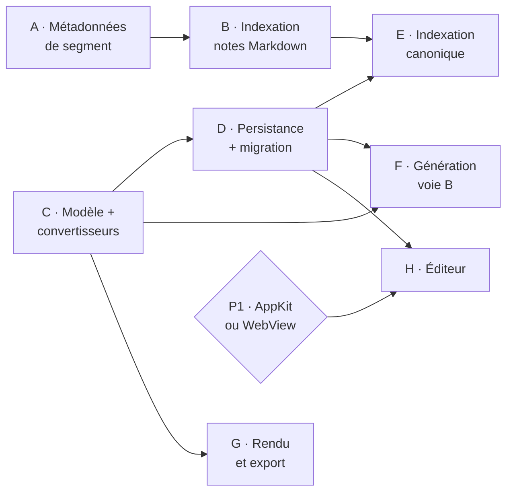

# Étude — passer les notes du Markdown à un JSON canonique

**Date** : 2026-08-10
**Statut** : étude. **Aucune décision n'est prise par ce document**, aucune ligne de code n'a été modifiée.
**Origine** : dépôt voisin `one2one-flutter`, ADR 001 « JSON canonique comme source de vérité »
(`../one2one-flutter/docs/adr/001-json-canonique-source-de-verite.md`, hors de ce dépôt)
**Rôle de `one2one-flutter`** : banc d'essai. Le format y est prototypé pour être rapatrié dans OneToOne (Swift).

## La question

Les notes de réunion sont stockées en Markdown. Le format est jugé trop pauvre pour porter
l'information structurée (locuteur, horodatage, références vers projets et collaborateurs) et
pour alimenter un RAG de qualité. Que coûte, et que rapporte, le passage à un arbre de blocs
typés sérialisé en JSON ?

## Ce qui est déjà décidé, et ce qui ne l'est pas

**Décidé côté flutter.** L'ADR 001 est validée : arbre de blocs typés (modèle AppFlowy /
Quill Delta), HTML en rendu primaire, Markdown en export secondaire jamais persisté, RAG sur
chunks structurés à `blockId` stables. Le modèle est codé — `NoteDocument`, `Block`, `DeltaOp`,
`BlockMetadata`, `NoteMetadata`, `schemaVersion` — et un importeur `OneToOne → canonique` existe
(`lib/features/import/one_to_one_sample_importer.dart`, alimenté par
`tool/extract_one_to_one_sample.py`).

**À moitié décidé côté Swift.** L'ADR
[`2026-08-08-reecriture-editeur-architecture-appflowy.md`](../../adr/2026-08-08-reecriture-editeur-architecture-appflowy.md)
**annule explicitement** la décision « le Markdown reste la source de vérité ; aucun modèle de
blocs persistant séparé n'est introduit ». Le JSON canonique n'est donc pas un virage nouveau
dans OneToOne : c'est la même décision poussée jusqu'à la persistance. Ce qui reste ouvert n'est
pas « arbre de blocs ou pas » — c'est tranché — mais « qu'écrit-on dans SwiftData ».

**Non décidé, et bloquant.** Le verdict du prototype AppKit est *en attente* : « aucune
vérification à l'écran n'a eu lieu : personne n'a lancé `swift run block-editor-probe`, ouvert
la fenêtre de la sonde, ni regardé un rendu »
([ADR de verdict](../../adr/2026-08-08-verdict-prototype-blocs-appkit.md)).

## Choix retenus pour cette étude

| Axe | Choix | Notes |
|---|---|---|
| Cible | Rapatriement dans OneToOne (Swift) | flutter = banc d'essai |
| Séquence | Avec la réécriture de l'éditeur | une seule migration, un seul modèle |
| Périmètre | Tout, rapports LLM inclus | voir réserve §2 |
| Génération LLM | Voie B — le modèle émet le JSON | retenue en connaissance de la réserve §2 |

## Constat de départ : trois faits mesurés

**1. Rien n'indexe les notes aujourd'hui.** `RAGService` n'indexe que trois sources :
`sourceType: "meeting"` (le *transcript*, via `RAGIndexer.reindex` qui lit
`mergedTranscript`/`rawTranscript`), `"attachment"` et `"mail"`. Aucun chunk ne vient de
`Note.body`, `Meeting.notes`, `Meeting.summary` ni `Meeting.prepNotes`. Le Markdown ne bloque
donc pas le RAG sur les notes : **il n'y a pas de RAG sur les notes.**

**2. Le Markdown n'est pas un champ, c'est une vingtaine.** Environ **24 champs de prose**
répartis sur 7 fichiers de modèles. Les candidats à la bascule : `Note.body`,
`Meeting.notes` / `.liveNotes` / `.prepNotes` / `.summary` / `.shortSummary`, `Interview.notes`,
`ManagerReportItem.userNotes` / `.generatedSummary`, `ReportRevision.body` / `.critique` /
`.writerMessage`, `Collaborator.standingPrepNotes`, `Project.standingPrepNotes` /
`.followUpNotes` / `.riskDescription`, `ProjectInfoEntry.content`,
`ProjectCollaboratorEntry.content`, `Entity.summary`, plus quatre champs de recrutement.
Une petite moitié seulement est réellement rendue en Markdown ; le reste est du texte brut, et
son passage en blocs est à justifier champ par champ.
Ordre de grandeur du couplage : `.summary` seul apparaît dans 22 fichiers / 56 occurrences.

**3. L'éditeur de blocs ne sert que deux champs.** `MarkdownNoteEditor` n'est branché que sur
`Meeting.liveNotes` (`MeetingView.swift:565`) et `Meeting.prepNotes` (`MeetingPrepTab.swift:41`).
`Note.body` est édité par un `TextEditor` nu (`NotesSection.swift:184`) et rendu en lecture par
`MarkdownText` (`:176`).

> **Réserve sur la séquence.** Les 12 365 lignes d'éditeur servent deux champs, et les contenus
> les plus intéressants pour le RAG — le rapport, les notes libres — ne passent pas par
> l'éditeur. Les chantiers « JSON canonique » et « réécriture de l'éditeur » se recouvrent donc
> beaucoup moins que la séquence « avec la réécriture » ne le suppose. La séquence retenue reste
> celle de l'étude, mais ce point mérite un réexamen avant l'engagement.

## 1. Le modèle canonique en Swift

Transposition 1:1 du flutter — c'est l'intérêt même du banc d'essai :

    NoteDocument { schemaVersion, documentId, blocks[], metadata }
    Block        { blockId, type, delta[], attributes, metadata, children[] }
    DeltaOp      { insert, attributes? }
    BlockMetadata{ speaker, timestamp, entityRefs[], flags }
    NoteMetadata { title, projectRef, meetingRef, participants[], createdAt, updatedAt }

**Persistance : une colonne `String` JSON par champ porteur** (`Note.bodyJSON`,
`Meeting.notesJSON`, …), pas d'entités `@Model` par bloc. Un arbre récursif en SwiftData est
pénible et recrée précisément le couplage qu'AppFlowy évite. La requêtabilité ne passe pas par
les blocs mais par les chunks RAG, qui sont déjà des entités SwiftData (`TranscriptChunk`).
C'est la répartition du flutter, où `note_file_store.dart` porte le document et le store
d'entités est séparé.

**Le gain structurel est `EntityRef`, pas les blocs.** Aujourd'hui une mention collaborateur est
du texte plus une closure de routage (décision n°5 de `STATUS.md`, toujours valide). En canonique
elle devient un `DeltaOp` portant `attributes.mention = EntityRef(kind: .collaborator, id: <stableID>)`.
C'est ce qui rend possible « retrouve tout ce qui mentionne X », impossible aujourd'hui quel que
soit le moteur de recherche.

**Risque induit : les `stableID`.** Les `EntityRef` s'appuieront sur eux, or ils sont `Optional`
et backfillés au démarrage par `repairStoreIfNeeded()` depuis le `onAppear` de `ContentView`.
`STATUS.md` note que cela tient « par circonstance, pas par construction », parce qu'aucun code
de démarrage ne les lit encore. Un document qui écrit des `EntityRef` **sera** ce code. Écrire
une référence vers un collaborateur au `stableID` encore `nil` produit une référence morte et
silencieuse. La réparation doit donc être remontée avant tout accès, pas s'adosser à un ordre
d'appel fortuit.

## 2. La génération LLM — voie B

**Fait dur** : `DirectLLMClient` n'a aucune contrainte de décodage — `GenerateParameters()` avec
`temperature = 0.1`, rien d'autre (`DirectLLMClient.swift:91-92`). Le provider par défaut est
`.direct` : le JSON sera produit en génération libre par un MoE 26b local, sans grammaire ni
schéma imposé. Le seul précédent LLM→JSON du dépôt, `AIIngestionService.parseJSON` (`:524-552`),
répare les sorties à la main : suppression des clôtures ```` ```json ````, extraction de la
première `{` à la dernière `}`, `print` en cas d'échec.

La voie B se conçoit donc en cinq pièces, dont deux répondent directement aux réserves émises :

1. **Le modèle n'émet jamais de `blockId`.** Il produit `type`, `delta`, `attributes`,
   `metadata` ; les identifiants sont attribués côté Swift. Supprime l'instabilité des
   identifiants sans rien retirer à la voie B.
2. **Réconciliation à la régénération.** Le nouveau rapport est diffé contre le précédent
   (empreinte de contenu + position) ; les blocs inchangés **conservent** leur `blockId`. Sans
   cette pièce, chaque régénération réembedde tout le rapport et la réindexation incrémentale —
   raison d'être du format — reste théorique.
3. **Décodeur strict** : types de blocs connus, delta non vide, profondeur bornée. Échec → une
   relance avec l'erreur de validation en contexte.
4. **Repli Markdown** si la relance échoue.
5. **Coût jetons** : un rapport en delta ops pèse environ 2 à 3× son équivalent Markdown, en
   local. À mesurer avant de généraliser, pas après.

> **Conséquence à assumer.** Le convertisseur Markdown→blocs est à écrire de toute façon : la
> migration de l'historique ne peut passer que par lui, et il sert de repli au point 4. La voie B
> ne l'économise pas — elle ajoute un second chemin au-dessus. Bonne nouvelle : il n'est pas à
> écrire de zéro, `swift-markdown` est déjà en dépendance (`Package.swift:16`) et son AST *est*
> un arbre de blocs typés.

## 3. La migration

`SchemaV1` est seul aujourd'hui. Il faut un `SchemaV2` et une `MigrationStage` custom dans
`OneToOneMigrationPlan`.

- **Forme** : chaque champ `X: String` gagne un `XJSON: String?`. Le Markdown d'origine est
  **conservé**, pas remplacé — c'est du texte, le coût disque est nul, et c'est la seule porte de
  sortie si la conversion se révèle lossy.
- **Bascule one-shot** au premier lancement, plutôt que paresseuse. La conversion paresseuse fait
  cohabiter deux formats pendant des mois et oblige le RAG à savoir lire les deux, ce qui annule
  le bénéfice pendant toute la transition.
- **Irréversibilité réelle** : le retour arrière n'existe que **jusqu'à la première réédition**
  d'un document. Après, le Markdown conservé est périmé. À écrire noir sur blanc dans l'ADR.

**Le point le plus facile à oublier : la sauvegarde est un second contrat de sérialisation.**
`BackupService.BackupPayload` sérialise `MeetingDTO.notes` / `.summary`, `InterviewDTO.notes`,
`EntityDTO.summary`, `TranscriptChunkDTO`… en JSON pour la sauvegarde et la restauration
complètes. Ce format change avec la bascule, et `restore(from:)` doit **continuer** à lire les
sauvegardes antérieures — sinon toutes les sauvegardes existantes deviennent irrécupérables le
jour de la migration.

## 4. Le RAG — ce qui change vraiment

Aujourd'hui `TextChunker.chunk()` découpe sur `\n\n`, cible 2 000 caractères, recouvrement 200 :
sur du Markdown, cela coupe un tableau en deux et sépare un titre de sa section. Et
`RAGIndexer.reindex` supprime **tous** les chunks de la réunion avant de tout réembedder.

Quatre gains, d'inégale valeur :

1. **Chunking aux frontières de blocs** — un chunk devient un ou plusieurs blocs entiers, jamais
   un tableau tronqué. `TextChunker` devient un `BlockChunker`.
2. **Réindexation incrémentale** — `TranscriptChunk` gagne des `blockIds` : éditer une ligne d'un
   rapport de 20 chunks recalcule 1 embedding au lieu de 20. Gain le plus tangible, entièrement
   suspendu à la stabilité des `blockId`, donc à la réconciliation du §2.
3. **Un filtre aujourd'hui impossible** — `RAGService.Scope.collaboratorPID` ne regarde que
   `m?.participants`, c'est-à-dire les *présents*. Avec `entityRefs` au niveau du bloc, « tout ce
   qui **mentionne** X » devient interrogeable.
4. **Locuteur et horodatage first-class** — « qu'a dit X à propos de Y », impossible sur du
   transcript en texte plat.

**Coût induit.** `RAGService.filtered()` charge **tous** les `TranscriptChunk` en mémoire et
calcule les similarités cosinus en Swift, avec un plafond assumé en commentaire (« OK tant que
< ~50k chunks »). Indexer notes et rapports en plus des transcriptions multiplie le volume de
chunks et rapproche ce plafond. Il faudra les prédicats par réunion évoqués dans le commentaire,
ou un véritable index vectoriel.

## 5. La périphérie

**Sérialiseurs.** Le Markdown redevient une sortie (`DocumentToMarkdown`), symétrique du
convertisseur d'entrée. `ExportService` produit Markdown, HTML, PDF, EML multipart et Apple
Notes ; `MarkdownToHTMLRenderer` et `ReportHTMLBuilder` deviennent un `DocumentToHTML`.

**Le piège propre à la voie B.** `AppSettings` porte des prompts par défaut qui imposent « Format
Markdown » (`:344`, `:358`), et `ReportTemplate.promptBody` / `SavedPrompt` portent les prompts
**déjà personnalisés par l'utilisateur**. Sous la voie B ils deviennent faux en silence : ils
produiront du Markdown, le décodeur JSON échouera, et tout basculera systématiquement dans le
repli Markdown — la voie B aura été payée pour tourner en voie A sans que rien ne le signale. Il
faut migrer les prompts stockés, ou détecter le cas et alerter.

**Tests.** 114 fichiers de tests, dont 40 liés à l'éditeur : 35 % de la suite est dans le
périmètre.

## 6. Question rouverte — l'éditeur en WebView

L'ADR de réécriture rejetait l'alternative n°4, « éditeur en WebView », au motif qu'elle
« abandonne l'intégration macOS native (saisie, correcteur, services) pour un problème de mise en
page ». Le passage au JSON canonique change les prémisses de ce rejet, sur quatre points.

**a. Le problème n'est plus une mise en page.** Il devient un modèle de document — arbre de blocs
et delta ops — qui est exactement ce qu'implémentent nativement les éditeurs JS matures
(ProseMirror, Lexical, Quill, TipTap). Le format cible de l'ADR flutter *est* le Quill Delta.

**b. Le risque central identifié par l'ADR disparaît.** L'ADR écrit : « le risque central est
solitaire : la sélection et la navigation du curseur à travers les blocs, gratuites en Flutter,
sont à reconstruire entièrement en AppKit. Sur ce point précis, appflowy-editor n'a rien à nous
apprendre et il n'existe aucun code à transposer. » C'est précisément ce qu'un `contenteditable`
piloté par un éditeur JS mature fournit d'emblée.

**c. WebKit est déjà dans le processus.** `MermaidRenderer.swift:103` crée un `WKWebView` par
rendu mermaid non caché. La frontière que le rejet voulait protéger est déjà franchie — et
**1 481 lignes sur 7 fichiers** (`MermaidAttachmentFactory`, `MermaidBlockLayout`,
`MermaidSourceLayout`, `MermaidRenderCache`, `MermaidResourceLocator`, et deux moteurs de rendu)
existent uniquement pour ramener une image rendue par le web dans une pièce jointe TextKit. Or
les trois chantiers ratés qui ont motivé l'ADR portaient tous sur le rendu des blocs mermaid.
Dans un éditeur WebView, ce cas devient trivial.

**d. La divergence avec le flutter s'annule.** L'ADR 001 fait de HTML le rendu *primaire*. Un
éditeur WebView fait converger les deux implémentations sur le même rendu, au lieu de les faire
diverger — ce qui est exactement ce qu'on attend d'un banc d'essai.

**Ce qu'il reste à vérifier avant d'en faire une décision** (aucun de ces points n'a été
instruit) :

- **Licence.** L'ADR prévoit que « le dépôt bascule sous AGPL-3.0 dès le premier code dérivé »
  d'appflowy-editor. Un éditeur JS sous licence permissive rendrait cette bascule **inutile**.
  À vérifier au cas par cas — c'est un enjeu structurant, pas un détail.
- **Intégration native réellement perdue.** Correcteur orthographique, substitutions, dictée,
  menu Services, accessibilité : à mesurer dans un `WKWebView` en `contenteditable`, pas à
  supposer. La perte est probablement plus faible que ne l'estimait l'ADR, mais elle n'est pas
  nulle.
- **Dépendance nouvelle.** Un bundle JS embarqué (pas de CDN — l'app doit fonctionner hors ligne)
  tombe sous la règle 4 de `CLAUDE.md` : pas de dépendance nouvelle sans justification.
- **Ordre des décisions.** Si la voie WebView est retenue, le prototype AppKit et sa session de
  vérification à l'écran deviennent sans objet. Trancher cette question **avant** de dépenser
  cette session.

Cette réouverture, si elle est retenue, exige un ADR qui remplace explicitement
`2026-08-08-reecriture-editeur-architecture-appflowy.md`. Conformément à la règle 5 de
`CLAUDE.md`, elle est **proposée, pas décidée**.

## 7. Contradictions relevées

Cette section recense les contradictions entre les décisions déjà écrites, et entre ces décisions
et l'état constaté du code. Elle ne les tranche pas.

### C1 — La prémisse de l'ADR flutter ne décrit pas le dépôt Swift

L'ADR 001 fonde la décision sur ce contexte : « Le projet Swift d'origine persistait les notes en
Markdown et **devait les re-parser pour l'indexation RAG** : perte des métadonnées structurées
(locuteur, horodatage, références entités), parsing fragile sur les cas limites, double source de
vérité entre contenu et métadonnées. »

Constat : **aucune note n'est indexée.** `RAGService` indexe le transcript, les pièces jointes et
les mails. Le transcript indexé n'est pas du Markdown — c'est `mergedTranscript` / `rawTranscript`,
du texte plat. Et aucun parseur Markdown n'intervient dans la chaîne d'indexation :
`TextChunker.chunk()` découpe sur `\n\n` et sur la ponctuation, rien de plus. Le re-parsing
Markdown invoqué par l'ADR n'existe pas.

**Mais le grief de fond est vrai, pour une autre cause.** La perte des métadonnées structurées est
réelle et vérifiable : `TranscriptSegment` porte `startSeconds`, `endSeconds`, `speakerID`,
`orderIndex`, `isHighlighted` et surtout `speaker: Collaborator?` — une **relation typée**,
c'est-à-dire exactement ce que l'`EntityRef` du format canonique est censé apporter. Ces
métadonnées sont détruites par `TranscriptTextBuilder.build`, qui les aplatit en préfixe textuel
`[\(seg.formattedTimestamp) · \(seg.displayLabel)] ` (`:21`) avant que `TextChunker` ne découpe
le résultat en chunks qui n'en gardent rien.

**Conséquence pour l'arbitrage.** Le remède au grief réel n'est pas le JSON canonique des notes :
c'est de reporter les métadonnées des segments sur les `TranscriptChunk` au moment de
l'indexation. Locuteur typé, horodatage et plage temporelle sont déjà en base, déjà reliés au
bon collaborateur. Le coût est sans commune mesure avec celui de la bascule complète, et le gain
recouvre une large part de ce que le §4 attend du format canonique.

### C2 — `STATUS.md` énonce des décisions que l'ADR a annulées la veille

L'ADR du 2026-08-08 annule explicitement les décisions n°1 (« le Markdown reste la source de
vérité ») et n°2 (« TextKit 1 est conservé »). `STATUS.md`, mis à jour le **2026-08-09**, réénonce
les deux pour le chantier actif : « Source de vérité : le Markdown reste le format stocké » et
« Moteur d'édition : AppKit / TextKit 1 ».

La règle 1 de `CLAUDE.md` demande de lire `STATUS.md` avant de commencer. Un lecteur qui la suit
reçoit donc l'état annulé, et ne rencontrera l'annulation que s'il ouvre les ADR de sa propre
initiative.

### C3 — Une décision validée dont le risque central n'a aucune preuve

L'ADR de réécriture porte le statut **validée**. L'ADR de verdict du prototype porte le statut
**en attente**, et dit : « Aucune vérification à l'écran n'a eu lieu : personne n'a lancé
`swift run block-editor-probe`, ouvert la fenêtre de la sonde, ni regardé un rendu. »

Or le prototype sondait ce que l'ADR de réécriture qualifie lui-même de risque « central » et
« solitaire » : la sélection et la navigation du curseur à travers les blocs en AppKit. La
décision est donc prise, et la seule inconnue qu'elle reconnaît n'a reçu aucune preuve. Le
présent chantier hériterait de cette situation, en l'aggravant : il ajoute une migration
irréversible au-dessus d'un socle non vérifié.

### C4 — Un format canonique, deux rendus divergents

L'ADR 001 fait de **HTML le rendu primaire** (point 2). L'ADR de réécriture **rejette
l'éditeur en WebView** (alternative n°4). Les deux implémentations du même format canonique
divergeront donc sur la chaîne de rendu : affichage HTML côté flutter, rendu natif côté macOS.

Le banc d'essai ne validera pas ce qu'on attend d'un banc d'essai : il validera le modèle de
document, pas la chaîne qui le donne à voir. C'est ce que la §6 rouvre.

### C5 — « Markdown jamais persisté » contre le Markdown qui survit partout

L'ADR 001 pose : « Markdown = export secondaire à la demande, **jamais persisté** » (point 3).
Dans la cible Swift, le Markdown reste présent à cinq endroits au moins : le convertisseur
d'entrée (migration de l'historique **et** repli de la voie B), le sérialiseur de sortie (export
Markdown, mail, Apple Notes), les prompts par défaut d'`AppSettings`, les `ReportTemplate.promptBody`
personnalisés, et le Markdown d'origine conservé en colonne pour permettre le retour arrière (§3).

La formulation « jamais persisté » ne tiendra pas côté Swift. Ce qui tiendra est plus modeste :
« le Markdown n'est plus la source de vérité ».

### C6 — La voie B décidée contre la capacité du moteur retenu

Le périmètre « tout, rapports inclus » combiné à la voie B suppose que le modèle produise du JSON
canonique fiable. Or le provider par défaut est `.direct`, et `DirectLLMClient` n'offre **aucun**
décodage contraint (`:91-92`). S'y ajoute que les prompts stockés — défauts d'`AppSettings`
(`:344`, `:358`) et prompts personnalisés — imposent encore « Format Markdown ».

Tant que ces deux points ne sont pas traités, le repli Markdown n'est pas le chemin exceptionnel :
c'est le chemin nominal. La voie B serait financée et la voie A exécutée, sans que rien ne le
signale.

### C7 — Le périmètre « tout » contre la nature réelle des champs

Sur les ~24 champs de prose, une petite moitié seulement est rendue en Markdown.
`Project.riskDescription`, `Entity.summary`, `Interview.alertDescription`,
`Collaborator.standingPrepNotes` portent du texte brut, souvent une à deux phrases. Les faire
passer par un arbre de blocs leur ajoute un `schemaVersion`, un `blockId`, un `delta` et un
encodage JSON pour transporter une ligne.

Le périmètre retenu est « tout » ; la justification champ par champ n'existe que pour une partie
d'entre eux.

### C8 — La convention de langue, déjà en litige

`CLAUDE.md` impose l'anglais pour les symboles. `STATUS.md` consigne que `Views/DesignSystem/` est
en français par décision explicite, et que la correction est **bloquée** tant que `CLAUDE.md` porte
des changements non commités du chantier éditeur.

Le modèle canonique introduira une famille de types (`NoteDocument`, `Block`, `DeltaOp`,
`BlockMetadata`) et un vocabulaire de types de blocs. La question se reposera à cette occasion,
sur un litige encore ouvert.

### C9 — Le chantier `feat/editeur-slash-blocs` s'éloigne d'une cible qui a bougé

La branche compte 113 commits d'avance sur `master`, n'est ni fusionnée ni abandonnée, et sa propre
vérification à l'écran reste due. Elle implémente l'architecture que l'ADR annule : TextKit 1, et
le Markdown comme source de vérité.

Ce chantier n'est donc pas neutre vis-à-vis de la présente étude : il capitalise sur des décisions
annulées. Le décider — fusionner, reprendre ou abandonner — est un préalable, pas une suite.

## 8. Découpage — une PR = une intention

Le chantier traverse le modèle de document, la persistance SwiftData, la génération LLM,
l'indexation RAG, l'export, le format de sauvegarde et l'éditeur. La règle 2 de `CLAUDE.md` impose
de le découper. Voici le découpage proposé : trois préalables qui sont des décisions, puis huit
lots dont chacun porte une intention unique, se vérifie seul et se fusionne seul.

### Préalables — décisions, pas du code

| # | Décision à prendre | Pourquoi elle bloque | Contradiction |
|---|---|---|---|
| P0 | Trancher le sort de `feat/editeur-slash-blocs` : fusionner, reprendre ou abandonner | 113 commits capitalisent sur des décisions annulées ; toute reprise de l'éditeur part de là | C9 |
| P1 | Instruire licences et intégration native, puis trancher AppKit vs WebView | Décide si le prototype AppKit et sa session de vérification ont encore un objet, et si la bascule AGPL-3.0 est nécessaire | C4, §6 |
| P2 | Remettre `STATUS.md` en cohérence avec les ADR | La règle 1 envoie tout lecteur sur un état annulé | C2 |

P1 doit précéder la session de vérification à l'écran du prototype, sans quoi cette session peut
être dépensée pour rien.

### Les huit lots



---

**Lot A — Les métadonnées de segment atteignent les chunks**

*Intention* : ne plus détruire à l'indexation le locuteur et l'horodatage que la base porte déjà.
*Contenu* : `TranscriptChunk` gagne locuteur, plage temporelle et référence de segment ;
`RAGIndexer.reindex` chunke à partir des `TranscriptSegment` au lieu de la chaîne aplatie par
`TranscriptTextBuilder` ; `RAGService.Scope` gagne le filtre par locuteur.
*Dépendances* : aucune. Champs additifs optionnels — migration légère, pas de `MigrationStage`.
*Vérification* : un chunk porte le bon collaborateur et la bonne plage ; une recherche filtrée par
locuteur renvoie ce qu'elle doit.
*Risque retiré* : traite C1 — le grief réel de l'ADR 001 — sans engager le format.

**Lot B — Les notes et les rapports entrent dans le RAG**

*Intention* : indexer ce qui ne l'est pas, sur le format actuel.
*Contenu* : `RAGIndexer` étendu à `Note.body`, `Meeting.notes`, `Meeting.summary`,
`Meeting.prepNotes` avec de nouveaux `sourceType` ; `Scope` étendu en conséquence.
*Dépendances* : aucune (indépendant de A, mais A l'améliore).
*Vérification* : jeu de requêtes connues avec rappel attendu — **c'est la ligne de base contre
laquelle le format canonique devra faire ses preuves au lot E.**
*Risque retiré* : lève le constat n°1. Fera probablement apparaître le plafond de
`RAGService.filtered()`, qui charge tous les chunks en mémoire ; prévoir un lot B′ de requêtage
par prédicats si la mesure l'exige.

**Lot C — Le modèle canonique et ses deux convertisseurs, sans persistance**

*Intention* : établir le format et mesurer la perte de conversion avant que la moindre donnée ne
bouge.
*Contenu* : `NoteDocument`, `Block`, `DeltaOp`, `BlockMetadata`, `NoteMetadata`, `Codable`,
`schemaVersion` — types valeur purs, zéro SwiftData, zéro interface. Plus `MarkdownToDocument`
(sur l'AST `swift-markdown`) et `DocumentToMarkdown`.
*Dépendances* : aucune.
*Vérification* : **aller-retour Markdown → document → Markdown sur le corpus réel existant**, avec
un rapport de perte champ par champ.
*Risque retiré* : c'est le lot qui décide si la bascule est faisable. S'il échoue, rien n'a été
migré et l'étude s'arrête ici pour un coût borné.

**Lot D — Le document canonique est persisté et l'historique migré**

*Intention* : faire du JSON canonique la forme stockée, sans perdre le retour arrière.
*Contenu* : `SchemaV2`, colonnes `XJSON` par champ porteur, `MigrationStage` custom one-shot,
Markdown d'origine conservé. **Et la rétrocompatibilité de `BackupService.restore(from:)`.**
*Dépendances* : C.
*Vérification* : migration exécutée sur une copie d'un store réel ; restauration réussie d'une
sauvegarde antérieure à la bascule.
*Risque retiré* : le contrat de sauvegarde, seul point dont l'oubli est irrattrapable.

**Lot E — L'indexation passe au canonique**

*Intention* : découper aux frontières de blocs et ne réembedder que ce qui a changé.
*Contenu* : `BlockChunker` en remplacement de `TextChunker` pour les champs migrés ;
`TranscriptChunk.blockIds` ; réindexation incrémentale.
*Dépendances* : B (ligne de base) et D.
*Vérification* : rappel égal ou supérieur à la ligne de base du lot B, **et** nombre d'embeddings
recalculés à l'édition d'une ligne — c'est la seule preuve que le gain principal existe.

**Lot F — La génération LLM émet du canonique**

*Intention* : régler empiriquement le pari de la voie B.
*Contenu* : décodeur strict, relance sur erreur de validation, réconciliation des `blockId` à la
régénération, repli sur `MarkdownToDocument`, **et migration des prompts stockés** — défauts
d'`AppSettings` et `ReportTemplate.promptBody` personnalisés.
*Dépendances* : C, D.
*Vérification* : taux de succès du décodage mesuré sur un lot de générations réelles, et surcoût
en jetons mesuré face au Markdown équivalent.
*Risque retiré* : traite C6. Si le taux de succès est mauvais, seul ce lot est perdu et la voie A
reste en place — le repli l'a déjà implémentée.

**Lot G — Rendu et export depuis le canonique**

*Intention* : les sorties ne dépendent plus du Markdown stocké.
*Contenu* : `DocumentToHTML` en remplacement de `MarkdownToHTMLRenderer` / `ReportHTMLBuilder` ;
`ExportService` rebranché pour Markdown, HTML, PDF, mail et Apple Notes.
*Dépendances* : C. **Parallélisable avec D, E et F.**
*Vérification* : comparaison des sorties avant/après sur un jeu de réunions réelles.

**Lot H — L'éditeur**

*Intention* : éditer le document canonique.
*Contenu* : selon P1 — réécriture par blocs en AppKit, ou éditeur WebView adossé au canonique.
*Dépendances* : P1 et D.
*Vérification* : session à l'écran, celle qui reste due depuis le 2026-08-08.

### Estimation

Jours de travail concentré, solo. Le chiffrage s'appuie sur des volumes mesurés — lignes, fichiers,
fichiers de tests — et non sur l'expérience du frottement propre à ce dépôt. C'est sa principale
faiblesse, et elle penche du côté optimiste.

| Lot | Jours | Ce qui porte le chiffre |
|---|---|---|
| P0 · sort de `feat/editeur-slash-blocs` | 0,5 – 3 | 0,5 si abandon ; plusieurs jours si reprise ou fusion (113 commits) |
| P1 · spike licences + intégration native | 2 – 3 | un `WKWebView` jetable pour mesurer correcteur, services, dictée |
| P2 · cohérence `STATUS.md` | 0,5 | |
| **A** · métadonnées de segment → chunks | 2 – 3 | réécrire `reindex` pour chunker depuis les segments, pas la chaîne aplatie |
| **B** · notes et rapports dans le RAG | 3 – 4 | déclencheurs d'indexation à créer — il n'existe aujourd'hui qu'un appel manuel (`MeetingView.swift:1792`) — plus le harnais de mesure |
| **C** · modèle + deux convertisseurs | 8 – 11 | `MarkdownToDocument` sur l'AST GFM : listes imbriquées et tableaux font le gros du coût |
| **D** · persistance + migration | 4 – 6 | premier `SchemaV2` du dépôt, plus la rétrocompatibilité de `restore(from:)` |
| **E** · indexation canonique | 4 – 6 | `BlockChunker` et diff de blocs pour le réembedding incrémental |
| **F** · génération voie B | 6 – 9 | réconciliation des `blockId` et campagne de mesure ; **forte variance** |
| **G** · rendu et export | 4 – 6 | `DocumentToHTML` doit égaler une sortie HTML déjà réglée |
| **H** · éditeur — voie WebView | 10 – 20 | supprime au passage l'essentiel des 1 481 lignes de pontage mermaid |
| **H** · éditeur — voie AppKit | 30 – 60 | risque d'échec réel : le curseur inter-blocs n'a aucun code à transposer |

**Totaux**

| Périmètre | Jours |
|---|---|
| Préalables + lots A à G, sans l'éditeur | **34 – 52** (~42 médian) |
| Le tout avec l'éditeur WebView | **45 – 72** |
| Le tout avec l'éditeur AppKit | **65 – 115**, avec probabilité non nulle de ne pas aboutir |

**Deux réserves à ne pas enterrer sous le tableau.**

Ces jours ne comptent pas les **sessions de vérification à l'écran**, goulet récurrent du projet :
`STATUS.md` en recense plusieurs, dues depuis le 2026-08-08, jamais tenues, et elles bloquent déjà
deux chantiers. Ce n'est pas un problème d'effort mais de calendrier, et aucune estimation d'effort
ne le résout.

Le **lot F est le seul dont la borne haute peut sauter**. Si le MoE local décode mal le JSON,
l'itération sur les prompts n'a pas de plafond naturel. C'est la raison d'être de son repli
Markdown : il borne la perte à ce lot.

### Ce que le découpage révèle

**L'éditeur est une feuille, pas une racine.** Aucun des lots A à G n'en dépend. Les deux champs
qu'il sert — `liveNotes` et `prepNotes` — sont la plus petite part de la valeur, alors qu'il
concentre 12 365 lignes, 35 % de la suite de tests, et le seul blocage non levé du dépôt.

**Le découpage préserve l'intention du choix « avec la réécriture ».** Ce choix visait à n'avoir
qu'une seule migration. Le lot D la porte, seul, une fois. Que l'éditeur arrive ensuite ne la
duplique pas : il arrive sur un store déjà canonique. On garde donc la migration unique **et** on
lève la dépendance au verdict du prototype.

**Trois jours de spike arbitrent trente jours d'écart.** L'écart médian entre les deux voies du
lot H est d'une trentaine de jours — le plus gros chiffre du tableau. P1 coûte deux à trois jours.
Aucun autre arbitrage du chantier n'a ce rendement.

**Trois lots livrent de la valeur avant toute décision structurante.** A, B et C ne migrent rien,
ne cassent rien, et ne présupposent ni la voie B ni le sort de l'éditeur. Le lot C, en particulier,
produit la seule mesure qui devrait conditionner l'engagement : combien la conversion perd, sur le
corpus réel.

Chiffré : **A + B ≈ 6 jours** livrent le RAG sur les notes, locuteur et horodatage compris —
l'objectif de départ, sans toucher au format. **A + B + C ≈ 15 jours** y ajoutent la mesure de
perte à la conversion, qui est la donnée devant décider des 27 à 37 jours suivants. À ce stade,
rien n'est migré et rien n'est irréversible.

## Synthèse

**Ce que ça coûte.** Deux convertisseurs (Markdown→blocs, blocs→Markdown), un sérialiseur HTML,
une génération LLM contrainte alors qu'aucune grammaire n'est disponible en local, un `SchemaV2`
avec migration one-shot, un format de sauvegarde rétrocompatible, une réconciliation de blocs à
chaque régénération, la réparation des `stableID` remontée avant tout accès — le tout adossé à
une réécriture d'éditeur dont le verdict du prototype est encore dû.

**Ce que ça rapporte.** Les `EntityRef` typées et la réindexation incrémentale. Le reste
(chunking propre, métadonnées de bloc) est appréciable mais accessoire.

**Ce qui remet l'ordre en question.** Rien n'indexe les notes aujourd'hui. Le RAG sur les notes
de réunion ne dépend pas de ce chantier : il dépend d'appeler le chunker existant sur
`Note.body`, `Meeting.summary` et `Meeting.notes`. Quelques jours, sur le Markdown actuel, sans
rien casser. Le JSON canonique **améliore** ce RAG ; il ne le crée pas.

## Ce qui reste à trancher

1. Valider le découpage du §8, et en particulier l'ordre A → B → C avant tout engagement
   structurant.
2. Instruire la voie WebView (§6) — et la trancher avant la session de vérification du prototype
   AppKit.
3. Décider si le report des métadonnées de `TranscriptSegment` sur les `TranscriptChunk` (C1) et
   un RAG sur le Markdown existant sont livrés d'abord, comme socle mesurable.
4. Mesurer le surcoût en jetons de la voie B avant de la généraliser à l'ensemble des champs concernés.

## Annexe — relevés

| Fait | Source |
|---|---|
| RAG n'indexe que transcript / attachment / mail | `OneToOne/Services/RAGService.swift`, `MeetingAttachmentService.swift:99`, `ProjectMailStore.swift:90` |
| Réindexation = suppression totale puis réembedding | `RAGService.swift`, `RAGIndexer.reindex` |
| Plafond assumé de la recherche | `RAGService.swift`, `filtered()` — « OK tant que < ~50k chunks » |
| Aucune contrainte de décodage | `OneToOne/Services/DirectLLMClient.swift:91-92` |
| Réparation manuelle du JSON LLM | `OneToOne/Services/AIIngestionService.swift:524-552` |
| Prompts imposant « Format Markdown » | `OneToOne/Models/AppSettings.swift:344`, `:358` |
| `swift-markdown` déjà en dépendance | `Package.swift:16`, `:50` |
| Éditeur branché sur deux champs | `MeetingView.swift:565`, `MeetingPrepTab.swift:41` |
| `Note.body` édité en `TextEditor` nu | `NotesSection.swift:184`, rendu `:176` |
| `WKWebView` déjà instancié | `OneToOne/Markdown/Blocks/MermaidRenderer.swift:103` |
| 1 481 lignes de pontage mermaid | `OneToOne/Markdown/Blocks/*Mermaid*.swift` |
| Contrat de sauvegarde | `OneToOne/Services/BackupService.swift:179-211`, `restore(from:)` `:551` |
| Fragilité des `stableID` | `STATUS.md`, section « Sûreté des données » ; `Services/IdentifierRepair.swift` |
| Métadonnées de segment disponibles | `OneToOne/Models/TranscriptSegment.swift:16-29` |
| Aplatissement qui les détruit | `OneToOne/Services/TranscriptTextBuilder.swift:21` |
| Décisions annulées par l'ADR | `docs/adr/2026-08-08-reecriture-editeur-architecture-appflowy.md`, « Décisions annulées » |
| Décisions réénoncées après annulation | `STATUS.md`, bloc du chantier `feat/editeur-slash-blocs` |
