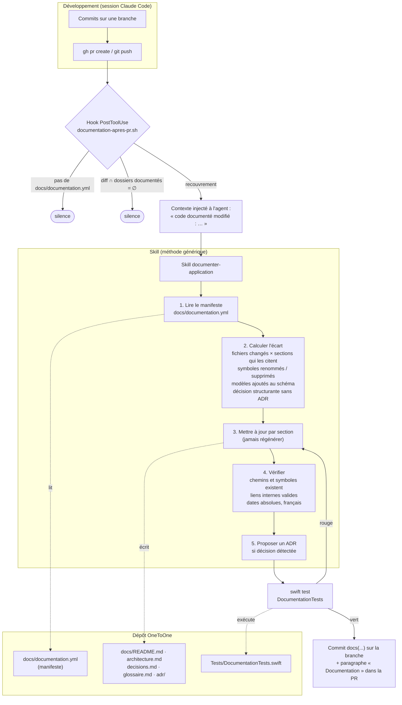

# Skill « documenter-application » — conception

**Date :** 2026-09-08 · **Statut :** validé en brainstorm, en attente du plan d'implémentation
**Public :** développeur (documentation technique de `/docs`). La documentation utilisateur est hors périmètre.

## 1. Problème

La documentation développeur de OneToOne vit dans `/docs` : `architecture.md`, les ADR, `cleanup-report.md`,
et l'historique de travail `superpowers/`. Elle n'est pas fausse par manque d'écriture, mais par manque de
**vérification** : `architecture.md` a décrit pendant tout le programme de refonte un modèle qui n'existait
plus (`Interview`, `SchemaV1`, 42 fichiers de tests contre 179). Rien ne signalait l'écart. `STATUS.md` a
atteint 5 778 lignes avant d'être scindé. `CLAUDE.md` et `architecture.md` se recouvrent.

Le but n'est donc pas d'écrire de la documentation, mais de la **garder vraie** : la documentation doit
devenir fausse de façon bruyante, comme le code, et se réaligner à chaque changement du code qu'elle décrit.

## 2. Décisions

| # | Décision | Justification |
| --- | --- | --- |
| D1 | Public **développeur** seulement | Le guide utilisateur par écran est un autre chantier (les captures de recette existent, il pourra s'y appuyer). |
| D2 | Skill dans **`~/.claude/skills/documenter-application/`**, générique | Réutilisable sur les autres projets. Les faits propres à un projet vivent dans un **manifeste** versionné avec son code, jamais dans le skill. |
| D3 | Déclenchement **automatique par un hook** à la création de PR (ou au push) | C'est le moment où le diff est complet et où un commit de documentation rejoint naturellement la PR. Le hook déclenche, le skill décide. |
| D4 | Mise à jour **par section**, jamais par régénération | Une régénération écrase les nuances écrites à la main (pièges, décisions) et produit un document que personne ne relit. |
| D5 | Documentation **gardée par des tests** (`swift test`) | Chemins, symboles, liste des modèles, ADR référencés : un écart fait échouer la suite, comme du code. |
| D6 | Le skill ne touche ni `CLAUDE.md` ni un ADR validé | `CLAUDE.md` = consignes pour l'agent ; un ADR validé se supersède, il ne s'édite pas (convention `docs/adr/README.md`). |
| D7 | Fabrication en **TDD de skill** | Ligne rouge sans le skill sur un scénario réel, puis rédaction contre les fautes observées, puis rejeu. |

## 3. Fonctionnement général



Lecture : le hook est un simple détecteur ; le skill porte la méthode ; le dépôt porte les faits (manifeste),
les documents et les tests qui les gardent. Aucune écriture n'a lieu hors de la branche de la PR.

## 4. Le skill

### 4.1 Emplacement et fichiers

```
~/.claude/skills/documenter-application/
  SKILL.md                         # méthode, garde-fous, erreurs fréquentes (< 500 mots)
  references/regles-de-redaction.md # style français, symboles, tableaux, ce qui relève du journal
  references/manifeste.md          # format de docs/documentation.yml, exemple complet
```

### 4.2 En-tête

- `name` : `documenter-application`
- `description` (déclencheur seulement, sans résumé de méthode) : « Utiliser quand le code documenté d'un
  projet a changé et que `/docs` doit être réaligné, ou quand un hook signale un écart de documentation
  (chemins ou symboles cités qui n'existent plus, modèle ajouté sans mention, PR touchant un dossier
  documenté). »

### 4.3 Méthode (corps de `SKILL.md`)

1. **Lire le manifeste** `docs/documentation.yml`. S'il n'existe pas : le proposer (à partir de
   `references/manifeste.md`) et s'arrêter là.
2. **Calculer l'écart**, sans écrire :
   - fichiers changés depuis la branche principale (`git diff --name-only <base>...HEAD`) croisés avec les
     sections qui les citent (recherche des chemins dans les documents du manifeste) ;
   - symboles renommés ou supprimés : chaque `` `TypeName` `` cité dont la déclaration n'existe plus ;
   - modèles persistés ajoutés ou retirés (liste `CurrentSchema.models` ou équivalent déclaré dans le
     manifeste) ;
   - décision structurante visible dans le diff (nouvelle dépendance, nouveau sous-système, changement de
     format de stockage, retrait d'une fonctionnalité) **sans** ADR correspondant.
   Produire la liste des écarts avant toute modification.
3. **Mettre à jour par section** : chaque écart désigne une section existante ; on la corrige en place.
   Une section manquante est ajoutée à l'endroit prévu par le manifeste. On ne régénère jamais un document.
4. **Vérifier** : chemins et symboles cités existent ; liens internes valides ; dates absolues ; français
   (libellés, prose), symboles en anglais entre accents graves ; pas de narration de session (elle relève
   du journal, pas de la documentation) ; l'index `docs/README.md` référence chaque document.
5. **Proposer un ADR** (jamais l'écrire d'autorité) si l'étape 2 a détecté une décision sans trace : un
   fichier daté selon la convention du dossier, statut « proposé », à valider par l'auteur.
6. **Consigner** : un commit `docs(...)` par document touché, et un paragraphe « Documentation » dans le
   corps de la PR (ce qui a été réaligné, ce qui reste à trancher).

### 4.4 Garde-fous

- Ne jamais toucher `CLAUDE.md` (consignes pour l'agent), ni un ADR au statut « validé ».
- Ne jamais supprimer une section sans écart avéré ; une section devenue sans objet est marquée
  « retirée le <date>, voir <ADR> » puis retirée à la PR suivante.
- Ne jamais inventer un chemin ou un symbole : tout ce qui est cité est vérifié par `test -e` ou par
  recherche dans les sources avant écriture.
- Si l'écart dépasse ce qu'une PR peut porter (refonte de plusieurs documents), s'arrêter et proposer un
  lot de documentation séparé.

### 4.5 Erreurs fréquentes (à alimenter par la ligne rouge)

Liste à constituer lors de la session de fabrication (§8) : fautes observées de l'agent **sans** le skill,
avec leur correction. Attendues : régénération intégrale, chemins inventés, franglais, narration de
session, mélange documentation / consignes, ADR édité au lieu d'être supersédé.

## 5. Le manifeste `docs/documentation.yml`

Fichier versionné dans chaque projet ; c'est lui qui rend le skill générique. Exemple pour OneToOne :

```yaml
langue: fr
branche_principale: master
tests: swift test --filter DocumentationTests

# Dossiers dont un changement déclenche le réalignement
code_documente:
  - OneToOne/Models/
  - OneToOne/Services/
  - OneToOne/Views/Meeting/
  - OneToOne/Views/Project/
  - Scripts/
  - Package.swift

# Documents tenus par le skill, avec leur public et leurs sections stables
documents:
  - chemin: docs/README.md
    public: tous
    role: index — une ligne par document, public visé
  - chemin: docs/architecture.md
    public: développeur
    sections:
      - "1. Présentation"
      - "2. Stack technique"
      - "3. Vue d'ensemble en couches"
      - "4. Point d'entrée & cycle de vie"
      - "5. Modèle de données"
      - "6. Couche Services"
      - "7. Écran de réunion"
      - "8. Vues"
      - "9. Flux principaux"
      - "10. Tests"
      - "11. Dette technique"
  - chemin: docs/decisions.md
    public: développeur
    role: registre lisible généré depuis les en-têtes de docs/adr/*.md
  - chemin: docs/glossaire.md
    public: développeur
    role: termes métier français ↔ symboles Swift

# Sources de vérité que les tests confrontent aux documents
verites:
  modeles_persistes: OneToOne/Models/SchemaVersions.swift   # CurrentSchema.models
  adr: docs/adr/

# Ce que le skill ne touche jamais
hors_perimetre:
  - CLAUDE.md
  - docs/superpowers/
  - docs/adr/*.md au statut validé
```

## 6. Le hook

### 6.1 Configuration (`~/.claude/settings.json`)

`PostToolUse`, outil `Bash`, commande `~/.claude/hooks/documentation-apres-pr.sh`. Configuration réalisée
avec le skill `update-config` au moment de l'implémentation.

### 6.2 Comportement du script

1. Lit la commande exécutée (entrée JSON du hook). Ne réagit que si elle contient `gh pr create` ou
   `git push` ; sinon sortie 0 silencieuse.
2. Sort en silence si le dépôt courant n'a pas de `docs/documentation.yml`.
3. Calcule `git diff --name-only <branche_principale>...HEAD` et le croise avec `code_documente`.
4. Sans recouvrement : silence. Avec recouvrement : renvoie un contexte à l'agent :
   « Le code documenté a changé dans cette PR (`<liste des fichiers>`). Lancer le skill
   `documenter-application` avant de clore, puis pousser le commit de documentation sur la branche. »
5. Le script **n'écrit rien** dans le dépôt et ne bloque jamais la commande.

### 6.3 Limites assumées

- Un push sans PR déclenche aussi le contexte : acceptable, le skill s'arrête si rien n'est à faire.
- Le hook est configuré au niveau utilisateur : il ne fait rien dans un dépôt sans manifeste.

## 7. Documentation gardée par les tests (dépôt OneToOne)

### 7.1 `Tests/DocumentationTests.swift` (Swift Testing, suite en français)

| Test | Règle |
| --- | --- |
| `cheminsCitesExistent` | Tout chemin `OneToOne/…`, `Scripts/…`, `Tests/…`, `docs/…` cité dans les documents du manifeste existe. |
| `symbolesCitesExistent` | Tout `` `TypeName` `` (majuscule initiale, sans point ni parenthèse) cité dans `architecture.md` a une déclaration `struct|class|enum|actor|protocol` dans les sources. |
| `modelesDocumentesEgalentLeSchema` | La liste des `@Model` de la section « Modèle de données » égale `CurrentSchema.models`. |
| `adrReferencesExistent` | Chaque `docs/adr/YYYY-MM-DD-….md` cité existe ; chaque ADR du dossier figure dans `decisions.md`. |
| `indexComplet` | `docs/README.md` référence chaque fichier de `/docs` hors `superpowers/` et `mesures/`. |
| `datesAbsolues` | Aucun « hier », « la semaine dernière », « récemment » dans les documents tenus. |

Ces tests sont écrits **avant** le réalignement de `/docs` : ils doivent être rouges sur l'état actuel, puis
verts.

### 7.2 Restructuration de `/docs`

- `README.md` : index par public, une ligne par document.
- `architecture.md` : sections numérotées stables (liste du manifeste) ; chaque sous-système cite ses
  fichiers et le test qui le garde.
- `decisions.md` : registre généré depuis les en-têtes des ADR (date, titre, statut, une ligne de
  décision), régénéré par le skill à chaque ADR ajouté.
- `glossaire.md` : fil, engagement, séance, planche, capture, espace, mode… ↔ symboles Swift.
- `superpowers/` et `mesures/` : historique de travail, hors index principal, mentionnés en pied du
  `README.md` comme archives.

## 8. Fabrication (TDD de skill)

### Session 1 — le skill

1. **Ligne rouge** : un agent **sans** le skill reçoit « la PR #51 a changé `Services/Meeting/` ; mets
   `/docs` à jour ». Noter ses fautes exactes (verbatim).
2. Écrire `Tests/DocumentationTests.swift` ; vérifier qu'il est rouge sur `/docs` actuel.
3. Rédiger `SKILL.md` et les deux références **contre les fautes observées**, pas contre des fautes
   supposées ; description limitée au déclencheur.
4. **Rejeu** du même scénario avec le skill ; resserrer jusqu'à conformité ; alimenter la table des erreurs
   fréquentes.
5. Réaligner `/docs` (index, sections, `decisions.md`, `glossaire.md`) jusqu'au vert des tests.

### Session 2 — le hook et le manifeste

1. `docs/documentation.yml` (§5) commité dans OneToOne.
2. `~/.claude/hooks/documentation-apres-pr.sh` + configuration via `update-config` ; test manuel : une PR
   factice touchant `Services/Meeting/` déclenche le contexte, une PR touchant seulement `Tests/` ne le
   déclenche pas.
3. PR sur OneToOne : tests, manifeste, `/docs` restructuré. `STATUS.md` mis à jour.

## 9. Critères d'acceptation

1. `swift test --filter DocumentationTests` est vert sur `master` après la PR, et rouge si l'on renomme un
   fichier cité dans `architecture.md` sans mettre la doc à jour (vérifié par mutation).
2. Une PR qui touche `OneToOne/Services/` reçoit le contexte du hook ; une PR qui ne touche que `Tests/`
   ne le reçoit pas.
3. Le skill, lancé sur le scénario de la ligne rouge, met à jour les seules sections concernées, sans
   régénération, sans chemin inventé, en français.
4. `docs/README.md` référence tous les documents ; `decisions.md` liste les onze ADR existants.

## 10. Hors périmètre

Documentation utilisateur par écran ; génération automatique de diagrammes Mermaid depuis le code ;
traduction ou refonte de `CLAUDE.md` ; nettoyage de `docs/superpowers/`.
