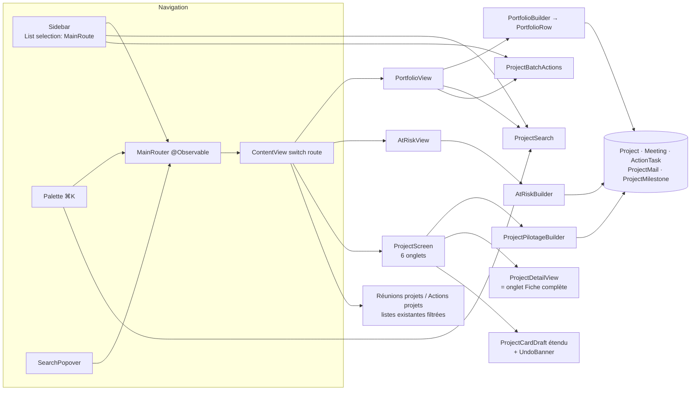

# Refonte de la gestion des projets — spécification d'exécution

Date : 2026-09-09. Auteur du design : Laurent (handoff
`docs/superpowers/specs/gestion-projets-2026-09/handoff/README.md`, maquette
`Gestion des projets.dc.html`, sept captures 2× sous `handoff/screenshots/`). Ce document ne
répète pas le handoff : il le confronte au code de `master` (`c0c1641`) et fixe les décisions
qu'il laissait ouvertes ou qu'il posait sur des faits inexacts. **Le handoff reste l'autorité
sur le rendu** (couleurs, typographie, densités, contenus des écrans, à reproduire au pixel
près) ; ce document est l'autorité sur l'intégration au code existant.

## 1. Ce qui est demandé

Cinq écrans et une refonte de navigation, en variante prudente d'abord :

| Code handoff | Écran | Capture |
| --- | --- | --- |
| 2b | Sidebar avec section « Projets » (Portfolio, À risque, Mes réunions projets, Actions projets, Épinglés, Récents), arbre « Projets par Entité » conservé replié | `2b-sidebar-variante-arbre-replie.png` |
| 1a | Portfolio : tableau triable, recherche, chips de facettes, vues enregistrées, sélection multiple | `1a-portfolio.png` |
| 1c | Palette ⌘K : projets + actions, surlignage, épinglage `⌘↩` | `1c-palette-cmdk.png` |
| 1d | Écran projet de pilotage : en-tête à pilules, six onglets, tuiles, actions, réunions, périmètre, colonne latérale ; l'actuel `ProjectDetailView` devient l'onglet « Fiche complète » | `1d-ecran-projet-pilotage.png` |
| 1f | Vue « À risque » groupée par motif (jalon dépassé, sans réunion 30 j, fiche incomplète) | `1f-vue-a-risque.png` |
| 2a | Bascule finale : retrait de l'arbre « Projets par Entité », drag & drop reporté sur la sélection multiple | `2a-sidebar-section-projets.png` |

Décision de Laurent (2026-09-09) : **2b d'abord, 2a en dernier lot du même chantier.**

## 2. Ce que le code impose (constats d'exploration)

Chaque constat corrige ou complète le handoff ; les décisions du §3 en découlent.

1. **Il n'y a pas de routeur.** La sidebar est une `List` de `NavigationLink` à destination inline
   (`Views/Sidebar.swift:187-422`) ; `ContentView.selectedTab` est mort (`OneToOneApp.swift:118`).
   Rien ne sait sélectionner un écran par programme, or le handoff en a besoin partout : palette →
   projet, Récents, fil d'Ariane, « Tout voir », `SearchPopover.onSelectProject` (no-op,
   `MenuBarController.swift:555`).
2. **⌘K est pris** par `MeetingShortcut.assistant` (`Views/Menus/MeetingShortcut.swift:38`,
   `MeetingCommands.swift:54`, `SessionAssistantPanel.swift:41`), et
   `Tests/MeetingShortcutsTests.swift` fige la liste des jetons et l'ensemble des déclarants.
   `HotkeySpec` est le mécanisme Carbon **global système** : mauvais outil pour une palette.
3. **`sidebar.projectsExpanded` est déjà la clé de l'arbre** (`Sidebar.swift:43`).
4. **Codes de recette en collision** : `1a`, `1c`, `2a`, `2b` existent dans `RecetteScreen`
   (cockpit, poste de pilotage, séance 1:1, préparation 1:1). `RecetteScreen.Cible` ne sait ouvrir
   qu'une réunion, jamais la fenêtre principale.
5. **Table de risque** : `MeetingKPI.Level.teinte` rend `ink4` pour « Faible » (décision
   documentée, `RiskLevelTint.swift`, gardée par `RefonteFinitionsTests`) ; le handoff écrit
   `okBg/okDeep`.
6. **`Project.projectManager` est vide sur 62 projets sur 63** du store réel
   (`Views/Collaborator/CollaboratorProjects.swift:4-15`) ; le nom vit dans `Project.chefDeProjet`
   (chaîne, import xlsx). Idem `technicalArchitect` / `architecte`.
7. **`phase`, `status`, `riskLevel`, `projectType` sont des chaînes libres**, listes en dur dans
   `DetailsViews.swift:17-21` et `Sidebar.swift:576/588` ; le semis écrit `phase: "Réalisation"`.
8. **Aucune donnée dérivée sur `Project`** (dernière réunion, actions ouvertes, mails) et pas de
   relation inverse `Project → Meeting` : tout est un filtre sur un `@Query` global.
9. **`MeetingActionCounts` est indexé sur une réunion** ; la surcharge `compute(_ tasks:)` existe.
   « En retard » n'existe nulle part. Doublon `ActionTask.isCompleted` / `status` : seul `status`
   fait foi.
10. **`multiSelectBar` et ses six `batch*` sont privés à `MainSidebarView`** (`Sidebar.swift:561-667`).
11. **Le drag & drop passe par `Project.code`** (`Sidebar.swift:546, 715, 725`).
12. **`StatusIcon`** (`ProjectListView.swift:74-91`, couleurs système, 12 px) a quatre appelants
    dans `Sidebar.swift` (sidebar, `EntityDetailView`, dashboard, Gantt). `ProjectListView` est
    orpheline.
13. **Le brouillon de `ProjectCardPanel`** est une bascule globale `isEditing`, exige un `Meeting`,
    `ProjectCardDraft` ne couvre que statut, budget, périmètre, thèmes, jalons, interlocuteurs,
    risques ; `.onExitCommand` ferme le panneau.
14. **`EditableTextField`/`EditableTextEditor` sont des `NSViewRepresentable`** : `NSFont.plexSans`
    obligatoire.
15. **Trois valeurs visuelles sans jeton** : ombre de la palette `0 18px 40px rgba(0,0,0,.16)`,
    surlignage `#FFE9A8`, tireté `rgba(0,0,0,.22)`. `text-wrap: pretty` sans équivalent.
16. **Écarts de composants** : `SegmentedMode` actif `ink1` (le handoff veut un segmenté noir : ok),
    `AvatarStack` 19 px (handoff 26), `TimecodeLabel.width` 34 (handoff 44).
17. **Quatre recherches de projets divergentes** : `Sidebar.projectMatches`,
    `MeetingsProjectFilterPicker` (privée), `SearchPopover`, menu à plat d'`AgendaInspectorPanel`.
18. **Documents** : `ProjectAttachment` (catégories DAT / DIT / Document) existe avec import et
    dépôt dans `ProjectDetailView:214-313`. Mails : `ProjectMail` et `MailIndexSuggestion`
    existent, aucune vue par projet ; `MailBrowserView` et `MailSuggestionService` sont classés
    « code mort à arbitrer » dans `architecture.md` §13 — **ils ne le sont plus** dès ce chantier.
19. **`MeetingKind`** n'a pas de « COPIL » : `.workshop` et `.oneToOne` existent ; COPIL se lit dans
    les `MeetingTag` ou le titre.
20. **`AppSettings`** est un `@Model` singleton ; le motif pour une structure persistée est une
    colonne `…JSON: String` + accesseur. `@AppStorage` ne stocke pas `[UUID]`.
21. **Garde-fous à faire passer** : `DocumentationTests` (inventaire des modèles, `code_documente`
    inclut `Views/Project/`), `MeetingShortcutsTests`, `RefonteTypographieTests` (périmètre à
    étendre), `RefonteFinitionsTests`, `SchemaV3MigrationTests`. Suite : 3 111 tests, 0 échec.
22. **Largeur de la sidebar** : `min 170 / ideal 190 / max 320` (`OneToOneApp.swift:139`) ; les
    captures montrent ~250 px.
23. Un champ optionnel ou à valeur par défaut ajouté à un `@Model` **ne demande pas** de
    `SchemaV4` (`SchemaVersions.swift:11-18`, précédent `Project.scopeText`).

## 3. Décisions

Les décisions marquées **(à valider)** sont structurantes ou contredisent le handoff ; les
autres sont des choix d'intégration que j'ai tranchés et que Laurent peut renverser.

**D0 — Routeur de navigation, lot 0 obligatoire (à valider).** Un `enum MainRoute: Hashable`
(`dashboard`, `assistant`, `actions`, `meetings`, `notes`, `manager`, `collaborators`,
`portfolio`, `atRisk`, `projectMeetings`, `projectActions`, `project(UUID, ProjectTab)`,
`collaborator(UUID)`, `entity(UUID)`, `settings`…) ; la sidebar devient une `List(selection:)`
sur `MainRoute` ; `ContentView` affiche le détail par `switch`. Un objet `@Observable
MainRouter` (`route`, `open(_:)`, `back()`) est injecté dans l'environnement ; la palette, les
Récents, le fil d'Ariane, `SearchPopover` l'appellent. Les `NavigationLink` inline existants
migrent un à un ; les écrans non touchés par la refonte (collaborateurs, archives) suivent le
même mécanisme sans changer de rendu. Coût si faux : un lot de plus ; sans lui, aucune des
interactions du handoff n'est réalisable.

**D1 — ⌘K va à la palette, l'Assistant passe à ⌘⇧K (à valider).** Le handoff est explicite et
⌘K est la convention universelle des palettes. `MeetingShortcut` est renommé en portée :
la table devient `AppShortcut` (mêmes cas + `palette`), `MeetingShortcutsTests` est mis à jour
(liste des jetons, déclarants nommés), la spec de la refonte réunion §1.4 est amendée par un
ADR. Alternative si refusé : palette sur ⌘P (libre), rien ne bouge côté Assistant.

**D2 — Table de risque unique, « Faible » reste `ink4` (à valider).** On ne rouvre pas une
décision de la refonte réunion pour un badge que la capture 1a ne montre même pas. Les badges
Modéré / Élevé / Critique et le tiret « absent » suivent le handoff à la lettre.

**D3 — Chef de projet et architecte : relation d'abord, chaîne en repli.** Fonction pure
`ProjectPeople.manager(of:) -> String?` : `projectManager?.name`, sinon `chefDeProjet` non
vide, sinon `nil` (« Non affecté » en italique). Même chose pour l'architecte. La règle « fiche
incomplète » lit cette fonction, pas la FK.

**D4 — `Project.pinned: Bool = false`**, migration légère, pas de `SchemaV4`. Récents :
`@AppStorage("projects.recentIDs")` chaîne d'UUID séparés par `,` (max 5, FIFO), accès par une
fonction pure `RecentProjects`. Vues enregistrées : `AppSettings.portfolioSavedViewsJSON: String
= "[]"` + accesseur `portfolioSavedViews: [PortfolioSavedView]` (nom, filtres, tri), motif
`managerCategoriesJSON`. Aucun nouveau `@Model`.

**D5 — Clé de la nouvelle section : `sidebar.projectsSectionExpanded`** (défaut `true`) ; l'arbre
garde `sidebar.projectsExpanded` et passe à `false` par défaut **pour les nouveaux utilisateurs
seulement** : on ne force pas la valeur d'un utilisateur existant. Le lot 2a supprime l'arbre et
sa clé.

**D6 — Codes de recette préfixés `p`** : `p2b`, `p1a`, `p1c`, `p1d`, `p1f`, `p2a` (la regex de
`recette-run.sh` accepte `[0-9a-z]*`). `RecetteScreen.Cible` gagne un cas `fenetrePrincipale(MainRoute)`
qui s'appuie sur D0 ; le semis de démonstration crée **un portefeuille de 62 projets sur 8
entités et 14 archivés** (extension `RefonteDemoSeed+Portfolio`, idempotente par `code`, réunions
et actions liées pour peupler « dernière réunion », « À risque » et les tuiles), uniquement dans
le home jetable (`CFFIXED_USER_HOME`, garde-fou existant).

**D7 — Une seule recherche de projets.** Service pur `ProjectSearch.matches(_:query:)` (nom,
code, domaine, **sponsor**, chef de projet, architecte, notes) et `ProjectSearch.rank` (préfixe
> mot > sous-chaîne, épinglés d'abord), utilisé par la sidebar, la palette et le Portfolio ;
`MeetingsProjectFilterPicker` et `SearchPopover` y migrent dans le lot palette.
`ProjectSearch.highlightRanges` alimente le surlignage `#FFE9A8`.

**D8 — « Chercher « x » dans les CR et mails » (à valider)** : ouvre un écran de résultats
lexical synchrone (`localizedStandardContains` sur `Meeting.textualContent` et
`ProjectMail.subject/body`, groupé Réunions / Mails, clic → réunion ou projet). Pas de RAG ni
d'embeddings à la frappe. Alternative : reporter cette action à un chantier ultérieur (la
palette ne montre alors que « Créer un projet »).

**D9 — Édition in-place par champ.** `ProjectCardDraft` est étendu (nom, phase, statut, type,
entité, chef de projet, architecte, dates, `riskLevel`/`riskDescription`, `plannedDays`,
`budgetCons`) ; un modificateur `.editableInPlace(field:)` gère lecture → champ actif au clic,
`⏎` valide (`draft.apply` + `undoSnapshot` + `UndoBanner` 5 s), `esc` annule le champ (pas
l'écran). `ProjectCardPanel` garde son comportement ; il perd sa dépendance obligatoire à
`Meeting` (`meeting: Meeting?`) pour être réutilisable hors réunion.

**D10 — Badges de type de réunion** : COPIL si un `MeetingTag` ou le titre contient « COPIL »
(insensible à la casse) ; Atelier si `kind == .workshop` ; 1:1 si `kind == .oneToOne` ; sinon
pas de badge. Fonction pure `MeetingTypeBadge.from(meeting:)`.

**D11 — Données dérivées calculées une fois par affichage** : `PortfolioRow` (struct
`Identifiable`, `Equatable`) construite par `PortfolioBuilder.rows(projects:meetings:tasks:)` dans
un `@Observable PortfolioModel`, recalculée sur changement des `@Query`, jamais dans `body`.
Même chose pour `ProjectPilotageState` (tuiles, actions, réunions, mails) et `AtRiskBuilder`
(trois motifs, règles du handoff avec `dueAt` et `MilestoneState != .done`, `max(date) < J−30`,
`ProjectPeople.manager == nil || sponsor.isEmpty || status == "Unknown"`). « En retard » = action
`status == .open` et `dueDate < aujourd'hui`.

**D12 — Trois jetons ajoutés** à `One2OneToken` (seul fichier autorisé à nommer une couleur) :
`paletteShadow`, `highlight`, `dashedBorder`. Le handoff disait « ne rien ajouter » ; il
n'avait pas ces trois valeurs. `AvatarStack` gagne un paramètre de taille (26 px) ;
`TimecodeLabel` n'est pas touché (la colonne date des réunions est un `Text` mono de 44 px).

**D13 — Largeur de la sidebar (à valider)** : `ideal` passe de 190 à 250, `max` à 320, `min`
reste 170. Les captures 2a/2b sont prises à 250.

**D14 — Sources uniques pour les listes de valeurs** : `ProjectPhase`, `ProjectStatus`,
`ProjectType`, `RiskLevel` deviennent des `enum` **non persistées** (`String` libre conservé
dans le modèle) avec `init?(raw:)` tolérant et `label` ; les listes en dur de
`DetailsViews.swift` et `Sidebar.swift` les lisent. Une valeur inconnue (« Réalisation ») s'affiche
en badge neutre `ink4`.

**D15 — Barre d'actions en lot extraite** : `ProjectBatchActions` (service, six opérations,
identité par `PersistentIdentifier`) + `ProjectBatchBar` (vue aux jetons One2One). La sidebar
et le Portfolio l'utilisent ; le drag & drop par `code` disparaît au lot 2a.

**D16 — `StatusIcon` migre sur les jetons** (`ok`/`warn`/`report`/`inkMuted`, taille en
paramètre, défaut 9) et sort de `ProjectListView.swift`, qui est supprimée.

**D17 — Périmètre typographique étendu** : `RefonteTypographieTests.perimetres` gagne
`Views/Project/`, `Views/Portfolio/`, `Views/Sidebar/`. Les nouveaux fichiers respectent
`plexSans`/`plexMono`/`.sectionLabel()` et `One2OneToken` exclusivement.

**D18 — Documentation** : chaque lot passe `DocumentationTests` ; `architecture.md` §5 (modèles),
§8 (Views : Portfolio, Project, Sidebar, routeur) et §13 (tailles fausses : `DetailsViews.swift`
624 l., `Sidebar.swift` 2 070 l.) sont corrigés par le skill `documenter-application` au fil des
PR ; un ADR par décision structurante (D0, D1, D9).

## 4. Architecture cible

Fichiers nouveaux (dossiers) : `Views/Navigation/` (`MainRoute`, `MainRouter`,
`MainDetailView`), `Views/Sidebar/` (extraction de la section Projets), `Views/Portfolio/`
(`PortfolioView`, `PortfolioTable`, `FilterChips`, `SavedViewMenu`, `PortfolioModel`),
`Views/Palette/` (`CommandPalette`, `PaletteRow`), `Views/Project/` (`ProjectScreen`,
`ProjectHeader`, `PilotageTab`, tuiles, `ProjectSideColumn`, onglets Réunions / Actions / Mails /
Documents), `Views/AtRisk/`, `Services/Project/` (`ProjectSearch`, `PortfolioBuilder`,
`AtRiskBuilder`, `ProjectPilotageBuilder`, `ProjectPeople`, `ProjectBatchActions`,
`RecentProjects`, `PortfolioSavedView`, `MeetingTypeBadge`, `ProjectPhase`…). Chaque règle
métier est une fonction pure testée avant sa vue (règle du dépôt).

## 5. Lots et ordre de livraison

Pile de PR empilées, une intention par PR, agents Opus en worktrees isolés, recette visuelle
par écran avec `Scripts/recette-run.sh --screen p<code>` et comparaison à la capture 2× du
handoff.

| Lot | Contenu | Écran de recette |
| --- | --- | --- |
| 0 | Routeur `MainRoute`/`MainRouter`, sidebar en `List(selection:)`, migration des `NavigationLink`, `RecetteScreen.Cible.fenetrePrincipale`, semis Portfolio 62 projets, `Project.pinned`, enums D14, jetons D12, extension du périmètre typographique | — (aucun rendu changé) |
| 1 | Section « Projets » 2b : quatre entrées, Épinglés, Récents, compteurs, arbre replié, largeur 250 ; `RecentProjects`, `ProjectSearch` (sidebar) | `p2b` |
| 2 | Portfolio 1a : `PortfolioBuilder`, tableau, tri, recherche, chips, vues enregistrées, `StatusIcon` migré, `ProjectBatchActions` + barre, « Groupé par entité », `ProjectListView` supprimée | `p1a` |
| 3 | Palette 1c : `AppShortcut` (D1), `CommandPalette`, surlignage, `⌘↩`, actions « Créer » et « Chercher dans les CR et mails » (D8), `SearchPopover`/`MeetingsProjectFilterPicker` sur `ProjectSearch` | `p1c` |
| 4 | Écran projet 1d : en-tête, onglets, Pilotage (tuiles, actions, réunions, périmètre, colonne latérale), `ProjectCardDraft` étendu + édition in-place (D9), onglets Réunions & CR / Actions / Mails / Documents (listes existantes), « Fiche complète » = `ProjectDetailView`, heatmap remplacée par la tuile Rythme | `p1d` |
| 5 | Vue « À risque » 1f : `AtRiskBuilder`, trois groupes, actions Replanifier / Planifier / Compléter (Replanifier ouvre le jalon en édition, Planifier crée une réunion projet, Compléter ouvre la fiche sur le champ) | `p1f` |
| 6 | Bascule 2a : retrait de l'arbre, de sa clé et du drag & drop par `code` ; « Déplacer vers une entité » sur la sélection multiple ; ADR de clôture ; `STATUS.md` | `p2a` |

Chaque lot : tests des fonctions pures d'abord, vue ensuite, capture de recette comparée à la
maquette, `swift test` complet vert, paragraphe « Documentation » dans la PR (skill).

## 6. Hors périmètre

Tri des colonnes persisté entre sessions ; onglet « Documents » au-delà de l'existant (import,
liste, ouverture) ; rattachement de mails depuis l'écran projet autre que l'ouverture de
`MailSuggestionReviewSheet` ; i18n ; nettoyage du code mort hors projets ; suppression des
colonnes `AppSettings` sans lecteur.

## 7. Critères d'acceptation

1. Les six captures de recette (`p2b`, `p1a`, `p1c`, `p1d`, `p1f`, `p2a`) reproduisent les
   captures du handoff au pixel près, à la fonte IBM Plex, aux jetons `One2OneToken`, sur le
   semis de 62 projets.
2. Depuis la palette, les Récents, le fil d'Ariane et `SearchPopover`, l'écran projet s'ouvre sur
   l'onglet Pilotage ; « Tout voir » ouvre l'onglet Actions ; « 1:1 ▸ » ouvre la fiche du
   collaborateur.
3. Aucune couleur hors `One2OneToken`, aucune fonte hors Plex dans `Views/Project/`,
   `Views/Portfolio/`, `Views/Sidebar/`, `Views/Palette/`, `Views/AtRisk/`, `Views/Navigation/`
   (test de lecture des sources).
4. `swift test` complet vert à chaque PR ; `DocumentationTests` verts ; les ADR D0, D1, D9
   existent.
5. Le store de production n'est jamais touché par un semis (garde-fou `recette-run.sh`).
